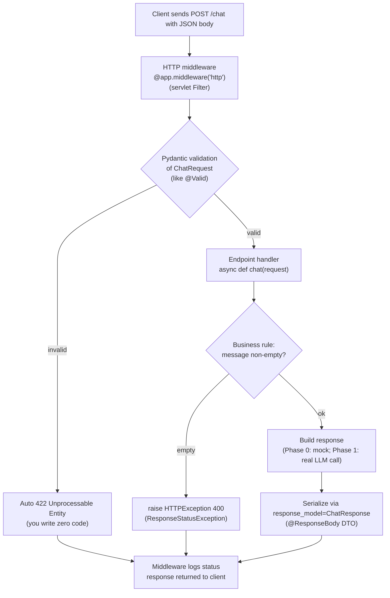

# Phase 0 — Diagrams

The source guide has no diagrams for Phase 0, so here are two that make the two
trickiest topics concrete: the FastAPI request lifecycle and `asyncio.gather`
fan-out/fan-in.

---

## 1. FastAPI request lifecycle



**Explanation.** A request first passes through HTTP middleware — the FastAPI equivalent of a servlet `Filter`/`OncePerRequestFilter` — which logs the method and path on the way in and the status code on the way out. FastAPI then binds and *validates* the JSON body against the `ChatRequest` Pydantic model; this is the `@Valid` step, and if a field is the wrong type or out of range (e.g. `temperature=9.9`) the framework returns a `422` automatically without you writing a single check. Only valid requests reach your `async def` handler, where you enforce business rules and may `raise HTTPException(400, ...)` (the `ResponseStatusException` analogue). The return value is serialized against `response_model=ChatResponse` — the `@ResponseBody` DTO contract — and every path funnels back through the middleware so the outbound status is logged.

---

## 2. `asyncio.gather()` fan-out / fan-in

```mermaid
sequenceDiagram
    participant Caller as fetch_all() coroutine
    participant Loop as Event loop (single thread)
    participant A as fetch_data(url A)
    participant B as fetch_data(url B)
    participant C as fetch_data(url C)

    Caller->>Loop: await gather(taskA, taskB, taskC)
    Note over Caller,Loop: like CompletableFuture.allOf(fA, fB, fC).join()
    Loop->>A: start, await network I/O
    Loop->>B: start, await network I/O
    Loop->>C: start, await network I/O
    Note over Loop: all three suspend on await;<br/>loop is free, no thread-per-call
    A-->>Loop: I/O done, resume -> result A
    C-->>Loop: I/O done, resume -> result C
    B-->>Loop: I/O done, resume -> result B
    Loop-->>Caller: gather returns [A, C, B] in ORIGINAL order
    Note over Caller: return_exceptions=True -> failures<br/>arrive as Exception objects, filtered out
```

**Explanation.** When `fetch_all` does `await asyncio.gather(taskA, taskB, taskC)`, the single-threaded event loop starts all three coroutines and each suspends at its `await` on network I/O — freeing the loop rather than blocking a thread, which is the key difference from a Java thread pool. The responses complete in whatever order the network delivers them (here C before B), and the loop resumes each coroutine as its I/O finishes. Crucially, `gather` returns results in the **original task order**, not completion order — the same guarantee you get from collecting `CompletableFuture.allOf(...).join()` results by future. With `return_exceptions=True`, a coroutine that raises does not cancel its siblings; its exception is returned in place of a result, and `fetch_all` filters those out, logging the failures.
