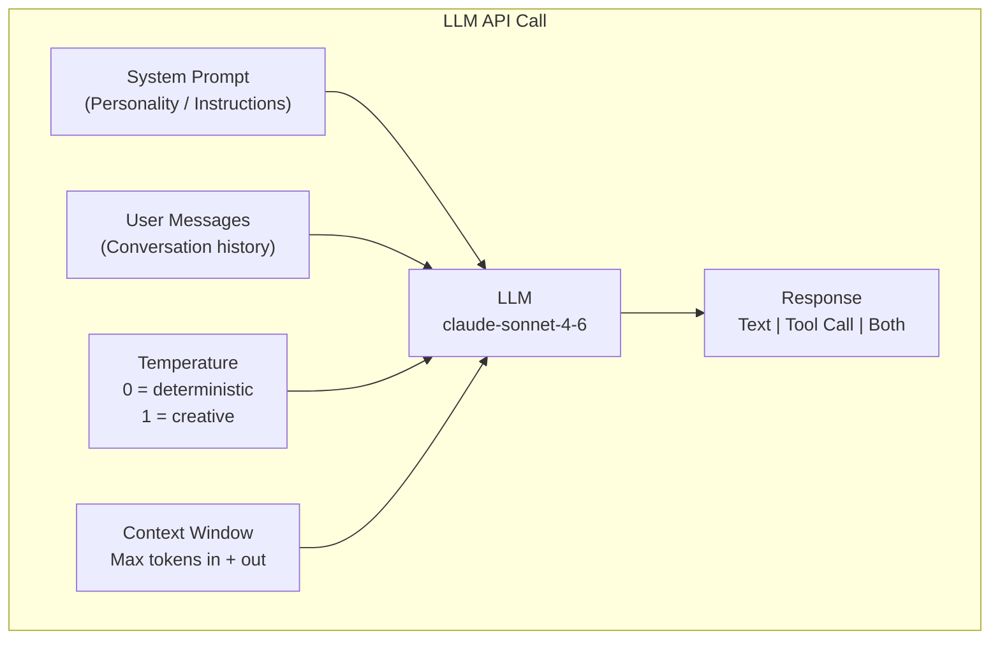

# Phase 1 — Diagrams

Visual companions to `notes.md`. Both render anywhere Mermaid is supported (GitHub, VS Code with a Mermaid extension, Obsidian, etc.).

---

## 1. The LLM API Call (reproduced from the roadmap)

This is the Phase 1 core-concepts diagram. It shows the four inputs that shape every call and the single response that comes out.



**Explanation.** Read this left-of-the-arrow as "what you control" and right-of-the-arrow as "what you get." Three of the four inputs are data you assemble per call — the **system prompt** (durable behavioral contract), the **user messages** (the full conversation history, because the API is stateless and remembers nothing), and the **temperature** (your randomness knob). The fourth, the **context window**, is a fixed capacity constraint: everything you send plus everything generated must fit inside it. The model collapses all four into one **response**, and the key subtlety for what comes next is that the response is not always plain text — it can be a tool call, or text and a tool call together. That branching is what the second diagram unpacks.

---

## 2. The Tool-Calling Agentic Loop (new — added for the notes)

This sequence diagram makes the agentic loop from §1.4 concrete. It traces a single user request through one or more tool round-trips until the model produces a final answer. The `loop` box repeats while `stop_reason == "tool_use"`; the moment the model returns any other stop reason, control falls through to the final response.

```mermaid
sequenceDiagram
    actor User
    participant App as App (your code + TOOL_REGISTRY)
    participant LLM as LLM (claude-sonnet-4-6)

    User->>App: "Create a HIGH priority ticket: login fails"
    App->>App: messages = [ {user: request} ]

    loop while stop_reason == "tool_use"
        App->>LLM: messages.create(messages, tools=TOOLS)
        LLM-->>App: stop_reason="tool_use"\ntool_use{ name, input, id }
        Note over App: model asks — your code executes
        App->>App: fn = TOOL_REGISTRY[name]; result = fn(**input)
        App->>App: append assistant tool_use turn
        App->>App: append user tool_result turn (matched by tool_use_id)
    end

    App->>LLM: messages.create(messages, tools=TOOLS)
    LLM-->>App: stop_reason="end_turn"\nfinal text answer
    App-->>User: "Created ticket TKT-001 (HIGH)…"
```

**Explanation.** The flow inverts who's in charge. Your `App` opens with the user's request and seeds the `messages` list, then enters the loop. On each pass it sends the full history (plus the tool catalog) to the **LLM**; the model decides whether it needs a tool. When it does, it returns `stop_reason == "tool_use"` and a structured request naming the tool, its arguments, and a unique `id` — but it does **not** run anything. Your `App` looks the function up in `TOOL_REGISTRY` (the dependency-injection map from the notes), executes it, and appends *two* turns: the assistant's `tool_use` and a matching `user` `tool_result` keyed by `tool_use_id`. That pairing is mandatory — an orphaned `tool_use` with no result, or a result with no matching id, is a malformed conversation. The loop repeats so the model can chain tools (search, then create a ticket, then summarize). As soon as the model returns a non-`tool_use` stop reason, it has everything it needs, emits the final text, and the `App` relays it to the user. The model orchestrates; your code supplies and runs the capabilities.
