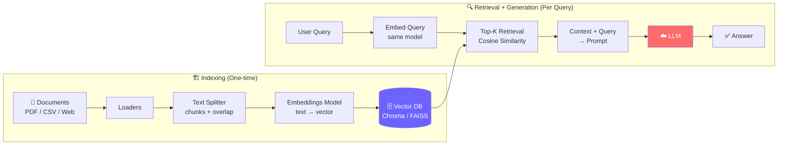
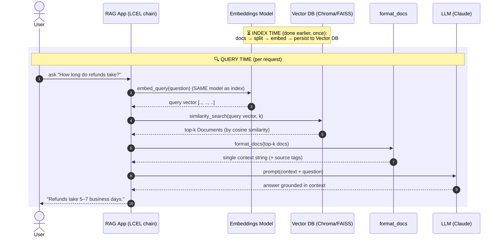

# Phase 2 — RAG Core: Diagrams

Two views of the same system. The first (from the roadmap) shows the **whole
machine** split into its two phases. The second (new) zooms into **one user
query at runtime** as a sequence, so you can see exactly what happens, in order,
on the hot path — and where the index-time work was already done.

---

## Diagram 1 — RAG Architecture (from the roadmap)

This is the canonical two-phase picture. The left box runs occasionally
(indexing); the right box runs on every request (retrieval + generation).

### How to read it

- **Indexing (left).** Documents → Loaders → Splitter → Embeddings → Vector DB.
  This is the ETL/index-build job. Slow, occasionally expensive, persisted to
  disk. You run it when documents change, not per request. (Phase 2.1 → 2.4.)
- **Retrieval + Generation (right).** Query → embed (same model!) → top-k
  cosine retrieval → assemble prompt → LLM → answer. This is the request-scoped
  hot path. (Phase 2.5 / 2.6.)
- **The hinge** is the Vector DB node `V`: it's the *output* of indexing and an
  *input* to retrieval. The arrow `V --> R` is the only thing connecting the two
  phases. Everything left of `V` happened earlier; everything right of `V`
  happens now.

The crucial, easy-to-miss detail: the **same embeddings model** appears on both
sides (`E` during indexing, `QE` at query time). It must be identical, or the
query vector and the stored vectors live in different spaces and cosine
similarity returns garbage.

---

## Diagram 2 — Single query at runtime (NEW: sequence diagram)

The flowchart shows topology; this sequence diagram shows **time and ownership** —
who calls whom, in what order, for one question. It makes the index-time vs
query-time split explicit by drawing the indexing work as a "previously /
already done" note, then walking the live request step by step.

### How to read it — step by step

The grey note at the top is **index time**. By the time a user asks anything,
the documents have already been loaded, split, embedded, and persisted into the
Vector DB. None of that happens during the request. This is the whole point of
persisting (`persist_directory`): you pay the indexing cost once, offline.

Everything in the shaded box is **query time**, one request:

1. **User → App.** A plain-text question arrives (your `@RestController`
   endpoint receiving a request).
2. **App → Embeddings.** The app embeds the *question* into a vector — using the
   **exact same model** that built the index. (Mismatch here = silent garbage
   retrieval. This is the arrow most worth tattooing on your brain.)
3. **Embeddings → App.** Back comes the query vector.
4. **App → Vector DB.** The app asks the index for the `k` nearest chunks.
5. **Vector DB → App.** The store returns the top-k `Document`s ranked by cosine
   similarity. This is the fuzzy "search index lookup" — not an exact key match.
6. **App → format_docs.** The retrieved chunks are joined into one labelled
   context string (with `[Source: …]` tags for citation).
7. **format_docs → App.** One clean context blob ready to interpolate.
8. **App → LLM.** The app fills the prompt template (context + question) and
   calls the LLM, instructing it to answer **only** from the context.
9. **LLM → App.** A grounded answer comes back (or "I don't have that
   information" if the context didn't cover it).
10. **App → User.** The answer is returned.

### The two-phase split, made explicit

| | Index time (Diagram 1, left box / top note) | Query time (Diagram 1, right box / shaded box) |
|---|---|---|
| **When** | Occasionally — when docs change | Every single request |
| **What** | Load → split → embed → persist | Embed query → retrieve → prompt → generate |
| **Cost profile** | Slow, embedding cost per chunk, write-once | Fast; one embed call + one LLM call |
| **Java analogy** | Nightly batch / building a Lucene index | Request-scoped service method hitting the index |
| **Shared dependency** | Produces the Vector DB **and** owns the embedding model | Reuses the **same** embedding model + reads the Vector DB |

Steps 2–5 are the "search index lookup" half (retrieval); steps 6–9 are the
"prompt assembly + downstream service call" half (generation). The Vector DB is
the only artifact carried over from index time — lose it (forgot
`persist_directory`) and step 4 has nothing to query.
