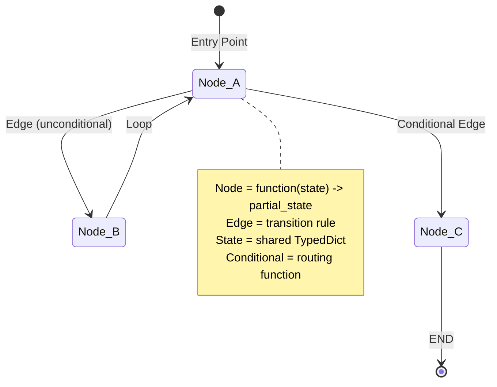
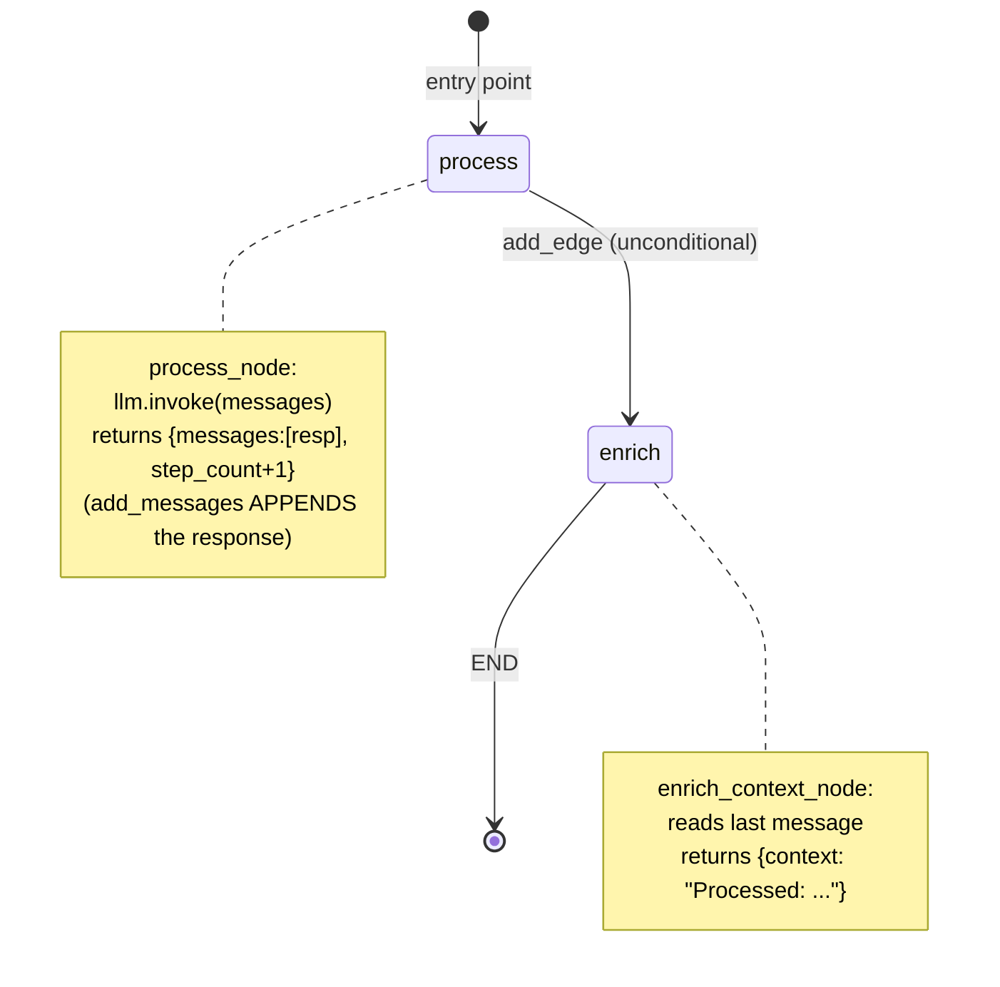
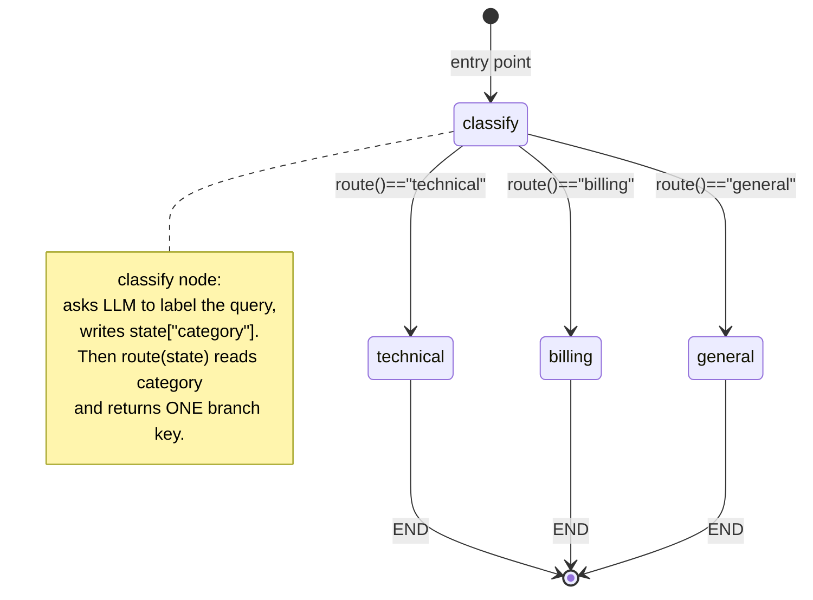
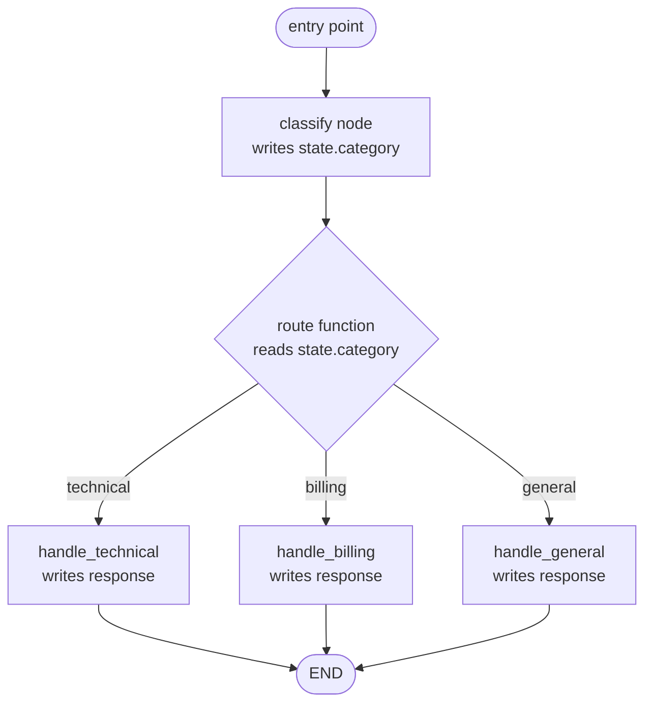

# Phase 3 - Diagrams

Three diagrams: the **mental model** (from the source), the **basic 3.1 linear graph** (drawn from the source code), and a **new routing diagram** for 3.2 (which the source only showed as Python).

---

## 1. LangGraph mental model (source)

This is the canonical picture of how a LangGraph state machine is shaped. It is lifted directly from the Phase 3 source.

**Reading it (spring-statemachine lens):**

- `[*] --> Node_A` - the **entry point**. Exactly one node starts the machine, like the initial state in a Spring state machine.
- `Node_A --> Node_B` - an **unconditional edge**. When `Node_A` finishes, `Node_B` always runs. A plain transition.
- `Node_A --> Node_C` - a **conditional edge**. A routing function decides at runtime whether to take this path. A guard.
- `Node_B --> Node_A` - a **loop**. Graphs may cycle; this is what makes iterative agents (and the ReAct loop) possible.
- `Node_C --> [*]` - reaching **`END`**, the final state for this branch.

The note restates the four primitives: a **node** is `function(state) -> partial_state`, an **edge** is a transition rule, the **State** is a shared `TypedDict`, and a **conditional** is a routing function.

---

## 2. Basic 3.1 graph: process -> enrich -> END (from source code)

The source shows section 3.1 only as code (a linear two-node graph). Reproduced here as a diagram so the flow is visible. This matches what `graph.get_graph().draw_mermaid()` prints for `code/01_basic_state_graph.py`.

**Explanation.** Two nodes wired in a straight line. `process` calls the model and returns a *partial* state (`messages` appended via the reducer, `step_count` incremented). `enrich` reads the latest message and returns just `context`. Neither node mutates state; each returns only the keys it changed. The machine runs entry point -> `process` -> `enrich` -> `END`, and `invoke` returns the final merged state.

---

## 3. NEW: 3.2 routing graph (classify -> conditional edge -> 3 branches -> END)

The source described section 3.2 only as Python code. This is the same routing graph drawn out. It mirrors what `graph.get_graph().draw_mermaid()` produces for `code/02_conditional_edges.py` (where the dashed lines are the conditional fan-out).

### As a stateDiagram-v2

### As a flowchart (the guard made explicit)

**Explanation of each piece:**

- **`classify` (node).** Calls the model with a "classify into technical / billing / general" prompt and writes the result into `state["category"]`. It only *decides the label*; it does not pick the next node itself.
- **`route` (the conditional edge / guard).** A pure function that *reads* `state["category"]` and *returns* a branch key - one of `"technical"`, `"billing"`, `"general"`. It never modifies state. This is the LangGraph guard: where a Spring guard returns true/false (a 2-way fork), this returns a label so we can fan out to three (or more) branches.
- **The mapping dict** (`{"technical": "technical", "billing": "billing", "general": "general"}`) translates the key `route` returns into the actual node to run. The keys must match `route`'s possible return values exactly; the values must be real node names.
- **`handle_technical` / `handle_billing` / `handle_general` (specialist nodes).** Exactly one runs per invocation. Each calls the model (with a role-specific system prompt for technical/billing, none for general) and writes `state["response"]`.
- **`END`.** Every branch terminates the run; whichever specialist ran, the graph finishes and `invoke` returns the final state with `category` and `response` populated.

The key insight for a Spring developer: the **routing decision is data-driven and centralised in one function**, not scattered across `if/else` inside the specialist nodes. That is what keeps the control flow inspectable - you can `draw_mermaid()` it and see every possible path at a glance.
