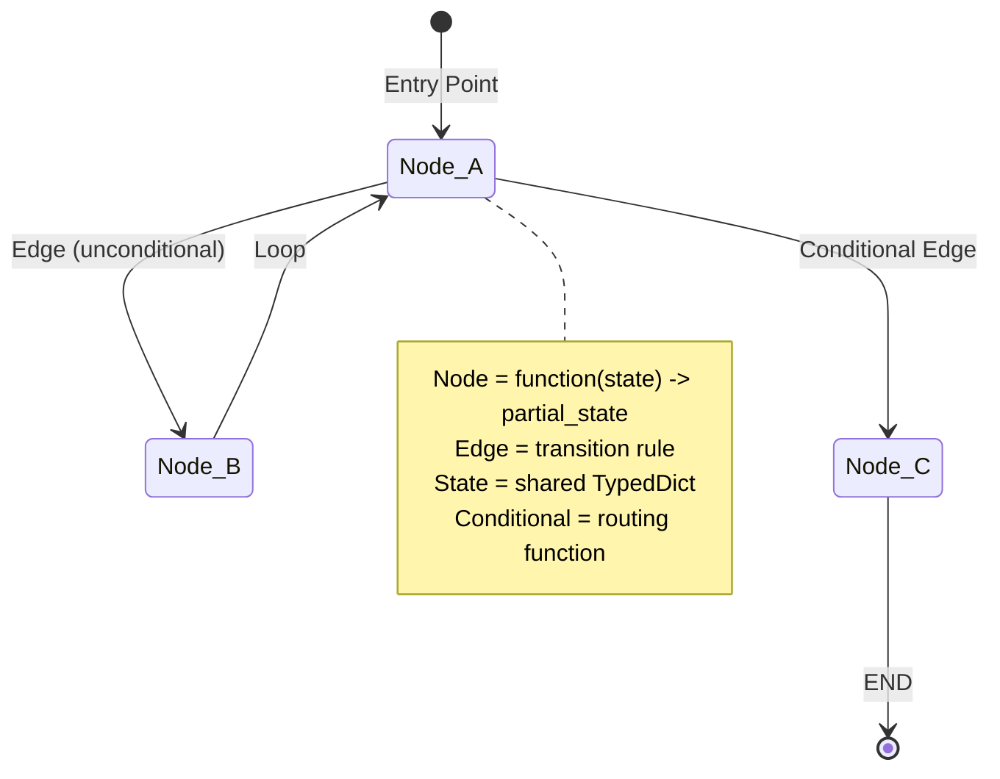

# Phase 3 - LangGraph Fundamentals (Notes)

> **Duration:** ~1.5 weeks
> **Goal:** Build stateful agents using a graph-based (state-machine) architecture.

---

## Why this matters

You already know `spring-statemachine`. LangGraph is the same idea, pointed at LLM agents.

In Spring, you model a workflow as **states**, **transitions**, **guards**, and a shared **extended state / context object** that flows through the machine. You register everything with a builder, call `build()`, then drive the machine with events and read the context at the end. LangGraph maps onto that almost 1:1:

| spring-statemachine | LangGraph | What it is |
| --- | --- | --- |
| state / action | **node** | A plain function `State -> partial State` |
| transition | **edge** (`add_edge`) | "After node A, go to node B" |
| guard | **conditional edge** (`add_conditional_edges`) | A routing function that reads state and returns which node runs next |
| extended state / context | **State** (a `TypedDict`) | The shared object carried between every node |
| initial state | **entry point** (`set_entry_point`) | Where the machine starts |
| final state | **`END`** | A sentinel marking "this branch is done" |
| `StateMachineBuilder` + `build()` | `StateGraph(...)` + `.compile()` | Wire it up, then freeze it into a runnable object |
| `stateMachine.start()` / send event | `graph.invoke(initial_state)` | Run from entry point to `END`, return final state |

The single biggest mental shift: in Spring you tend to *mutate* the context object inside an action. In LangGraph you **never mutate state in place** - a node *returns a partial dict* describing only the keys it changed, and LangGraph merges that delta back into the shared state for you. If you have done event sourcing or written a Redux reducer, that pattern will feel familiar: "here is the change to apply", not "here is the new whole world".

Why bother with a graph at all instead of a big `if/else` service method? Because agents loop, branch, retry, and call tools. A state machine makes that control flow **explicit, inspectable, and resumable**. You can print it as a diagram, snapshot it mid-run, and resume it later - things a tangle of nested `if` statements can never give you.

---

## The mental model

Here is the core picture (also in `diagrams.md`):



Read it like a Spring state diagram:

- **`[*] --> Node_A`** is your entry point. Exactly one node starts the machine.
- **`Node_A --> Node_B`** is an unconditional edge: when `Node_A` finishes, `Node_B` always runs next.
- **`Node_A --> Node_C`** dashed/conditional: a *routing function* decides at runtime whether to go to `Node_C`.
- **`Node_B --> Node_A`** is a loop. Graphs can cycle (that is what makes the ReAct loop possible). Spring lets you transition back to a prior state too.
- **`Node_C --> [*]`** ends that path at `END`.

A node is **stateless**. It receives the current `State`, does its work (maybe calls the LLM, maybe calls a tool), and returns a small dict of changes. It holds no fields of its own between runs. All memory lives in `State` (and, once you add a checkpointer, in the checkpoint store keyed by `thread_id`).

---

## 3.1 Basic StateGraph

The smallest useful graph: define the state shape, write a couple of node functions, wire them in a line, compile, invoke.

### The State is a `TypedDict`

```python
class AgentState(TypedDict):
    messages: Annotated[List, add_messages]   # append-only history
    step_count: int
    context: str
```

A `TypedDict` is just a dict whose keys and value-types are declared for tooling. Think of it as a lightweight DTO / record - except it is still a plain `dict` at runtime, so the type hints are advisory (your IDE and mypy enforce them, the interpreter does not). This is the schema of the context object that flows through the machine.

### Reducers: how updates are merged (`add_messages`)

Look closely at `messages: Annotated[List, add_messages]`. That `Annotated[..., add_messages]` attaches a **reducer** to the `messages` key. A reducer answers the question: *"When a node returns a new value for this key, how do I combine it with the existing value?"*

- **Default behaviour (no reducer):** last write wins. The new value **replaces** the old one. That is what happens to `step_count` and `context`.
- **With `add_messages`:** the new list is **appended** to the existing list, not substituted for it.

This is the detail that trips up every newcomer. When `process_node` returns `{"messages": [response]}`, it is *not* overwriting the conversation with a one-message list - `add_messages` appends `response` to the running history. (Java analogy: it is a custom merge strategy, like a `Collector` that concatenates collections instead of overwriting, or a JPA `@ElementCollection` you append to rather than reassign.)

### Nodes return partial state

```python
def process_node(state: AgentState) -> dict:
    response = llm.invoke(state["messages"])
    return {
        "messages": [response],          # appended by add_messages
        "step_count": state["step_count"] + 1,
    }
```

Note what is **not** returned: `context`. This node did not touch `context`, so it does not mention it. Returning only the changed keys is idiomatic and important - see the mistakes section.

### Wiring and compiling

```python
builder = StateGraph(AgentState)
builder.add_node("process", process_node)
builder.add_node("enrich",  enrich_context_node)
builder.set_entry_point("process")
builder.add_edge("process", "enrich")
builder.add_edge("enrich", END)
graph = builder.compile()
```

`StateGraph(AgentState)` is your `StateMachineBuilder`, parameterised by the state schema. `add_node` registers states/actions, `add_edge` registers transitions, `set_entry_point` picks the start, and `compile()` is `build()` - it validates the wiring and returns an immutable, runnable graph. Calling `graph.invoke(initial_state)` runs from the entry point until every active branch hits `END`, then returns the final merged state.

See `code/01_basic_state_graph.py` for a runnable version (offline, no API key).

---

## 3.2 Conditional edges (routing)

A linear graph is boring. Real agents branch. A **conditional edge** is a guard: one node finishes, and a **routing function** inspects the state and returns the *name of the next node*.

```python
def route(state: RouterState) -> Literal["technical", "billing", "general"]:
    cat = state["category"]
    return cat if cat in ("technical", "billing") else "general"

builder.add_conditional_edges("classify", route, {
    "technical": "technical",
    "billing":   "billing",
    "general":   "general",
})
```

Three things to internalise:

1. **The routing function only reads state; it never modifies it.** It returns a string. That separation of "decide" from "act" is exactly a Spring guard returning a boolean - except a guard returns true/false (a 2-way fork) while a routing function returns a label, letting you fan out to as many branches as you like.

2. **The mapping dict is a translation layer.** The *left-hand keys* are what `route()` can return; the *right-hand values* are the node names to jump to. They happen to be identical in this example, but they need not be. If `route()` returns a key that is not in the map, the graph errors - so the return values and the map keys must agree exactly.

3. **The classifier node sets the field the router reads.** `classify` writes `category`; `route` reads `category`. The node decides *what*, the router decides *where*.

The shape is: `classify -> (route) -> one of {technical, billing, general} -> END`. Each specialist node fills `response` and then the graph ends. See `diagrams.md` for the drawn-out routing graph, and `code/02_conditional_edges.py` to watch three different queries take three different branches offline.

---

## 3.3 ReAct agent with tools

**ReAct = Reasoning + Acting.** Instead of answering in one shot, the model loops:

> think -> decide to call a tool -> read the tool's result -> think again -> ... -> final answer

LangGraph ships a prebuilt graph for this so you do not have to hand-wire the loop:

```python
from langgraph.prebuilt import create_react_agent
agent = create_react_agent(llm, tools=[calculator, get_stock_price, search_docs])
result = agent.invoke({"messages": [HumanMessage("What is 15% of AAPL stock price?")]})
```

Under the hood `create_react_agent` builds a tiny two-node graph: an **agent node** (the model, which may emit tool calls) and a **tools node** (which executes whatever the model asked for and feeds results back). A conditional edge checks "did the model request a tool?" - if yes, run the tool and loop back to the agent; if no, the model's message is the final answer and the graph ends. That loop-with-a-guard is something a graph does naturally and a straight-line method cannot.

### Tools

A tool is a typed function decorated with `@tool`. The decorator publishes the function's name, docstring, and signature as a schema the model can call - like exposing a `@Service` method as a callable endpoint whose contract the caller can read.

```python
@tool
def calculator(expression: str) -> str:
    """Evaluate a math expression safely..."""
    allowed_names = {k: v for k, v in math.__dict__.items() if not k.startswith("_")}
    try:
        result = eval(expression, {"__builtins__": {}}, allowed_names)
        return str(result)
    except Exception as e:
        return f"Error: {e}"
```

**Safety note (the org's "no insecure defaults" rule applies here):** `eval` is dangerous on raw input. The source locks it down by passing `{"__builtins__": {}}` (so `open`, `__import__`, etc. are unreachable) and a whitelist of only `math` names. Never `eval` untrusted input without this kind of sandbox - and for production, prefer a real expression parser over `eval` entirely. Also note tools **return errors as data** (`f"Error: {e}"`) rather than raising; the agent reads the error string and can recover, whereas an uncaught exception would crash the run.

In the source the other two tools (`get_stock_price`, `search_docs`) are stubs marked `# TODO`. In `code/03_react_agent.py` they are filled in as clearly-labelled mocks (a fixed price table and a fixed doc snippet) so the loop runs offline; swap them for a real market-data API and a vector-store retriever in production.

> The runnable file uses a small hand-written ReAct loop offline (because a trivial stub cannot emit genuine tool calls), and the real `create_react_agent` when you flip `USE_MOCK = False`. Both drive the identical reason -> act -> observe control flow.

---

## 3.4 Persistent memory (checkpointing)

Without persistence, every `graph.invoke()` starts from a blank state - the agent is amnesiac. A **checkpointer** saves the full state after each run, keyed by a **`thread_id`**, and auto-restores it on the next call with the same `thread_id`. That is what gives a chatbot memory across turns.

```python
from langgraph.checkpoint.memory import MemorySaver
memory = MemorySaver()
graph = builder.compile(checkpointer=memory)   # the one line that adds memory

config = {"configurable": {"thread_id": "session-alice-001"}}
graph.invoke({"messages": [HumanMessage("My name is Alice.")]}, config)   # turn 1
r = graph.invoke({"messages": [HumanMessage("What is my name?")]}, config) # turn 2, remembers
```

The mechanics:

- **`thread_id`** is your conversation correlation id - the HTTP session id of the agent world. Same id == same memory; a different id starts fresh.
- **`MemorySaver`** is an in-process store. It is *dev only* - state vanishes when the process dies. In production you swap in `PostgresSaver` / `RedisSaver` (Phase 11), exactly like moving from an in-memory `HttpSession` to Spring Session backed by JDBC or Redis.
- The **`add_messages` reducer is what makes multi-turn work**: each turn the restored history is *appended to*, not replaced, so the conversation accumulates per thread.
- **`graph.get_state(config)`** lets you peek at the persisted state at any time. `snapshot.values` holds the state dict; `snapshot.next` tells you which node would run next (an empty tuple `()` means the run finished). This is your "inspect the session attributes" / debugger view.

`code/04_checkpointing_memory.py` proves it both ways: with the same `thread_id` the agent recalls the name; with a fresh `thread_id` it does not - which is exactly how you would diagnose a "my bot forgot everything" bug (almost always a missing or changing `thread_id`).

---

## Common Java-dev mistakes (read this twice)

> These are the traps that cost beginners the most time. Each maps to a habit Spring developers carry over.

- **Returning the full state instead of a partial dict.** A node should return *only the keys it changed*: `return {"step_count": n + 1}`. Returning the entire state object is unnecessary and, for reducer keys, actively wrong - you can accidentally re-feed the whole message list back through `add_messages` and duplicate history. Think "return the delta", not "return the world".

- **Mutating state in place.** Do not do `state["messages"].append(x)` or `state["context"] = "..."` inside a node and return nothing. LangGraph applies *returned* deltas through reducers; in-place mutation bypasses that machinery and leads to confusing, order-dependent bugs. Treat `state` as read-only input.

- **Forgetting the reducer makes `messages` append-only.** Returning `{"messages": [new_msg]}` does **not** replace the history - `add_messages` appends. If you expected a replace, you will be surprised by a growing list. Conversely, if you forget to annotate `messages` with `add_messages`, each node will *clobber* the history and the agent loses context.

- **Wrong key names in the conditional-edge mapping.** The strings your routing function returns must exactly match the keys in the `add_conditional_edges` map, and the map's values must be real registered node names. A typo (`"techncial"`) does not fail at compile time the way a misspelled Java enum would - it surfaces at runtime as a routing error. Keep the `Literal[...]` return type in sync with the map.

- **No `thread_id`, so memory does not persist.** Compiling with a checkpointer is not enough - you must pass `config={"configurable": {"thread_id": "..."}}` on every `invoke`. Omit it, or change it between turns, and the agent "forgets". This is the single most common "checkpointing is broken" report, and it is almost never the checkpointer.

- **Treating nodes as stateful objects.** Nodes are pure-ish functions, not Spring `@Component` singletons holding fields. Do not stash data on the function or in a module global expecting it to flow to the next node - put it in `State`. If two nodes need to share data, one writes a State key and the other reads it.

- **Calling `eval` on tool input without a sandbox.** The `calculator` tool disables builtins and whitelists `math` for a reason. Carrying over a naive `eval(userInput)` is a remote-code-execution hole. Sandbox it, or use a proper parser.

---

## Key terms (glossary)

- **StateGraph** - the builder/blueprint for the machine, parameterised by a State schema. Your `StateMachineBuilder`.
- **node** - a function `State -> partial State`. A state/action in spring-statemachine. Stateless; all data lives in State.
- **edge** - an unconditional transition: "after node A, run node B" (`add_edge`).
- **conditional edge** - a routing function attached via `add_conditional_edges`; reads state, returns the next node's key. A guard that picks among many branches.
- **reducer** - a per-key merge function declared with `Annotated[Type, reducer]`. Decides how a node's returned value combines with the existing value. Default = replace.
- **`add_messages`** - the built-in reducer for chat histories. **Appends** new messages instead of replacing the list.
- **TypedDict** - a dict with declared key/value types. The State schema; advisory at runtime, enforced by tooling. A lightweight DTO/record.
- **ReAct** - "Reasoning + Acting": the loop where a model thinks, calls tools, reads results, and repeats until it can answer.
- **checkpointer** - a store that saves/restores graph state per `thread_id` (`MemorySaver` for dev; Postgres/Redis savers for prod). Spring Session, essentially.
- **`thread_id`** - the conversation correlation id under `config["configurable"]`. Same id == same memory.
- **entry point** - the node where the machine starts (`set_entry_point`). The initial state.
- **`END`** - the sentinel node marking the end of a branch. The final state.

---

## What to build (see exercises.md)

The Phase 3 checklist, restated:

- [ ] Build a 3-node `StateGraph` and trace state through it.
- [ ] Implement conditional routing to 3+ branches.
- [ ] Create a ReAct agent with a calculator + a search tool.
- [ ] Add `MemorySaver` and test multi-turn memory.
- [ ] Print the graph as Mermaid: `print(graph.get_graph().draw_mermaid())`.

The runnable, offline-first versions of all four live in `code/`. Work through them, then do the exercises without peeking.
