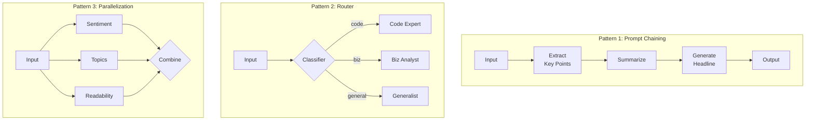

# Phase 4 - Diagrams

Two diagrams: the **Workflow Patterns** overview (the three subgraphs, lifted from the Phase 4 source), and a **new decision tree** for choosing which pattern to use.

---

## 1. Workflow Patterns (source)

The canonical Phase 4 picture: the three patterns side by side. Reproduced exactly from the source.



**Reading it (microservice-orchestration lens):**

- **Pattern 1 - Prompt Chaining (`PC`).** A straight line: `Input -> Extract Key Points -> Summarize -> Generate Headline -> Output`. Each box's output is the next box's input. This is a Unix pipe / `Stream` chain / Spring Integration pipes-and-filters. Use it when each step *depends on* the previous step. Implemented in `code/01_prompt_chaining.py`.

- **Pattern 2 - Router (`RT`).** `Input -> {Classifier}` (the diamond = a decision), which fans to exactly ONE of `Code Expert`, `Biz Analyst`, or `Generalist`. Only one specialist runs per input. This is Spring MVC dispatch / the Strategy pattern. The "general" branch doubles as the **default** - the catch-all when classification is unclear. Implemented in `code/02_router_pattern.py`.

- **Pattern 3 - Parallelization (`PL`).** `Input` fans OUT to `Sentiment`, `Topics`, and `Readability` simultaneously, then all three fan IN to `{Combine}`. The three analyses are independent, so they run concurrently. This is `ExecutorService.invokeAll` / `CompletableFuture.allOf(...).join()`. Implemented in `code/03_parallelization.py`.

The shapes encode the intent: a **line** = sequential dependency, a **diamond fork** = pick one, a **split-then-merge** = do all, concurrently.

---

## 2. NEW: "Which workflow pattern should I use?" decision tree

The source shows the three patterns but never the *choosing* logic. This decision tree makes the selection explicit. Walk it top-down for any new task.

```mermaid
flowchart TD
    START([New task: one or more LLM steps]) --> Q1{Does each step\nDEPEND ON the\nprevious step's output?}

    Q1 -->|Yes - B needs A's result| CHAIN[Use PROMPT CHAINING\nstep1 -> step2 -> step3\nLCEL: prompt | llm | parser]

    Q1 -->|No - steps are independent| Q2{Do the inputs fall into\nMUTUALLY EXCLUSIVE\ncategories, where only\nONE handler should run?}

    Q2 -->|Yes - pick exactly one| ROUTE[Use ROUTER\nclassify -> conditional edge\n-> ONE specialist\nALWAYS add a default branch]

    Q2 -->|No - run several independent\nsubtasks on the same input| Q3{Are the subtasks\nINDEPENDENT\nof each other?}

    Q3 -->|Yes| PAR[Use PARALLELIZATION\nfan-out -> asyncio.gather -> fan-in\nwrap blocking calls in asyncio.to_thread]

    Q3 -->|No, they depend| CHAIN

    CHAIN --> COMBINE([Need more? COMBINE patterns:\nrouter branch can be a chain,\na chain step can fan out])
    ROUTE --> COMBINE
    PAR --> COMBINE
```

**Explanation of each decision:**

- **Q1 - "Does each step depend on the previous step's output?"** This is the first and most important question. If step B genuinely consumes step A's result (the headline needs the summary, which needs the key points), you have a true data dependency and must **chain**. The mistake to avoid: chaining steps that are actually independent, which needlessly triples latency. Ask honestly whether B *reads* A's output, or whether they just happen to be written next to each other.

- **Q2 - "Mutually exclusive categories, only one handler runs?"** If the steps are independent AND the input belongs to exactly one of several categories (this is a code question OR a billing question OR a creative request - never two at once), use a **router**. One classifier picks the lane; one specialist runs. The non-negotiable: include a **default branch** so an unexpected classification routes somewhere instead of crashing. This is the Spring MVC dispatch / Strategy decision.

- **Q3 - "Are the subtasks independent of each other?"** If you want to run *several* analyses on the *same* input and none needs another's output (sentiment, topics, readability all read the raw text), **parallelize** them with `asyncio.gather` for a real speedup. The catch: wrap any blocking `llm.invoke` in `asyncio.to_thread`, or the single event loop serialises everything and you get no speedup. If it turns out the subtasks *do* depend on each other, fall back to chaining (the arrow loops back to CHAIN).

- **COMBINE (the terminal note).** Real systems are compositions: a router branch can itself be a chain, and a chain step can fan out to a parallel block. The capstone document analyzer (exercises.md, exercise 5) does all three. Pick the dominant shape first, then nest the others inside.

The Spring-developer takeaway: this is the same reasoning you already do when deciding between a sequential service call (`thenApply`), a `switch`/strategy dispatch, and an `ExecutorService.invokeAll` - just applied to LLM steps instead of method calls.
