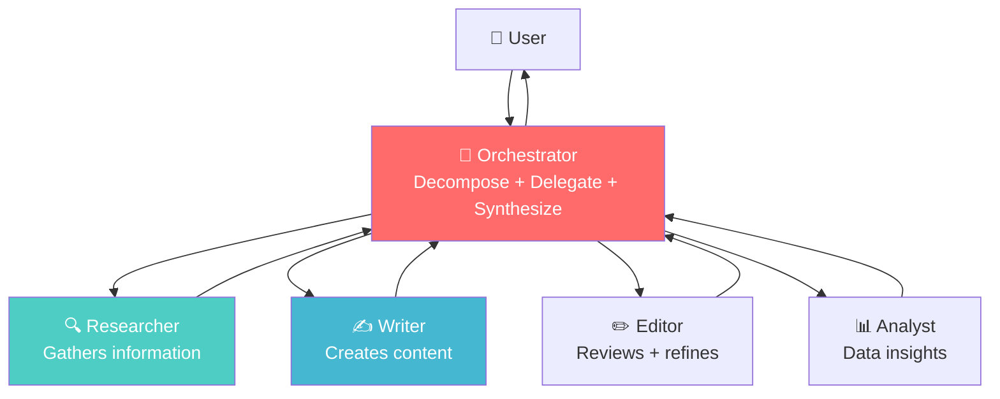
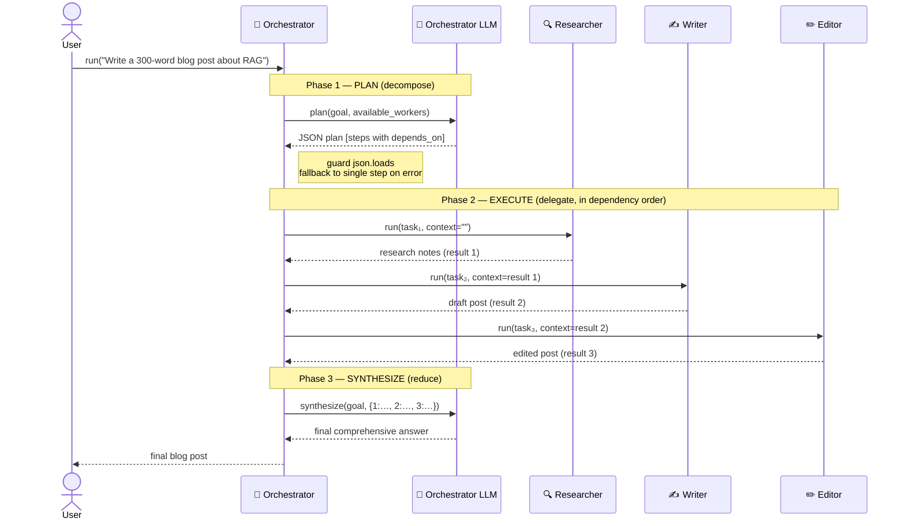

# Phase 5 — Diagrams

Two diagrams. The first is the **multi-agent architecture** pulled straight from the roadmap (the static "who talks to whom" picture). The second is a **sequence diagram** I'm adding to show the *dynamic* story — what actually happens, in order, during one orchestrator run.

---

## 1. Multi-Agent Architecture (from the roadmap)

**What it shows.** This is the hub-and-spoke topology. The user only ever talks to the orchestrator — they never see the workers, exactly as a REST client only sees your facade `@Service` and never the specialist beans behind it. The orchestrator delegates *down* to four specialist workers (Researcher, Writer, Editor, Analyst), each a stateless role with its own system prompt, then collects their outputs *back up* (the return arrows) before sending one synthesized answer to the user. The arrows are bidirectional per worker because every delegation is a request/response: the orchestrator hands down a task and the worker hands back text. Note what the picture *doesn't* show — the order of calls or which worker feeds which. That ordering lives in the runtime-generated plan, not in the static wiring, which is exactly why the sequence diagram below is necessary.

---

## 2. One Orchestrator Run (sequence diagram — added)

**What it shows.** This is the same system as diagram 1, but told as a *timeline* — and the timeline is where the orchestrator–worker pattern actually earns its name. Read it top to bottom as three phases. In **Phase 1 (plan)** the orchestrator doesn't decide the steps itself; it asks its own LLM to decompose the goal into a JSON list of subtasks, each tagged with `depends_on`. The note flags the critical guard: that JSON is parsed defensively with a fallback, because a non-deterministic model wrote it. In **Phase 2 (execute)** the orchestrator walks the steps in dependency order and you can literally see the data flowing along the edges — the Researcher returns notes, those notes become the Writer's `context`, the Writer's draft becomes the Editor's `context`. Each worker is a separate request/response round-trip (each one a place you'd add a timeout and retry in production). In **Phase 3 (synthesize)** the orchestrator hands the whole `Dict[int, str]` of results back to its LLM to fuse into one answer, then returns it to the user. Compare this to a Spring Saga: Phase 1 is the saga deciding its steps, Phase 2 is the ordered service calls passing state forward, and Phase 3 is assembling the final response — except here the *plan itself* was generated at runtime rather than coded in advance.
