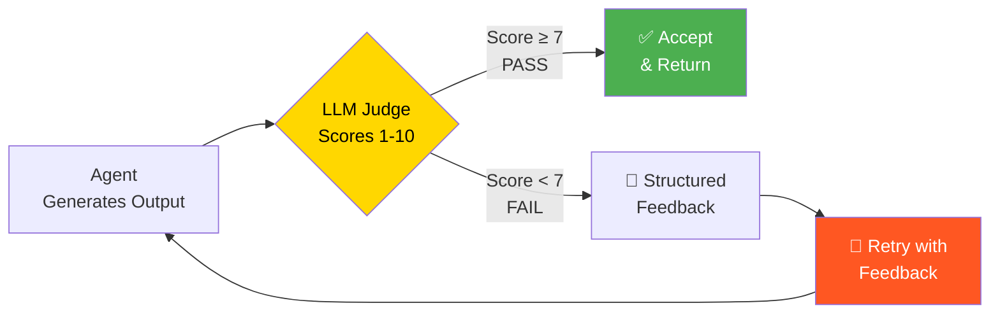
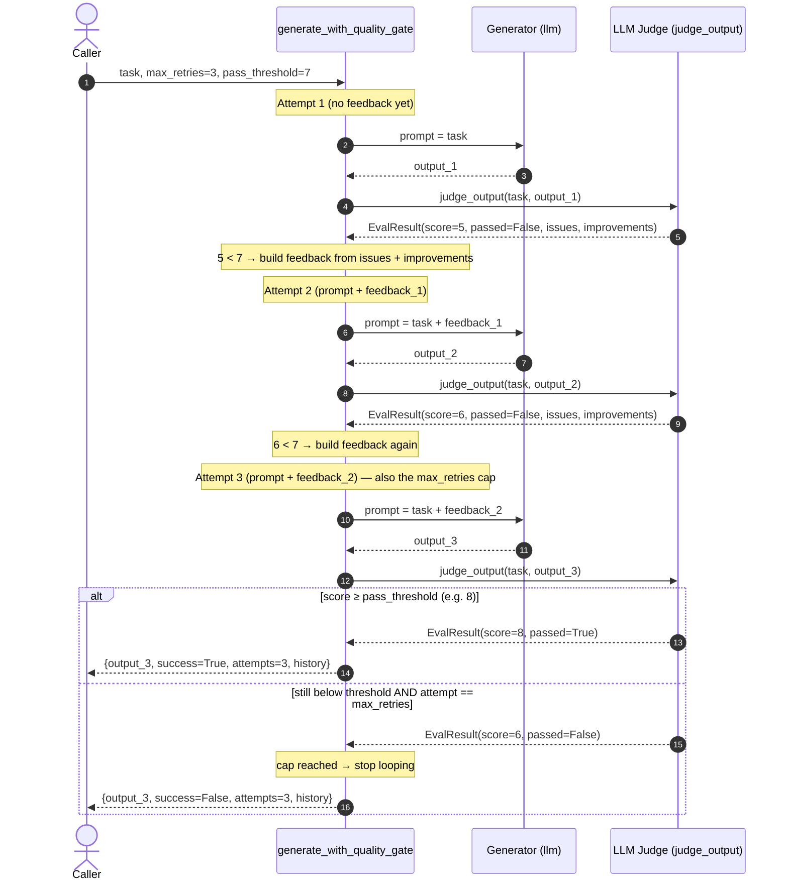

# Phase 6 — Diagrams

## 1. Evaluation Loop (from the roadmap)

The canonical evaluator-optimizer flow. An agent generates output; an LLM judge scores it 1–10. If the score clears the threshold (≥ 7) the output is accepted and returned. If it falls short, the judge's structured feedback is captured and fed into a retry, which loops back to the generator. This is the high-level "what happens at each gate" view.

**Explanation.** Read it as a control loop. The diamond (`EVAL`) is the decision point — the quality gate. The only two ways out of the loop are the green "Accept" node (the gate passed) or, implicitly, the loop running out of retries (not drawn here — see the sequence diagram below, which makes the `max_retries` exit explicit). The orange "Retry with Feedback" node is what distinguishes this from a plain retry: feedback flows *forward* into the next generation, so each pass through `GEN` is better-informed than the last.

---

## 2. `generate_with_quality_gate` across attempts (sequence diagram)

The flowchart above shows the *shape* of the loop but hides time and the `max_retries` cap. This sequence diagram traces an actual run of `generate_with_quality_gate` over multiple attempts: the generator produces output, the judge scores it, a failing score becomes feedback that is injected into the next generation, and the loop terminates either when the score clears the threshold or when the attempt counter hits `max_retries` (in which case the last — still failing — output is returned with `success=False`).

**Explanation.** The two-LLM-call-per-attempt cost is now visible: every attempt is one round-trip to the generator *and* one to the judge — which is exactly why the `max_retries` cap matters. Notice the score climbing (5 → 6 → 8) as the judge's feedback accumulates into the prompt; that is the optimizer working. The closing `alt` block is the loop's exit logic from §6.2: it returns on either a passing score *or* the final attempt, and the returned `success` flag tells the caller honestly whether the gate was met (`True`) or whether they're holding the best-of-a-bad-batch last attempt (`False`). The `history` list records the per-attempt scores so the improvement trajectory is auditable after the fact.
