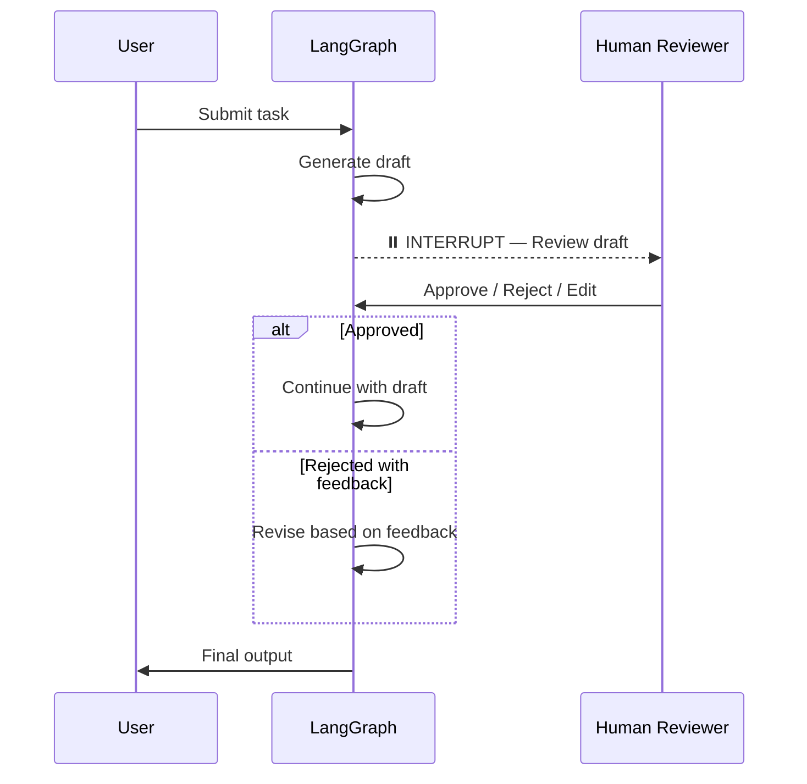
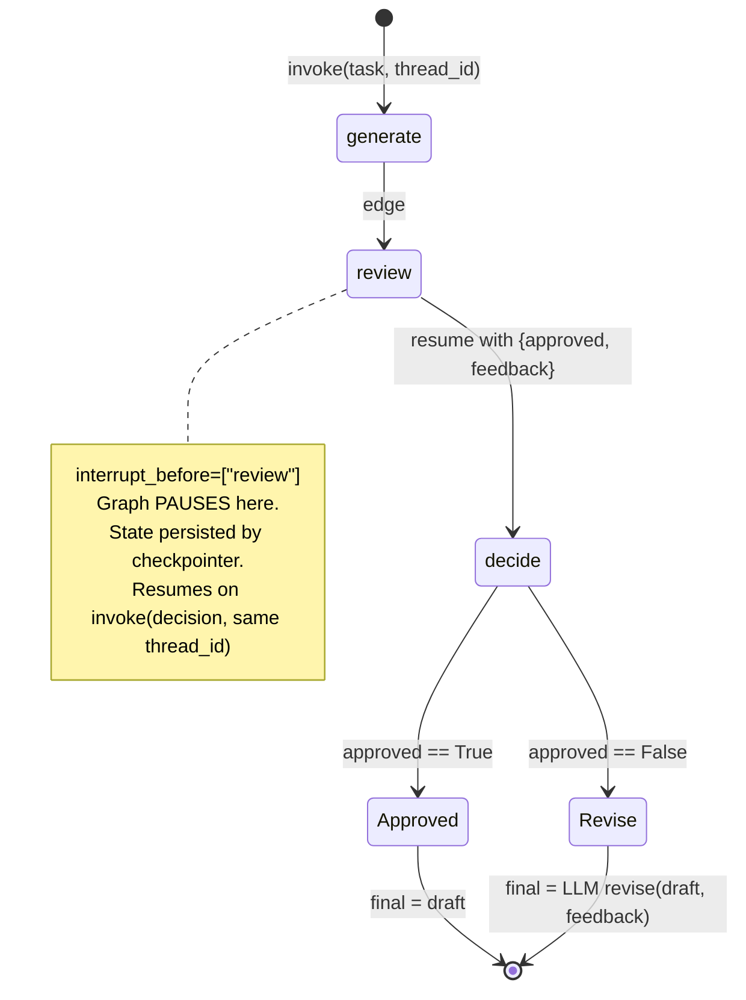

# Phase 7 — Human in the Loop · Diagrams

## 1. HITL sequence (from the roadmap)

The end-to-end interaction: the graph generates a draft, **interrupts** to let a human review, then
resumes down the approve or reject-with-feedback branch.

---

## 2. Graph state machine (new — fills the gap)

The sequence diagram shows the *interaction over time*; this `stateDiagram-v2` shows the **compiled
graph itself** — the nodes, the interrupt point, and the two decision branches that the source only
expresses in code. This is the view that maps cleanly onto `spring-statemachine`: each box is a
state, the dashed interrupt is a manual-approval gate, and `decide` is a guarded transition.

**How to read it:** `generate` runs autonomously and produces the draft. The graph then halts at the
dashed `review` boundary — nothing past it executes until a human decision is injected on the same
`thread_id`. `decide` is the guard: `approved == True` ships the draft as-is; otherwise the LLM
revises it using the feedback. Both branches terminate at `END`.
