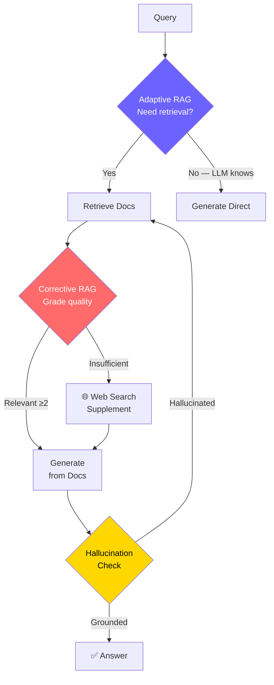
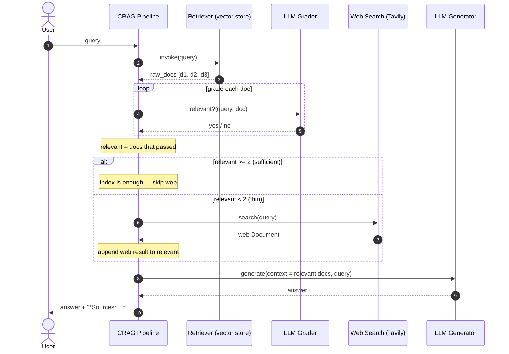

# Phase 8 — Diagrams

Two diagrams: the **Advanced RAG Decision Flow** (reproduced verbatim from the
roadmap) and a new **Corrective RAG sequence diagram** showing the CRAG
pipeline end to end.

---

## 1. Advanced RAG Decision Flow

**Explanation.** This is the whole phase on one page. A query first hits the
**adaptive gate** (purple): if the LLM already knows the answer it generates
directly and the rest of the pipeline is skipped — the cheapest possible path.
Otherwise it retrieves, and every retrieved doc passes through **corrective
grading** (red). With at least two relevant docs we generate straight from
them; if the set is too thin we detour through a **web-search supplement**
first. After generation, a **hallucination check** (gold) verifies the answer
is grounded in the context — grounded answers are returned, hallucinated ones
loop back to retrieval rather than being shipped. The three coloured diamonds
are the three "reason about retrieval" decisions that distinguish advanced RAG
from the naive retrieve-then-generate chain of Phase 2.

---

## 2. Corrective RAG (CRAG) — sequence diagram

**Explanation.** This unrolls the corrective-grading diamond into a step-by-step
exchange between the participants. The pipeline retrieves raw candidates, then
**loops** over them asking the grader a yes/no relevance question per document
— this is the step naive RAG omits entirely. The `alt` block is the correction
decision: if at least two docs pass, the index is trusted as-is and the web is
never called (saving an external request); if fewer than two pass, the pipeline
**falls back** to a web search and folds that result into the context. Only then
does generation run, and the response is returned with explicit **source
provenance** so the caller can see whether each fact came from the index, the
web, or both. Mapped to Spring Boot: the grading loop is input validation on
downstream data, the `alt` fallback is a Resilience4j secondary source, and the
`*Sources*` tag is the audit field on the response DTO.
