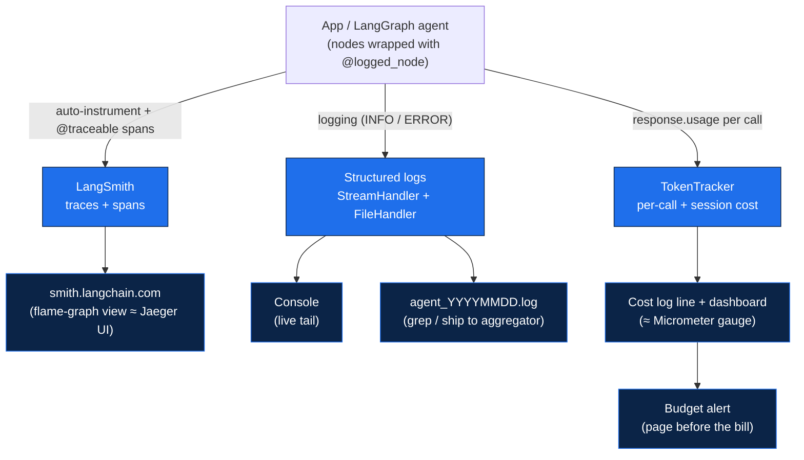
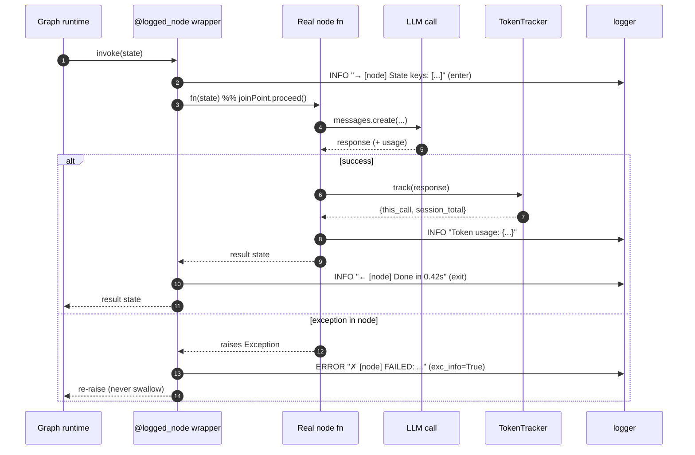

# Phase 9 — Diagrams

The source roadmap has no Mermaid diagram for this phase, so here are two that make the observability picture concrete. Both render on GitHub and in any Mermaid-aware Markdown viewer.

---

## 1. The observability stack (flowchart)

This is the "where does each signal go and who looks at it" map — the agentic counterpart of a diagram showing your Spring service emitting to Jaeger, your JSON logs flowing to a log aggregator, and your Micrometer metrics feeding a dashboard with alerts. One application/graph emits **three independent observability signals**: traces (LangSmith), structured logs, and token/cost metrics. Each lands in a different place and answers a different question — traces show the call tree, logs show the ordered narrative, and the token tracker shows the running bill — and the cost stream is the one you wire an alert on so a runaway loop pages you before the invoice does.

---

## 2. One request through a `@logged_node`-wrapped node (sequence diagram)

This zooms into a single node call to show the AOP `@Around` shape of `@logged_node`: it logs on **enter**, calls the real node (`joinPoint.proceed()`), tracks tokens, then logs on **exit**. The bottom `alt` block is the critical bit — on the error path the wrapper logs the exception **and re-raises it** (`exc_info=True`, then `raise`). It never swallows the failure, so the caller still sees the error and the run fails *visibly* instead of marching on with corrupted state.

