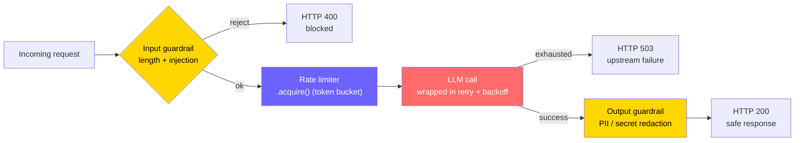
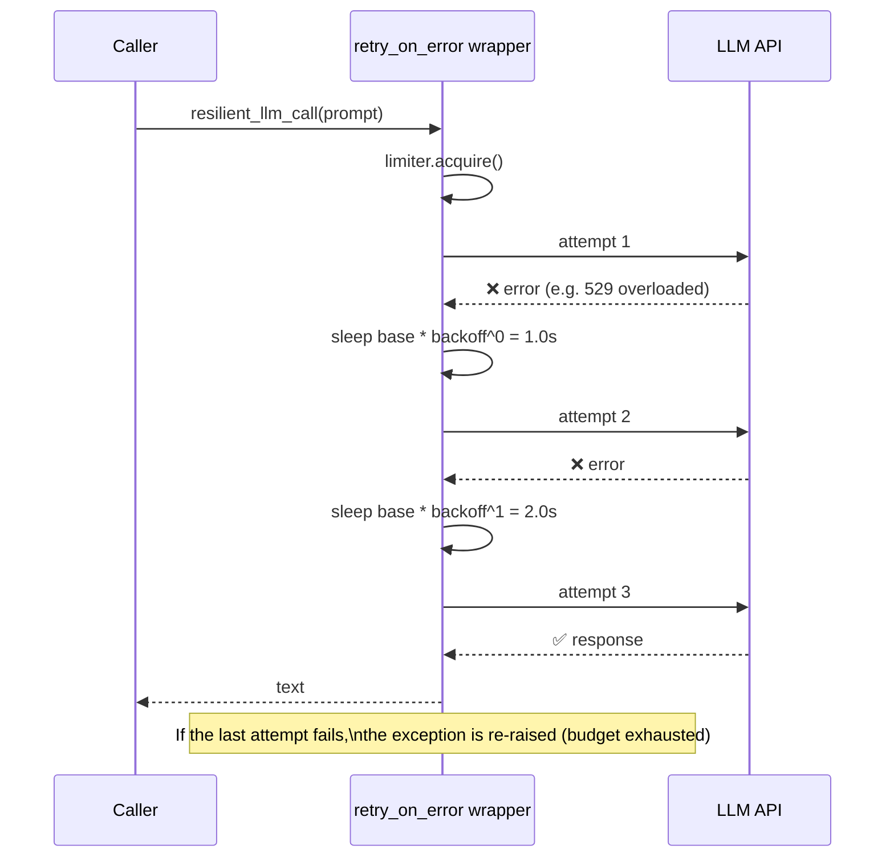

# Phase 10 — Production Engineering · Diagrams

The source has no Mermaid diagram for this phase. Here are two that turn the prose into pictures: the
hardened request path, and the retry/backoff loop.

## 1. Hardened request path (new)

Every production LLM request should pass through the same gauntlet: validate input, throttle, call
with retries, sanitize output. This is your `OncePerRequestFilter` chain + Resilience4j, in one view.

**How to read it:** the two yellow gates are the guardrails (input and output) — necessary but not
sufficient on their own. The purple limiter smooths traffic so you never trip provider 429s; the red
node is the only place that talks to the model, and it's wrapped so transient failures retry instead
of bubbling up. Both failure exits return clean HTTP errors rather than leaking stack traces.

## 2. Exponential backoff retry loop (new)

What `retry_on_error` actually does on a flaky call — the `wait = base * backoff^attempt` schedule
that a Spring Retry `@Retryable(backoff=@Backoff(...))` annotation hides from you.

**How to read it:** each retry waits longer than the last (geometric backoff), which gives an
overloaded provider room to recover instead of hammering it. The retry budget (`max_retries`) caps
total attempts so a persistent outage fails fast rather than looping forever. In production, add
*jitter* to the sleep so a fleet of clients doesn't retry in lockstep (the thundering-herd problem).
