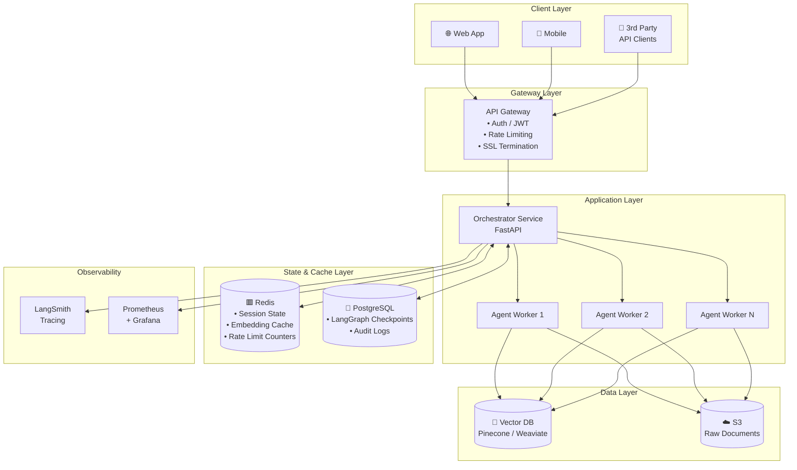
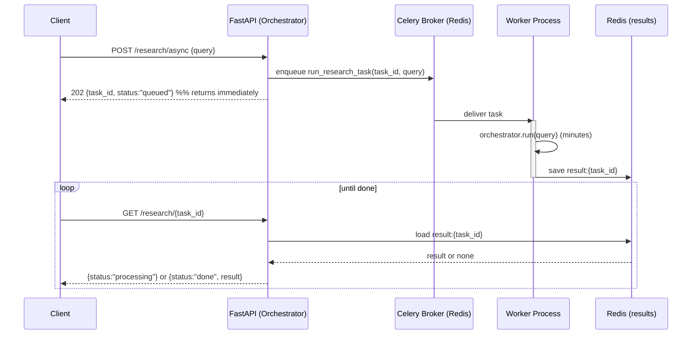

# Phase 11 — Scaling & Architecture · Diagrams

## 1. Enterprise architecture (from the roadmap)

The full n-tier deployment: clients → gateway → stateless app tier → shared state → data →
observability. Note that everything mutable lives in the State/Data layers, never in the app tier.

---

## 2. Async background-task pattern (new — fills the gap)

The architecture diagram shows *where* the queue sits but not *how a long job flows through it*. This
sequence diagram makes the submit-and-poll pattern from §11.3 concrete — the agent equivalent of
Spring `@Async` + a broker, with the client polling for the result instead of blocking.

**How to read it:** the API never holds the request open for the long job — it enqueues and returns a
`task_id` in milliseconds. A worker process (scaled independently of the API tier) runs the agent and
writes the result to Redis. The client polls a lightweight status endpoint until the result appears.
This decoupling is what keeps the API responsive under long-running agent workloads.
