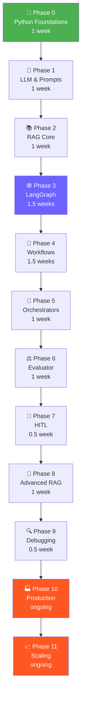

# 🚀 Agentic AI Roadmap — Java Backend Dev → AI Engineer

A structured, deep-dive study folder built from the *Complete Agentic AI Roadmap (0 → Production Engineer)*.
Every phase is expanded with theory, **Java/Spring Boot analogies**, Mermaid diagrams, fresh practice
exercises, curated official resources, and **runnable, production-style Python code**.

> **Who this is for:** an enterprise Java engineer (Spring Boot, microservices, JPA, message queues)
> crossing over into Python + LLM engineering. Wherever a Python idiom appears, you'll find the Java
> mental model right next to it so you're never learning two things at once.

---

## How to use this folder

Work the phases **in order, `00 → 11`**, then build the capstones in `final-projects/`. Each numbered
phase folder is self-contained:

| File | What it gives you |
|------|-------------------|
| `notes.md` | Theory + Java analogies, expanded with a *why-this-matters* intro, a *common Java-dev mistakes* callout, and a *key terms* glossary. |
| `diagrams.md` | Every Mermaid diagram for the phase, **plus one extra** diagram that fills a gap in the prose. |
| `exercises.md` | 4–6 fresh practice problems, easy → hard, each with a one-line hint (no solutions). |
| `resources.md` | 4–8 verified official docs / one quality article or video / one real GitHub repo. |
| `code/` | Each code block as a separate, runnable `.py` file with imports, a `__main__` demo, inline comments, and every `TODO` filled in (mock data clearly marked where an API key is needed). |

**Recommended loop per phase:** read `notes.md` → study `diagrams.md` → run every file in `code/` →
do `exercises.md` → bookmark `resources.md`.

---

## ⏱️ Timeline at a Glance

| Phase | Topic | Folder | Duration |
|-------|-------|--------|----------|
| 0 | Python Foundations | [`00-python-foundations`](./00-python-foundations/notes.md) | 1 week |
| 1 | LLM & Prompt Engineering | [`01-llm-prompt-foundations`](./01-llm-prompt-foundations/notes.md) | 1 week |
| 2 | RAG Core | [`02-rag-core`](./02-rag-core/notes.md) | 1 week |
| 3 | LangGraph Fundamentals | [`03-langgraph-fundamentals`](./03-langgraph-fundamentals/notes.md) | 1.5 weeks |
| 4 | Workflows | [`04-workflows`](./04-workflows/notes.md) | 1.5 weeks |
| 5 | Orchestrators | [`05-orchestrators`](./05-orchestrators/notes.md) | 1 week |
| 6 | Evaluator & Optimizer | [`06-evaluator-optimizer`](./06-evaluator-optimizer/notes.md) | 1 week |
| 7 | Human in the Loop | [`07-human-in-the-loop`](./07-human-in-the-loop/notes.md) | 0.5 week |
| 8 | Advanced RAG | [`08-advanced-rag`](./08-advanced-rag/notes.md) | 1 week |
| 9 | Debugging & Observability | [`09-debugging-observability`](./09-debugging-observability/notes.md) | 0.5 week |
| 10 | Production Engineering | [`10-production-engineering`](./10-production-engineering/notes.md) | ongoing |
| 11 | Scaling & Architecture | [`11-scaling-architecture`](./11-scaling-architecture/notes.md) | ongoing |

**Total: ~10–12 weeks to production-level.**

---

## 🗺️ Full Learning Path



---

## 🔄 Java → Python Quick Reference (Keep This Handy)

| Java | Python | Notes |
|------|--------|-------|
| `SpringBoot @RestController` | `FastAPI router` | Same REST model |
| `@RequestBody` POJO / DTO | `Pydantic BaseModel` | Built-in validation |
| `CompletableFuture<T>` | `async / await` | Nearly identical mental model |
| `ExecutorService.invokeAll()` | `asyncio.gather()` | Run many tasks in parallel |
| `Maven / Gradle` | `pip + requirements.txt` | Or `pyproject.toml` |
| `Interface` | `Protocol` / `ABC` | Duck typing common instead |
| `Stream.map().collect()` | List comprehension `[f(x) for x in xs]` | |
| `Optional<T>` | `T \| None` or `Optional[T]` | Python 3.10+ union syntax |
| `try { } catch (Exception e) { }` | `try: ... except Exception as e:` | |
| `@Slf4j / log.info()` | `import logging; logger.info()` | |
| `HashMap<K,V>` | `dict` | First-class citizen in Python |
| `record` / Lombok `@Data` | `@dataclass` | |
| `spring-statemachine` | `LangGraph StateGraph` | Nodes = states, edges = transitions |
| `Spring Retry @Retryable` | `tenacity` / custom backoff decorator | See Phase 10 |
| `Redis / Spring Session` | `redis-py` + `SessionStore` | See Phase 11 |
| `@Async` + task executor | `Celery` workers | See Phase 11 |

---

## 📦 Global Project Setup

Each phase's `code/` folder ships its own `requirements.txt`, but this is the full superset for the
whole roadmap. Treat the virtual environment like a Maven project scope.

```bash
# 1. Create + activate a virtual environment
python -m venv agentic-env
source agentic-env/bin/activate        # Linux/Mac
# agentic-env\Scripts\activate         # Windows

# 2. Install core dependencies
pip install fastapi uvicorn httpx pydantic python-dotenv
pip install anthropic openai
pip install langchain langchain-community langchain-anthropic langchain-openai
pip install langgraph
pip install chromadb faiss-cpu
pip install langsmith
pip install redis

# 3. Freeze
pip freeze > requirements.txt
```

Create a `.env` file at the project root (**never commit this**):

```bash
ANTHROPIC_API_KEY=sk-ant-...
OPENAI_API_KEY=sk-...
LANGCHAIN_API_KEY=ls__...
LANGCHAIN_TRACING_V2=true
LANGCHAIN_PROJECT=agentic-ai-dev
```

> **Note on models & keys:** the code samples target Anthropic Claude (`claude-sonnet-4-6` as written
> in the source roadmap). Files that need a live API key or external service run against clearly
> labelled **mock/placeholder data** by default, so you can execute them offline and swap in real
> calls when ready.

---

## 🎯 Final Projects

Build these after the phases — they integrate everything. See [`final-projects/`](./final-projects/).

| # | Project | Phases Used | Complexity |
|---|---------|-------------|------------|
| 1 | [Chat with PDF](./final-projects/01-chat-with-pdf/README.md) (FastAPI + RAG) | 0, 1, 2 | ⭐⭐ |
| 2 | [Multi-doc Research Agent](./final-projects/02-research-agent/README.md) | 0–4 | ⭐⭐⭐ |
| 3 | [Blog Generator](./final-projects/03-blog-generator/README.md) (Planner + Writer + Editor) | 0–5 | ⭐⭐⭐ |
| 4 | [Self-correcting RAG API](./final-projects/04-self-correcting-rag/README.md) | 0–6, 8–10 | ⭐⭐⭐⭐ |

---

## 📚 Key Libraries Reference

| Library | Purpose | Command |
|---------|---------|---------|
| `anthropic` | Anthropic Claude API | `pip install anthropic` |
| `openai` | OpenAI GPT API | `pip install openai` |
| `langchain` | LLM chains, RAG, tools | `pip install langchain` |
| `langchain-anthropic` | Anthropic LangChain integration | `pip install langchain-anthropic` |
| `langgraph` | Agent state machines | `pip install langgraph` |
| `chromadb` | Local vector DB | `pip install chromadb` |
| `faiss-cpu` | Fast similarity search | `pip install faiss-cpu` |
| `fastapi` | REST API | `pip install fastapi uvicorn` |
| `pydantic` | Data validation | `pip install pydantic` |
| `httpx` | Async HTTP client | `pip install httpx` |
| `langsmith` | Observability & tracing | `pip install langsmith` |
| `redis` | Session state & cache | `pip install redis` |
| `celery` | Background task queue | `pip install celery` |

---

*Adapted for Java backend developers. Examples use Python + Anthropic Claude + LangChain / LangGraph.*
*Source roadmap: "Complete Agentic AI Roadmap (0 → Production Engineer)."*
