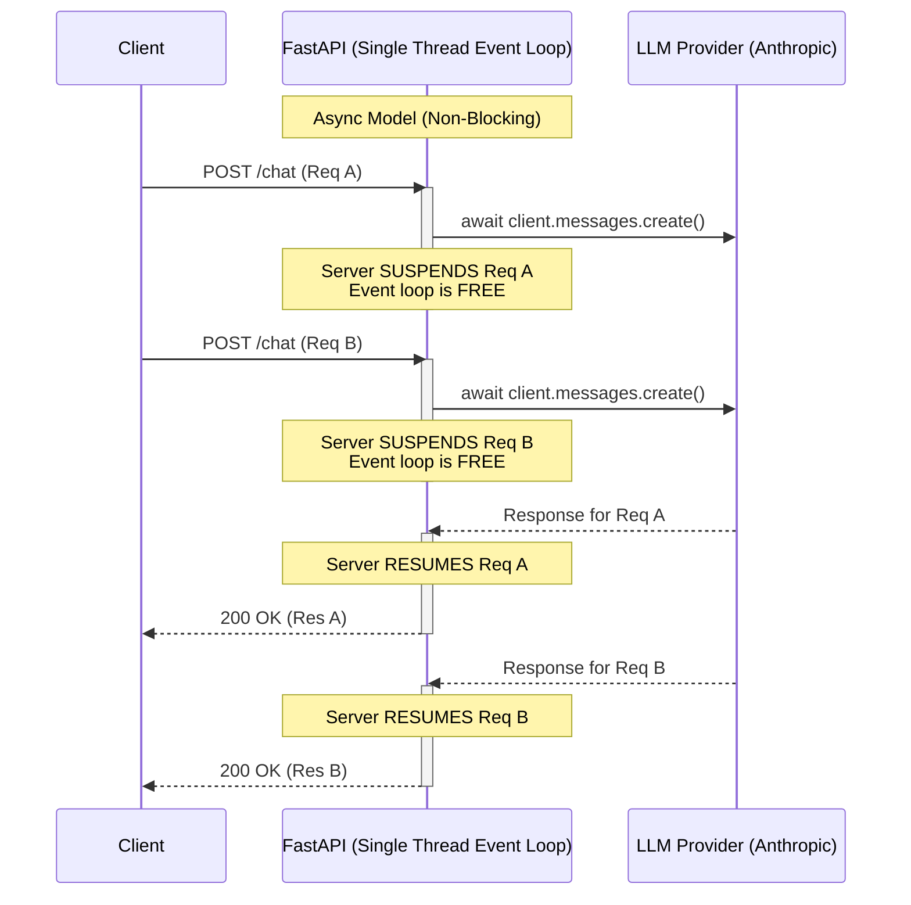

# Phase 00: Python Foundations — Diagrams

Since this phase is foundational, the original markdown did not include a specific Mermaid diagram. However, understanding how Python handles asynchronous I/O compared to Java's traditional thread-per-request model is crucial for an AI Engineer building LLM APIs.

## Async I/O vs. Traditional Threading (FastAPI vs. Spring Boot)

This sequence diagram illustrates the difference between a traditional blocking approach (common in older Java setups without WebFlux) and Python's `asyncio` event loop (used by FastAPI) when making long-running calls to an LLM.

### Why this matters for AI Engineering
When you call an LLM, it can take anywhere from 2 to 30 seconds to generate a response. If your Python server used blocking I/O (like Java's traditional `Thread.sleep` or blocking HTTP calls), a single request would tie up the entire server thread. By using `async / await` with FastAPI and async HTTP clients (`httpx`), the Python process yields control back to the event loop while waiting for the LLM, allowing it to handle thousands of concurrent requests efficiently on a single thread.
