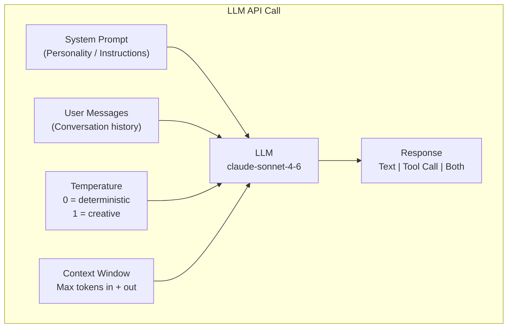
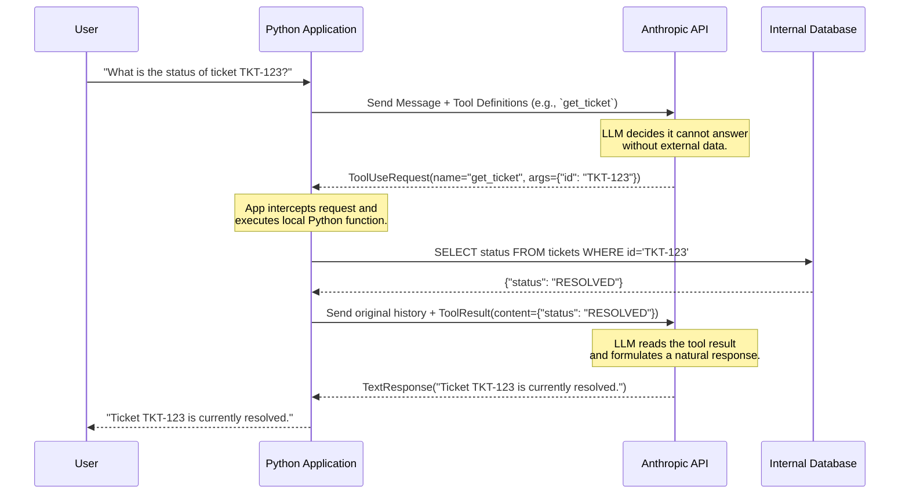

# Phase 01: LLM & Prompt Foundations — Diagrams

## 1. Core Concepts Diagram (Stateless API)
This diagram illustrates the stateless nature of the LLM API. The developer must assemble the full context window on every request.

## 2. Tool Calling (Function Calling) Sequence Diagram
*New diagram added to clarify the complex multi-step process of Tool Calling.*

When an LLM uses a tool, it doesn't execute the code itself. It simply asks your application to run the code on its behalf. This requires a round-trip loop.

### Why this matters for AI Engineering
In enterprise Java, this is conceptually similar to a saga pattern or an orchestration orchestrator (like Netflix Conductor), where the LLM acts as the orchestrator deciding *which* service to call next based on the state, and your Python code acts as the worker executing the task and reporting back.
