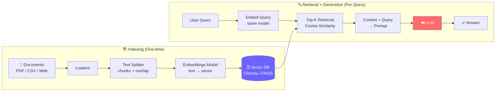
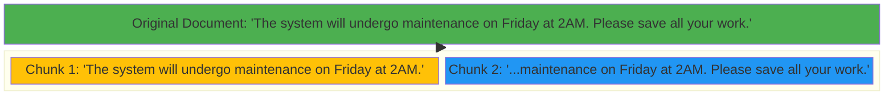

# Phase 02: RAG Core — Diagrams

## 1. RAG Architecture (Ingestion vs Retrieval)
This is the standard architectural diagram for a Retrieval-Augmented Generation system. It highlights the one-time indexing pipeline (ETL) and the real-time query pipeline.

## 2. Text Splitting and Chunk Overlap
*New diagram added to visualize why chunk overlap prevents data loss across boundaries.*

When splitting text, cutting rigidly at 1000 characters might slice a sentence in half, separating a subject from its predicate. Overlap duplicates characters across chunks to preserve context.

### Why this matters for AI Engineering
If a user queries "When is the maintenance?", and the text was split exactly between "maintenance on" and "Friday at 2AM" without overlap, the embeddings for both chunks might score poorly for relevance because the sentence's meaning was destroyed. Overlap (shown in the duplicated phrase "...maintenance on Friday at 2AM.") guarantees that the semantic connection survives in at least one chunk.
