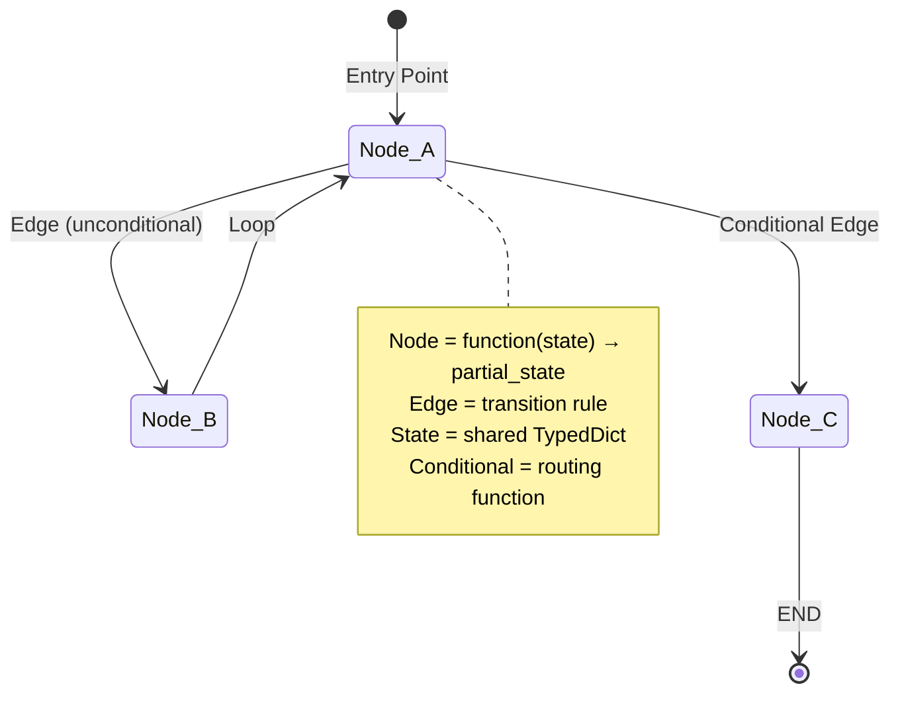
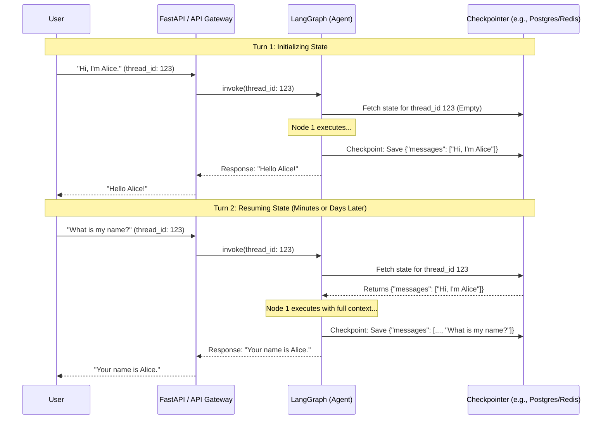

# Phase 03: LangGraph Fundamentals — Diagrams

## 1. LangGraph Mental Model (State Machine)
This diagram illustrates the core architecture of a LangGraph application, acting as a state machine where nodes update a shared state object.

## 2. Checkpointing and State Persistence Flow
*New diagram added to visualize how persistent memory (checkpointing) allows an Agent to remember context across disparate API requests.*

Unlike Java web apps that might hold session state in memory while a user is active, AI Agents often run as stateless cloud functions. LangGraph Checkpointing saves the exact state of the graph after every node, allowing a graph to be "paused" and "resumed" perfectly.

### Why this matters for AI Engineering
In enterprise Java, this is equivalent to Event Sourcing or CQRS. You aren't just saving the final state; the Checkpointer saves a snapshot at *every superstep* (every node execution). This allows for advanced features like "Time Travel" — rewinding an agent to a previous state, fixing a mistake, and letting it run again.
