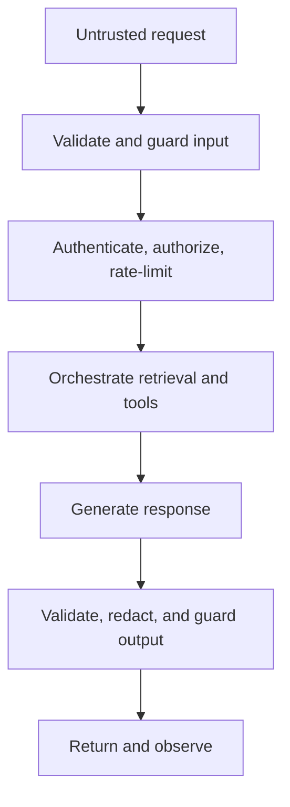
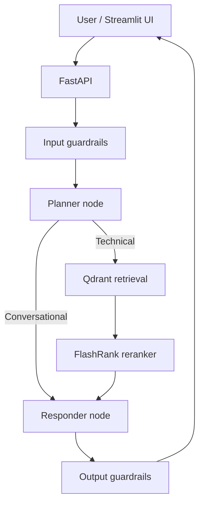
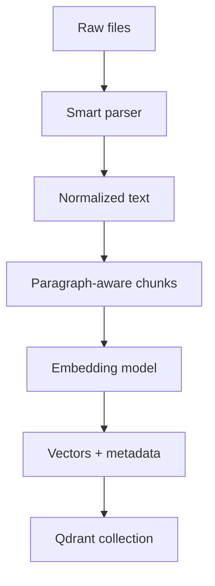
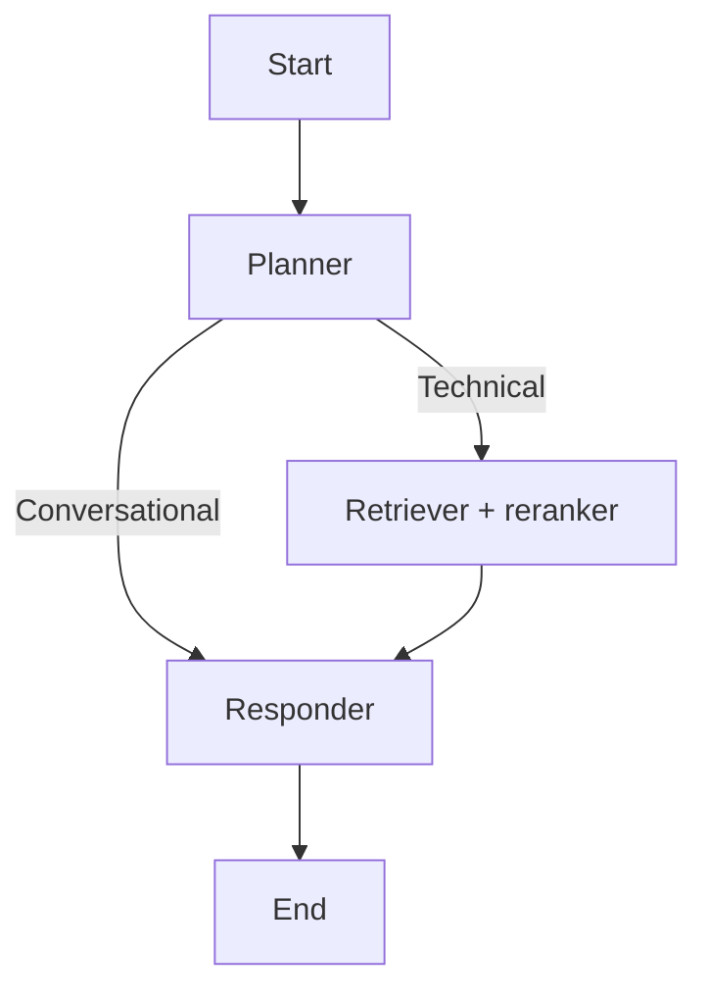
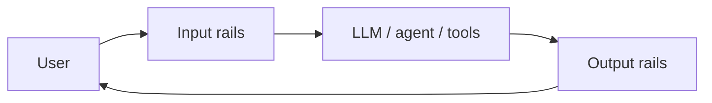
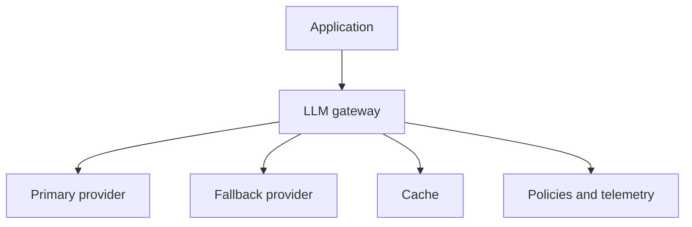

# Enterprise-Grade Agentic RAG: Comprehensive Study Notes

## Lecture Scope and Terminology

These notes reconstruct the technical content of an eight-hour lecture on building a production-oriented, agentic Retrieval-Augmented Generation (RAG) system. The lecture develops a local prototype centered on Kubernetes documentation and covers:

- enterprise architecture and security risks;
- heterogeneous document ingestion;
- chunking, embeddings, and Qdrant indexing;
- semantic retrieval and cross-encoder reranking;
- LangGraph-based planning, retrieval, response generation, and short-term memory;
- a FastAPI service layer;
- Logfire-based observability;
- NeMo Guardrails concepts and demonstrations;
- LLM gateways, routing, fallback, virtual keys, caching, and Portkey.

Formal evaluation implementation, multimodal ingestion, CI/CD, and AWS deployment were announced for a later session and were **not completed in this lecture**. They are therefore listed as future work rather than reconstructed as if they had been demonstrated.

Caption errors have been normalized throughout:

| Captioned term | Correct term |
|---|---|
| Quadrant | **Qdrant** |
| Grog/Grock | **Groq** |
| Log file | **Logfire** |
| Flash rank | **FlashRank** |
| Gina | **Jina AI** |
| Langraph | **LangGraph** |
| Kolang | **Colang** |
| Pipe lumber | **pdfplumber** |
| Pi PDF | **pypdf** |

> **RAG** is an architecture in which relevant external knowledge is retrieved at query time and supplied to a language model as context, allowing the model to answer using information that may be private, proprietary, or newer than its pretraining data.

---

# 1. Why an Enterprise-Grade AI Application Is Different

## 1.1 Prototype architecture versus production architecture

A minimal generative-AI application has a short request path:


For a demonstration, it may be sufficient to call an LLM API directly. A production system must additionally manage trust boundaries, sensitive data, unpredictable behavior, external tools, failures, costs, governance, and operational visibility.

The lecture's expanded architecture contains the following logical layers:

1. **Users and channels**
   - Web or desktop applications
   - Slack or Microsoft Teams
   - API clients
   - Other conversational interfaces
2. **API and session boundary**
   - Authentication and authorization
   - Session management
   - Rate limiting and quotas
   - Request schema validation
3. **Input guardrails**
   - Prompt-injection and jailbreak detection
   - Personally identifiable information (PII) detection
   - Toxicity, hate, or abuse detection
   - Topic, policy, and compliance checks
   - Context sanitization
4. **Orchestration layer**
   - Planner or router
   - Retrieval tools
   - Reasoning and response nodes
   - Memory management
   - Output formatting and streaming
5. **Tool and integration layer**
   - Search engines and databases
   - REST APIs and web services
   - CRM and enterprise systems
   - Sandboxed code execution
   - S3, Google Cloud Storage, or Azure Blob Storage
   - Email, messaging, and notification systems
6. **LLM gateway**
   - Model routing and load balancing
   - Provider fallback and failover
   - Quotas and rate limits
   - Caching and cost control
   - Model and API-key abstraction
   - Audit logs and policy enforcement
7. **Output guardrails**
   - Harmful-content checks
   - Secret or PII masking
   - Hallucination and factuality checks
   - Policy validation
   - Safe refusal or fallback response
8. **Observability and evaluation**
   - Traces, spans, logs, latency, errors, and token use
   - Retrieval and generation quality metrics
9. **Security and governance**
   - Encryption
   - Secret management
   - Network isolation
   - Access control
   - Human-in-the-loop approval where appropriate

## 1.2 Major risk categories

### Untrusted input

Users can provide malicious prompts, manipulated files, hidden instructions, or sensitive values such as credit-card numbers, driver's-license identifiers, access tokens, or proprietary source code. The system must treat input as untrusted even when it looks conversational.

### Unpredictable output

An LLM is probabilistic rather than a deterministic rules engine. It can hallucinate, provide dangerous advice, reveal secrets from retrieved context, or generate a response that violates organizational policy. High-stakes domains such as healthcare, finance, security, and mental health require especially strict controls.

### Data leakage

Leakage may occur through:

- prompts sent to third-party model providers;
- over-broad vector-store access;
- retrieval of a document belonging to another tenant;
- logs or traces that retain secrets;
- an LLM being tricked into exposing system prompts or hidden context.

### Insecure tool integration

An agent may call APIs, execute code, update records, or trigger notifications. If tool permissions are broad or tool parameters are not validated, a prompt injection can become an actual side effect. The lecture cited public incidents in which agents performed unintended destructive actions and poorly protected vector data was exposed.

### Compliance and legal risk

Enterprise systems must respect privacy laws, emerging AI regulation, industry rules, data-retention constraints, and internal governance. It is insufficient for a model merely to produce a plausible answer.

### Lack of visibility

Without structured logging, tracing, and monitoring, teams cannot reliably answer:

- Which prompt, model, tool, and retrieved documents produced this answer?
- How many tokens and how much latency did the request consume?
- Was a guardrail activated?
- Did retrieval or reranking fail?
- Which provider or fallback model served the request?

## 1.3 Security by design

Security should be inserted at multiple boundaries rather than added only after generation:



The lecture's central production principle is that **no single model call is a sufficient safety boundary**. Guardrails, gateway policies, access control, observability, evaluation, and infrastructure security address different failure modes.

## Key Takeaways

- A working chatbot is not automatically a production-ready AI system.
- Inputs, retrieved context, model outputs, tools, and logs all create separate attack surfaces.
- Input and output validation must surround the model call.
- Gateways, observability, evaluation, and governance are first-class architectural layers.
- Production readiness is a system property, not a property of the LLM alone.

---

# 2. Target System and End-to-End Flow

## 2.1 Use case

The implemented assistant is a technical enterprise assistant whose knowledge base focuses primarily on **Kubernetes**, enterprise networking, and related infrastructure material. It should:

- answer ordinary conversational messages without unnecessarily searching the knowledge base;
- retrieve documentation for technical queries;
- rerank the retrieved candidates;
- generate a grounded answer;
- preserve conversational state by session;
- expose the workflow through FastAPI;
- trace internal stages;
- demonstrate security and gateway controls.

## 2.2 Runtime request flow



The planner is deliberately narrow. It classifies a request into one of two routes:

- **conversational**: answer from conversation history without retrieving documents;
- **technical**: formulate or retain a search query, retrieve candidate passages, rerank them, and answer using the resulting context.

## 2.3 Offline ingestion flow



The source corpus is intentionally split for demonstration:

- **true data**: material relevant to the assistant's Kubernetes use case;
- **noisy data**: unrelated material used to show why retrieval and reranking quality matter.

In a normal production repository, relevant and noisy documents need not be placed in folders literally named `true_data` and `noisy_data`; that split was pedagogical.

## 2.4 Local MVP and intended cloud version

The local implementation favors accessible or free components for rapid validation:

| Layer | Local prototype | Announced production direction |
|---|---|---|
| LLM | Groq-hosted model | Provider/model selected through a gateway |
| Embeddings | Gemini, local SentenceTransformer fallback | Jina embeddings were proposed |
| Reranking | FlashRank | Jina reranker was proposed |
| Vector database | Qdrant Cloud | Qdrant integrated with AWS architecture |
| Memory | LangGraph `MemorySaver` | Durable memory service or database |
| Observability | Logfire | Continue with production telemetry and dashboards |
| API | FastAPI/Uvicorn | Containerized cloud service |
| Deployment | Not completed | AWS ECS with Fargate, autoscaling, and CI/CD were announced |

The methodology is to prove the architecture locally, establish interfaces, and then replace components without rewriting the whole system.

## Key Takeaways

- The system has two distinct pipelines: offline ingestion and online query processing.
- Agentic routing prevents every message from triggering retrieval.
- Retrieval quality is improved by reranking candidates before generation.
- Local components are an MVP; stable interfaces make later upgrades possible.
- Evaluation and deployment belong to Part 2, not the completed Part 1 implementation.

---

# 3. RAG Foundations

## 3.1 Why RAG is needed

A plain LLM call uses only the information encoded during training plus the immediate prompt. It does not automatically know private organizational documentation, recent meeting notes, internal policies, proprietary reports, or rapidly changing API documentation.

RAG adds external context at inference time:

$$
q \xrightarrow{\text{retrieve}} C_q = \{c_1,c_2,\ldots,c_k\}
$$

$$
y = \operatorname{LLM}(\text{instructions}, q, C_q, H)
$$

where:

- $q$ is the user's query;
- $C_q$ is the retrieved context;
- $H$ is conversation history;
- $y$ is the generated answer.

RAG is therefore an efficient mechanism for supplying relevant context, not a method for modifying the LLM's weights.

## 3.2 The two RAG flows

Every conventional vector-based RAG system has two major flows.

### Data injection or indexing

1. Load raw documents.
2. Parse each format into normalized text.
3. Divide the text into chunks.
4. Embed each chunk.
5. Store its vector, text, source, and metadata in a vector database.

### Retrieval and generation

1. Receive query $q$.
2. Embed $q$ using the same compatible embedding space used for the documents.
3. Search for nearest document vectors.
4. Optionally apply keyword/hybrid search and metadata filters.
5. Rerank candidates with a stronger pairwise model.
6. Give the top passages to the LLM.
7. Generate and validate the answer.

## 3.3 Embeddings

> An **embedding** is a numerical representation of an object—here, text—constructed so that semantically similar objects occupy nearby positions in a vector space.

An embedding model is a function:

$$
f: \mathcal{X} \rightarrow \mathbb{R}^{d}
$$

For a chunk $c$, the vector is:

$$
\mathbf{v}_c = f(c) = [v_1,v_2,\ldots,v_d]
$$

The lecture illustrated this with a two-dimensional space in which *dog*, *cat*, *tiger*, and *rhino* would cluster, whereas *MacBook* and *Lenovo* would form a different semantic region. Real embedding spaces use hundreds or thousands of dimensions.

### Cosine similarity

The demonstrated Qdrant collection uses cosine similarity:

$$
\operatorname{cos}(\mathbf{q},\mathbf{d}) =
\frac{\mathbf{q}\cdot\mathbf{d}}
{\|\mathbf{q}\|_2\|\mathbf{d}\|_2}
$$

Higher cosine similarity generally indicates stronger semantic alignment.

### Embedding-model selection

The lecture recommends consulting the **MTEB leaderboard** rather than selecting a model only by popularity. Relevant factors include:

- retrieval performance for the target task and language;
- multilingual or domain-specific capability;
- vector dimension;
- parameter count and inference latency;
- maximum input length;
- hosting cost and rate limits;
- license and data-governance requirements.

A larger embedding dimension can preserve more representational detail, but it increases storage, network, and search costs. Modern models may support **Matryoshka Representation Learning (MRL)**, allowing useful prefixes of the full embedding at several dimensions.

### Critical compatibility rule

Document and query vectors must belong to a compatible space and have the same dimension:

$$
\mathbf{q}, \mathbf{d} \in \mathbb{R}^{d}
$$

Cosine similarity is not defined between vectors in $\mathbb{R}^{768}$ and $\mathbb{R}^{3072}$ without an explicit learned or engineered mapping. Even equal-dimensional vectors produced by different models are generally not semantically aligned.

The prototype discussed:

- a Gemini embedding with dimension `3072`;
- `sentence-transformers/all-mpnet-base-v2` as a local fallback with dimension `768`.

This is a major caveat in the lecture's sample fallback design. The instructor later clarified that **mixing these outputs in one collection is not good practice**. A safe production strategy is one of:

1. retry the same embedding provider with exponential backoff;
2. use a second endpoint serving the exact same model and dimension;
3. abort the indexing job and resume later;
4. write fallback embeddings to a separate collection and query with that same model;
5. re-embed the entire collection when upgrading models.

Padding a 768-dimensional vector to 3072 dimensions merely makes shapes equal; it does not make the semantic spaces compatible.

## 3.4 Chunking

> **Chunking** divides a document into smaller retrievable units so an embedding represents a focused semantic region and the LLM receives only relevant context.

Important parameters are:

- **chunk size**: maximum amount of text in a chunk;
- **chunk overlap**: material repeated between adjacent chunks to reduce loss of boundary context.

The demonstrated splitter is “semantic-ish,” not a learned semantic splitter. It separates paragraphs on blank lines and groups paragraphs until a character-size threshold (shown as approximately `1500`) would be exceeded. The implementation shown did **not** include overlap, though the lecture had earlier explained why overlap is often useful.

```python
def chunk_text(text: str, chunk_size: int = 1500) -> list[str]:
    if not text.strip():
        return []

    paragraphs = [p.strip() for p in text.split("\n\n") if p.strip()]
    chunks: list[str] = []
    current = ""

    for paragraph in paragraphs:
        candidate = f"{current}\n\n{paragraph}".strip()
        if len(candidate) <= chunk_size:
            current = candidate
        else:
            if current:
                chunks.append(current)
            current = paragraph

    if current:
        chunks.append(current)
    return chunks
```

There is no universally optimal chunk size. The lecture recommends experimenting on a representative subset and measuring retrieval quality. In enterprise documents containing tables, figures, and layout, the stated preference order was roughly:

1. layout-aware or context-aware chunking;
2. semantic chunking;
3. simple fixed-size or paragraph grouping as a baseline.

Docling was mentioned as a useful parser with a hybrid chunker. For images, charts, and tables, layout detection, bounding boxes, OCR, and multimodal embeddings/rerankers are required; these were deferred.

## 3.5 Dense, sparse, hybrid, and alternative retrieval

### Dense semantic retrieval

Dense retrieval embeds the query and chunks into vectors and ranks by a vector-distance measure. It is good at semantic paraphrases but can miss exact identifiers or rare keywords.

### Sparse retrieval and BM25

BM25 was introduced as a common sparse retrieval method. A standard form is:

$$
\operatorname{BM25}(q,d)=
\sum_{t\in q}
\operatorname{IDF}(t)
\frac{f(t,d)(k_1+1)}
{f(t,d)+k_1\left(1-b+b\frac{|d|}{\operatorname{avgdl}}\right)}
$$

where $f(t,d)$ is term frequency, $|d|$ is document length, and $k_1,b$ tune saturation and length normalization.

### Hybrid retrieval

Hybrid RAG combines sparse and dense evidence, commonly using BM25 plus embeddings. The lecture also mentioned broader combinations involving graph retrieval. Qdrant supports sparse vectors and hybrid search; production selection should be driven by exact retrieval operations, filters, scale, and latency requirements.

### Other approaches mentioned

- **Graph RAG** for highly relational knowledge.
- **Vectorless RAG** or document-level late-interaction approaches for some use cases.
- **ColPali-style document retrieval**, which can embed document pages more directly but generally requires GPU resources.
- Domain-specific embedding models or fine-tuned embedding models, especially for legal corpora.

## Key Takeaways

- RAG supplies external context; it does not retrain the LLM.
- Ingestion and retrieval are distinct flows that must use a compatible embedding space.
- Chunk size and strategy are empirical choices, not universal constants.
- Dense search captures meaning; sparse search protects exact lexical matches.
- Never silently mix unrelated embedding models or dimensions in one search space.

---

# 4. Project Setup and Modular Structure

## 4.1 Environment

The lecture uses Python `3.11` and the `uv` package manager. A dependency conflict occurred when a different Python version was selected, reinforcing the value of pinning the runtime.

```bash
uv python install 3.11
uv venv --python 3.11
source .venv/bin/activate
uv pip install -r requirements.txt
```

The dependency groups discussed include:

- `fastapi` and `uvicorn` for the service layer;
- `python-dotenv` for environment variables;
- Google Generative AI / LangChain Google integration for embeddings;
- `sentence-transformers` for a local embedding model;
- `qdrant-client` for vector storage;
- `pypdf` and `pdfplumber` for PDFs;
- `beautifulsoup4` for HTML;
- DOCX/PPTX or `unstructured` tooling for office formats;
- `langgraph` and Groq integration for orchestration and generation;
- `flashrank` for reranking;
- `logfire` for tracing and observability.

## 4.2 Configuration and secrets

Secrets are placed in `.env`; nonsecret configuration may be centralized in `config.py`.

Representative variables:

```dotenv
GROQ_API_KEY=...
GROQ_FALLBACK_API_KEY=...
GEMINI_API_KEY=...
QDRANT_URL=...
QDRANT_API_KEY=...
```

Representative settings object:

```python
import os
from dotenv import load_dotenv

load_dotenv()

class Settings:
    GEMINI_API_KEY = os.getenv("GEMINI_API_KEY")
    QDRANT_URL = os.getenv("QDRANT_URL")
    QDRANT_API_KEY = os.getenv("QDRANT_API_KEY")
    QDRANT_COLLECTION = "enterprise_rag"
    GROQ_API_KEY = os.getenv("GROQ_API_KEY")
    GROQ_FALLBACK_API_KEY = os.getenv("GROQ_FALLBACK_API_KEY")
    GROQ_MODEL = os.getenv("GROQ_MODEL", "configured-model")

settings = Settings()
```

The collection name was static in the demonstration, though it may also be externalized. Production systems should use a managed secret store rather than treating `.env` as the final secret-management solution.

## 4.3 Module organization

The lecture builds a structure resembling:

```text
project/
├── .env
├── requirements.txt
├── data/
│   ├── true_data/
│   └── noisy_data/
├── processed_data/
└── app/
    ├── __init__.py
    ├── config.py
    ├── main.py
    ├── agents/
    │   ├── state.py
    │   ├── planner.py
    │   ├── retriever.py
    │   ├── responder.py
    │   └── graph.py
    ├── injection/
    │   ├── processor.py
    │   ├── chunking/
    │   │   └── splitter.py
    │   └── loaders/
    │       ├── html.py
    │       ├── office.py
    │       ├── pdf.py
    │       └── text.py
    └── services/
        └── retrieval/
            ├── embeddings.py
            ├── qdrant_service.py
            └── reranker.py
```

The main separation of responsibilities is:

- loaders know how to parse one file type;
- the splitter only chunks normalized text;
- the embedding service owns model initialization and embedding calls;
- the processor orchestrates parsing, chunking, metadata, embedding, and indexing;
- retrieval services own vector search and reranking;
- agent nodes decide what to do with a request;
- FastAPI exposes the graph to clients.

## Key Takeaways

- Pin the Python version to make the environment reproducible.
- Keep secrets outside source files and centralize configuration access.
- Separate parsing, chunking, embedding, storage, orchestration, and API concerns.
- Modular boundaries make provider/model replacement easier during production hardening.

---

# 5. Heterogeneous Document Ingestion

## 5.1 Smart parser

Different formats require different extraction strategies. The “smart parser” is deterministic routing code—not an LLM orchestrator. It inspects the extension and selects a loader.

```python
def parse_file(path: str) -> str:
    suffix = Path(path).suffix.lower()
    if suffix == ".pdf":
        return parse_pdf(path)
    if suffix in {".html", ".htm"}:
        return parse_html(path)
    if suffix in {".txt", ".md"}:
        return parse_text(path)
    if suffix in {".docx", ".pptx"}:
        return parse_office(path)
    raise ValueError(f"Unsupported file type: {suffix}")
```

Unsupported types and empty extraction results are skipped or reported rather than indexed as empty vectors.

## 5.2 Text loader

Plain text is read directly using a known encoding. Production code should handle encoding detection or controlled fallbacks rather than assuming every file is UTF-8.

## 5.3 HTML loader

The HTML path:

1. reads the file;
2. parses it with Beautiful Soup;
3. removes irrelevant markup such as scripts/styles where appropriate;
4. extracts visible text;
5. normalizes excess whitespace.

The goal is clean content, not an HTML dump polluted by navigation and executable markup.

## 5.4 PDF loader with fallback

The PDF loader first uses `pypdf` page by page. If a page yields no text, it falls back to `pdfplumber` for that page or document. This illustrates a production-minded pattern:

```pseudocode
open PDF with primary parser
for each page:
    text = primary.extract(page)
    if text is blank:
        text = fallback.extract(page)
    append nonblank text
return joined text
```

This is still insufficient for scanned PDFs, images, charts, or complex tables. Such files require OCR and layout-aware extraction. The lecture explicitly deferred multimodal ingestion.

## 5.5 Office loader

Office parsing detects `.docx` versus `.pptx` and uses the relevant library or unstructured-document tooling. The common contract is that every loader returns normalized text, allowing downstream chunking to remain file-format agnostic.

## 5.6 Metadata and versioning

Each indexed point retains metadata such as:

- source filename;
- source type or source directory;
- original chunk text;
- chunk identifier;
- optionally document version, timestamp, tenant, section, or page number.

> **Metadata** is data describing the indexed content. It enables source citation, filtering, deletion, tenant isolation, debugging, and incremental updates.

For changing documents, the lecture correctly frames the solution as version-aware software engineering:

1. detect which document version changed;
2. add embeddings for newly added chunks;
3. delete or replace embeddings for removed/modified chunks;
4. preserve a stable document identifier in metadata;
5. avoid blindly duplicating the whole document on every update.

## Key Takeaways

- Normalize heterogeneous files behind a common loader contract.
- Use parser fallbacks and explicit exception handling.
- Text extraction alone does not solve scanned or layout-heavy documents.
- Rich metadata is essential for traceability, filtering, deletion, and updates.
- Document synchronization is primarily a versioning problem, not an LLM problem.

---

# 6. Embedding, Indexing, and Qdrant

## 6.1 Embedding service responsibilities

The lecture's embedding module contains:

- a health probe for the Gemini embedding endpoint;
- lazy initialization of the selected model;
- local SentenceTransformer loading;
- active-model and model-type state;
- embedding dimension lookup;
- batch embedding;
- retry with exponential delay;
- a single-query embedding helper for online retrieval;
- Logfire spans around batches.

Constants shown included approximately:

```python
BATCH_SIZE = 50
GEMINI_DIMENSION = 3072
FALLBACK_DIMENSION = 768
FALLBACK_MODEL = "sentence-transformers/all-mpnet-base-v2"
```

## 6.2 Retry and backoff

Transient provider failures should be retried, but retries must be bounded. A standard exponential backoff is:

$$
t_n = \min(t_{\max}, t_0 2^n) + \epsilon
$$

where $\epsilon$ is random jitter that prevents synchronized clients from retrying together.

```python
def embed_with_retry(batch: list[str], attempts: int = 4):
    for attempt in range(attempts):
        try:
            return primary_model.embed_documents(batch)
        except RateLimitError:
            if attempt == attempts - 1:
                raise
            delay = min(30, 2 ** attempt) + random.random()
            time.sleep(delay)
```

The demonstrated code discussed switching to another model after repeated failure. As emphasized earlier, this is safe only when the fallback produces a compatible vector space or writes to a separate collection.

## 6.3 Batch embedding

For texts $[c_1,\ldots,c_N]$, process batches rather than one network request per chunk:

```python
def embed_texts(texts: list[str], batch_size: int = 50) -> list[list[float]]:
    output = []
    for start in range(0, len(texts), batch_size):
        batch = texts[start:start + batch_size]
        with logfire.span("embed_batch", size=len(batch)):
            output.extend(embed_with_retry(batch))
    return output
```

Batching reduces request overhead but must respect provider limits on requests, tokens, and input size.

## 6.4 Qdrant concepts

Qdrant Cloud setup returns:

- cluster endpoint/URL;
- API key.

A **collection** is analogous to a table, but its records are vector points. Each point contains:

- a unique `id`;
- a `vector`;
- a `payload` containing text and metadata.

```python
PointStruct(
    id=str(uuid.uuid4()),
    vector=embedding,
    payload={
        "text": chunk,
        "file_name": file_name,
        "source_type": source_type,
    },
)
```

Before indexing, create the collection if it does not exist using the active vector dimension and cosine distance.

```python
VectorParams(size=embedding_dimension, distance=Distance.COSINE)
```

The processor then uses an upsert operation to insert or update points.

## 6.5 Processor orchestration

The core per-file sequence is:

```pseudocode
function process_file(path, source_type):
    begin trace span
    text = select_loader_by_extension(path)
    if text is empty: skip with warning

    chunks = chunk_text(text)
    processed = {
        file_name,
        source_type,
        chunks
    }
    save processed JSON locally

    embeddings = embed_texts(chunks)
    points = []
    for each (chunk, embedding):
        points.append(Point(id, embedding, metadata))

    qdrant.upsert(collection, points)
    record counts and status
```

The processor also supports directory traversal and a universal injection entry point that:

1. discovers source subdirectories;
2. labels source types;
3. creates the collection if needed;
4. processes every supported file;
5. saves normalized chunks locally for inspection;
6. traces each stage.

## 6.6 Production considerations absent from the baseline

The lecture's baseline is educational. A hardened ingestion service should additionally support:

- idempotent document/chunk IDs rather than random IDs for every run;
- checksum-based change detection;
- asynchronous jobs and retry queues;
- dead-letter handling;
- per-document transaction/status records;
- tenant and ACL metadata;
- deletion and reindex workflows;
- rate-limit-aware concurrency;
- embedding-model version stored with every point;
- evaluation before promoting a new index.

## Key Takeaways

- Batch embeddings and bounded retries improve reliability and cost.
- A Qdrant point is a vector plus payload metadata and an ID.
- The collection dimension must match every inserted and queried vector.
- The processor coordinates loaders, chunks, local artifacts, vectors, and upserts.
- Production ingestion needs idempotency, versioning, access metadata, and resumability.

---

# 7. Retrieval and Reranking

## 7.1 Semantic retrieval

At query time:

1. embed the user query;
2. search Qdrant for the nearest vectors;
3. retrieve a deliberately broad candidate set (the demonstration used `15`);
4. rerank candidates;
5. retain the best subset (the demonstration used the top `5`).

```pseudocode
query_vector = embed_query(query)
candidates = qdrant.search(query_vector, limit=15)
reranked = rerank(query, candidates)
context = top(reranked, 5)
```

Vector search may return relevant chunks in an imperfect order or interleave noisy passages. Retrieval maximizes candidate recall; reranking improves precision near the top.

## 7.2 Bi-encoder versus cross-encoder

### Bi-encoder retrieval

The query and each document are embedded independently:

$$
\mathbf{q}=f(q),\qquad \mathbf{d}_i=f(d_i)
$$

Then a cheap similarity function compares them. Document embeddings can be precomputed, so this scales well.

### Cross-encoder reranking

A cross-encoder scores the query and document together:

$$
s_i = g([q;d_i])
$$

Because the model jointly attends to both inputs, it can capture fine-grained relevance better than comparing two independently produced vectors. However, it must run once per candidate and is too expensive for the entire corpus.

This leads to the standard two-stage design:


## 7.3 FlashRank service

The local implementation installs FlashRank and creates a reusable ranker. A rerank request includes the query and candidate passages. Results are returned in descending relevance order.

```python
from flashrank import Ranker, RerankRequest

ranker = Ranker()

def rerank_documents(query: str, documents: list[dict], top_n: int = 5):
    passages = [
        {"id": str(i), "text": d["text"], "meta": d.get("metadata", {})}
        for i, d in enumerate(documents)
    ]
    results = ranker.rerank(RerankRequest(query=query, passages=passages))
    return results[:top_n]
```

The lecture proposes Jina's reranker as a later production replacement. The interface—query plus passages returning ranked passages—should remain stable.

## 7.4 Retrieval quality and noisy data

Noisy data exposes several weaknesses:

- embeddings may consider a tangential passage semantically similar;
- a large chunk may contain one relevant sentence and much irrelevant content;
- missing metadata filters may cross domains or tenants;
- poor parsing or chunk boundaries may destroy meaning;
- an irrelevant top chunk can mislead generation.

Mitigations include:

- better chunking;
- sparse+dense hybrid retrieval;
- metadata/ACL filtering;
- stronger embeddings;
- cross-encoder reranking;
- query rewriting;
- relevance thresholds and abstention;
- retrieval evaluation on labeled queries.

## Key Takeaways

- First-stage retrieval and reranking solve different optimization problems.
- Bi-encoders enable scalable search; cross-encoders improve top-result ordering.
- Fetch more candidates than the number ultimately placed in the prompt.
- Noisy or poorly structured corpora require filters, hybrid search, and evaluation—not just a larger LLM.

---

# 8. Agentic Orchestration with LangGraph

## 8.1 What “agentic” means in this system

Traditional software hard-codes the order of function calls. An agentic system allows a model-assisted decision to select the next node or tool. The functions still exist, but routing is conditional on state and model output.

In this lecture, “agentic” does not mean unrestricted autonomy. It means a constrained graph with three nodes:

1. planner;
2. retriever;
3. responder.

## 8.2 Agent state

> **State** is the structured information passed between nodes so the graph knows the conversation, current query, route, retrieved documents, status, and final output.

The lecture identifies four message types:

- **Human message**: user input;
- **AI message**: assistant output;
- **System message**: internal behavior/instruction prompt;
- **Tool message**: information returned by Qdrant or another tool.

A representative state is:

```python
class AgentState(TypedDict, total=False):
    messages: Annotated[list[BaseMessage], add_messages]
    current_query: str
    documents: list[dict]
    plan: str
    status: str
    intent: str
    final_answer: str
```

The exact fields in the lecture included messages, current query, documents, plan, status/intent, and final answer.

## 8.3 Planner node

The planner reads conversation history and the latest message. It emits a tightly constrained result:

- `conversational`; or
- a technical/search route (the lecture alternately describes the output as `technical` or a search query).

Conceptual prompt:

```text
Analyze the conversation history and latest user message.
If no enterprise-knowledge search is required, output only: conversational
Otherwise output the technical search query.
Do not add explanation.
```

The node records the decision and current status in Logfire. A narrow output schema matters: free-form planner prose makes routing brittle. Production code should use structured output or an enum rather than parsing arbitrary text.

## 8.4 Retriever node

The retriever is a deterministic tool node:

1. reads the technical query from state;
2. embeds it;
3. searches Qdrant for up to 15 candidates;
4. converts result payloads into document objects;
5. invokes FlashRank;
6. stores the top five documents in state;
7. updates status/plan fields.

The retriever is not itself an LLM. It is Python code called because the planner chose the technical branch.

## 8.5 Responder node

The responder has two prompt modes.

### Conversational mode

- role: friendly enterprise assistant;
- input: conversation history and latest user message;
- knowledge-base search: skipped;
- goal: reply naturally while preserving continuity.

### Technical mode

- role: senior technical architect;
- input: user query plus reranked documentation context;
- goal: answer from supplied technical evidence.

The generated answer, status, plan, and messages are written back to state.

## 8.6 Graph construction

```python
workflow = StateGraph(AgentState)
workflow.add_node("planner", planner_node)
workflow.add_node("retriever", retriever_node)
workflow.add_node("responder", responder_node)

workflow.set_entry_point("planner")
workflow.add_conditional_edges(
    "planner",
    route_planner,
    {
        "conversational": "responder",
        "technical": "retriever",
    },
)
workflow.add_edge("retriever", "responder")
workflow.add_edge("responder", END)

rag_agent = workflow.compile(checkpointer=MemorySaver())
```

The graph topology is:



## 8.7 Agentic design cautions

- The planner can misclassify a query; evaluate routing accuracy separately.
- A conversational query might still require factual retrieval.
- Query rewriting should not change critical identifiers, dates, quantities, or negations.
- Tool nodes need schemas, timeouts, authorization, and least privilege.
- The LLM should not decide access control; ACL filters must be deterministic.
- State may contain sensitive material and must follow retention rules.

## Key Takeaways

- Agentic behavior here is constrained conditional routing, not unlimited autonomy.
- Shared state carries messages, route decisions, documents, and output between nodes.
- The planner decides whether retrieval is needed; the retriever remains deterministic code.
- LangGraph makes nodes and conditional edges explicit and observable.
- Structured planner outputs and deterministic security checks are essential in production.

---

# 9. Conversation Memory

## 9.1 Local memory with `MemorySaver`

LangGraph's `MemorySaver` is used as a local checkpointer. It retains the sequence of user and assistant messages for a thread, enabling follow-up questions such as “What was my previous question?”

Each invocation includes a configurable `thread_id`:

```python
config = {"configurable": {"thread_id": request.thread_id}}
result = rag_agent.invoke(initial_state, config=config)
```

The thread ID is analogous to a chat/session identifier in a hosted assistant interface.

## 9.2 Memory types mentioned

The lecture distinguishes simple conversational memory from richer forms:

- **conversation/buffer memory**: chronological recent messages;
- **token-limited memory**: retains history within a token budget;
- **episodic memory**: past events or interactions;
- **semantic memory**: persistent facts and concepts about users or tasks;
- **procedural memory**: learned instructions, habits, or procedures.

`MemorySaver` is used only to prove that local continuity works. Long conversations can exceed the model context or lose early details.

## 9.3 Production memory options

The lecture names Mem0, LangMem, and Neo4j/graph storage as examples for durable memory. A production memory design must decide:

- what is stored;
- how it is summarized;
- how long it is retained;
- which user owns it;
- how it is encrypted and deleted;
- whether facts require user confirmation;
- how irrelevant or stale memories are prevented from contaminating answers.

## Key Takeaways

- A thread ID isolates conversational state for a session.
- `MemorySaver` is suitable for local validation, not durable multi-instance production.
- “Memory” includes several distinct mechanisms; conversation history is only the simplest.
- Persistent memory requires privacy, retention, ownership, and stale-data policies.

---

# 10. FastAPI Service Layer

## 10.1 Why expose the graph as an API

The LangGraph workflow is a Python object. A frontend or another service needs a stable network contract to invoke it. FastAPI wraps the graph with request validation and routes.

The demonstration creates three endpoints:

- `GET /` — health/home message;
- `GET /graph` — inspect or render the graph topology;
- `POST /query` — execute the RAG graph with a query and thread ID.

FastAPI automatically exposes interactive OpenAPI/Swagger documentation at `/docs`.

## 10.2 Request schema

```python
from pydantic import BaseModel

class QueryRequest(BaseModel):
    query: str
    thread_id: str
```

Production schemas should also constrain maximum length and reject blank input.

## 10.3 Query endpoint

```python
@app.post("/query")
def query(request: QueryRequest):
    initial_state = {
        "messages": [HumanMessage(content=request.query)],
        "current_query": request.query,
        "documents": [],
        "plan": "",
        "status": "initializing",
    }
    config = {"configurable": {"thread_id": request.thread_id}}
    result = rag_agent.invoke(initial_state, config=config)
    return {
        "question": request.query,
        "answer": result.get("final_answer"),
        "route": result.get("plan"),
        "status": result.get("status"),
        "sources": result.get("documents", []),
    }
```

The lecture described the route as returning the question, answer, route/thought classification, status, and sources. Exposing raw chain-of-thought is inappropriate; a production API should return a short route/reason code and citations, not hidden model reasoning.

## 10.4 Running the service

```bash
uvicorn app.main:app --reload --port 8000
```

This means:

- import `app` from `app/main.py`;
- start an ASGI server;
- listen on port `8000`;
- reload on code changes for local development.

The `--reload` flag is for development, not production.

## 10.5 Production API concerns

Not fully implemented in the lecture but required in enterprise use:

- authentication and authorization;
- per-user or per-tenant thread ownership;
- request/response size limits;
- rate limiting;
- async I/O and streaming;
- cancellation and timeouts;
- correlation IDs;
- safe exception mapping;
- CORS policy;
- health/readiness endpoints;
- multiple workers and external durable state.

## Key Takeaways

- FastAPI turns the graph into a reusable backend contract.
- Pydantic validates the query and thread/session identifier.
- `/docs` makes routes testable during development.
- Never expose hidden chain-of-thought; expose sources, status, and safe route metadata.
- Authentication, limits, timeouts, and external state are necessary before production.

---

# 11. Observability with Logfire

## 11.1 Logs, spans, and traces

> A **trace** represents one end-to-end operation, such as ingesting a document or answering a query.

> A **span** represents one timed sub-operation inside a trace, such as parsing a file, embedding a batch, searching Qdrant, reranking documents, or calling the LLM.

Nested spans form a waterfall, making it possible to find the slow or failed stage.

The lecture instruments:

- file processing;
- chunking;
- embedding batches;
- Qdrant indexing;
- planner decision;
- knowledge retrieval;
- semantic reranking;
- response generation;
- guardrail events;
- FastAPI execution.

## 11.2 Demonstrated diagnostic value

The dashboard showed, for example:

- an ingestion trace turning red;
- the failed embedding batch;
- a provider rate-limit error;
- retrieval of 15 candidates;
- reranking down to the top five;
- whether conversational retrieval was skipped;
- latency and nested execution spans.

This converts a vague symptom—“the assistant failed”—into a precise diagnosis—“the embedding provider rate-limited batch N during ingestion.”

## 11.3 What to record

Useful operational fields include:

- trace and request IDs;
- session/thread ID in hashed or controlled form;
- node name and route;
- model/provider/version;
- prompt and completion token counts;
- retrieval candidate count and scores;
- reranking latency and selected document IDs;
- cache hit/miss;
- retry count and error class;
- guardrail rule triggered;
- end-to-end latency and status.

Do **not** indiscriminately log raw secrets, PII, full proprietary prompts, or unrestricted retrieved text. Observability data is itself sensitive.

## 11.4 Observability versus evaluation

Observability answers “What happened operationally?” Evaluation answers “Was the answer or retrieval good?” A successful 200 response and a green trace do not prove factual correctness.

## Key Takeaways

- Traces contain spans that expose the timing and status of internal stages.
- Instrumenting each RAG step makes rate limits and retrieval behavior diagnosable.
- Telemetry must be structured and correlated across the request.
- Logs and traces can leak sensitive data; apply redaction and retention controls.
- Observability is necessary but does not replace quality evaluation.

---

# 12. Guardrails and NeMo Guardrails

## 12.1 Guardrail placement

> A **guardrail** is a policy-enforcement layer that checks or transforms AI inputs and outputs according to explicit rules.

The desired flow is:



Input rails prevent unsafe or irrelevant requests from consuming model/tool capacity. Output rails provide defense in depth when input detection or model behavior fails.

## 12.2 Demonstrated rail categories

### Topic guard

The assistant should remain focused on Kubernetes, hardware, networking, or its configured enterprise domain. “Tell me a joke” should be refused or redirected.

### Jailbreak and instruction override

Examples include:

- “Ignore all previous instructions.”
- “Pretend you have no restrictions.”
- role reassignment intended to override the system prompt.

The demonstration importantly showed that some variants bypassed the configured NeMo rails. Guardrails are probabilistic controls, not mathematical guarantees.

### Sensitive on-topic requests

A request may be topically relevant but impermissible, for example asking how to hack a Kubernetes cluster or illegally sniff packets. Topic classification alone is therefore inadequate.

### Dialogue/greeting rails

Common greetings and farewells can be handled with controlled responses instead of spending full LLM inference on every “hello,” “thanks,” or “goodbye.” This improves consistency and may reduce cost.

### Custom pattern rails

Use-case-specific rules can detect:

- API tokens;
- card numbers;
- email addresses or phone numbers;
- urgency such as a critical production outage.

Detection should trigger redaction, refusal, escalation, or an urgent workflow as appropriate.

### Output rails

The lecture tests prompts designed to make the model reveal a fake or real-looking secret in YAML/config examples. Even if generation produces a sensitive pattern, the output layer should withhold or redact it.

## 12.3 Colang model

NeMo Guardrails uses **Colang**, a small domain-specific language combining declarative natural-language examples with flow rules. The lecture emphasizes four constructs:

1. `define`;
2. `user` intent;
3. `bot` response;
4. `flow` connecting them.

Conceptual example:

```colang
define user ask off topic
  "Tell me a joke"
  "Write a poem"
  "Recommend a movie"

define bot refuse off topic
  "I can only assist with the configured enterprise domain."

define flow handle off topic
  user ask off topic
  bot refuse off topic
```

The examples help a similarity layer identify candidate intents. A model may then confirm the classification. The strength is quick, readable policy construction; the weakness is incomplete example coverage and susceptibility to clever paraphrases.

## 12.4 Similarity plus model confirmation

The described NeMo flow is approximately:

1. compare a new input with example utterances;
2. if similar to a protected intent, ask a model/classifier to confirm;
3. execute the associated rail flow.

This avoids sending every message directly to an expensive model-only guard, but detection remains sensitive to coverage, similarity thresholds, and classifier behavior.

The transcript says local similarity uses FastEmbed-related components. It also contrasts a **vector store** with a full **vector database**: a database normally adds persistent CRUD, APIs, access controls, filtering, and operational features beyond a local similarity index.

## 12.5 Llama Guard and other alternatives

The lecture mentions:

- **Llama Guard**: a safety model trained to classify content according to policies;
- **Guardrails AI**: customizable validation tooling;
- **AWS Bedrock Guardrails**: managed/cloud-native policy controls;
- custom or hybrid multilayer systems.

The right choice depends on threat model, cloud environment, latency, language coverage, customization, and regulatory requirements. No framework should be trusted blindly.

## 12.6 Limitations and defense in depth

The live demo showed inconsistent jailbreak resistance. Therefore:

- guard both input and output;
- enforce tool permissions outside the LLM;
- sanitize retrieved documents;
- isolate tenants before retrieval;
- rate-limit repeated attacks;
- continuously test adversarial prompts;
- log rail decisions without leaking attack content or secrets;
- escalate high-risk actions to deterministic policy or a human.

## Key Takeaways

- Guardrails are explicit policy layers around the LLM/agent.
- Topic, jailbreak, sensitive-content, PII, dialogue, and output checks solve different problems.
- Colang defines user intents, bot responses, and flows using examples.
- The demonstration proved that open-source rails can be bypassed; defense in depth is mandatory.
- Authorization and destructive-action controls must never depend only on prompt instructions.

---

# 13. LLM Gateways, Routing, Fallback, and Caching

## 13.1 Why a gateway is needed

Direct integration tightly couples application code to each model provider and API key. It also leaves the application to handle every quota, outage, timeout, retry, log, and provider change.

An LLM gateway adds a control plane:



Gateway capabilities presented include:

- routing;
- load balancing;
- fallback/failover;
- retries and timeouts;
- quota and rate-limit enforcement;
- ordinary and semantic caching;
- cost tracking and optimization;
- virtual keys;
- guardrails and policies;
- audit logs and metadata.

## 13.2 Rate-limit motivation

Provider plans impose constraints such as:

- requests per minute/day;
- tokens per minute/day;
- audio seconds per period.

If a limit allows 30 requests per minute, the 31st concurrent request can fail even though the application code is correct. The lecture compared this to exhausting prepaid talk-time balance.

Observability showed a real ingestion failure caused by an embedding rate limit. Gateways were then introduced for model-call fault tolerance, though embedding fallback requires the vector-compatibility precautions described earlier.

## 13.3 Model routing

Routing has two distinct uses.

### Failure-based routing

```pseudocode
try primary model
if timeout, outage, or retryable rate limit:
    try fallback model
if fallback fails:
    try another approved provider
```

This improves availability but must account for incompatible output schemas, safety behavior, context limits, and data residency.

### Task-based routing

- deep research or complex reasoning → larger reasoning model;
- simple email or routine classification → smaller, cheaper model.

A UI selection or planner node may choose the route. This saves cost but requires routing evaluation: misrouting a difficult task to a weak model reduces quality.

## 13.4 Load balancing

The Portkey demo split traffic by weight, for example:

- 70% to a larger primary model;
- 30% to a smaller model;

or 50/50 for experimentation. Weighted routing can support capacity management or A/B testing, but metrics must be segmented by model so quality differences are visible.

## 13.5 Virtual keys and slugs

Maintaining many provider keys directly in application configuration is error-prone. The gateway stores provider credentials and gives the application a gateway credential plus an alias for each integration.

In the Portkey demonstration, this alias is a **slug**, such as `rag-1` or `rag-2`.

Conceptually:

```text
Application gateway key + provider slug
                 ↓
Gateway resolves approved provider credential
                 ↓
Provider API
```

The demo creates two Groq integrations, assigns slugs, and shows that the provider key can later be updated centrally.

A third-party gateway becomes part of the trust boundary. “Used in production” is not by itself a security proof; an organization must assess encryption, credential handling, certifications, data retention, regional processing, auditability, and contractual controls.

## 13.6 Caching

### Exact caching

If the exact same normalized request appears again, reuse the stored response:

$$
K = h(\text{model},\text{prompt},\text{parameters},\text{policy version})
$$

Exact caching has low ambiguity but misses paraphrases.

### Semantic caching

For paraphrases such as “What is NLP?” and “Tell me about NLP,” embed requests and compare meaning:

$$
\operatorname{hit}(q,q') =
\mathbb{1}[\operatorname{sim}(f(q),f(q')) \ge \tau]
$$

A reranker/cross-encoder can confirm borderline matches.

Semantic cache keys must preserve important differences. “How many elections in 15 years?” must **not** reuse an answer for “20 years.” Dates, numbers, negation, tenant, permissions, tool state, model version, and knowledge-base version belong in cache policy.

### Cache invalidation

The lecture says cache may live as long as its backing store. In production, entries need TTLs and invalidation when:

- source documents change;
- policy or prompt changes;
- model version changes;
- user permissions change;
- the answer is time-sensitive;
- a previous response is found incorrect.

Redis was suggested for ordinary caching. GPTCache and vector-backed solutions were mentioned for semantic caching.

## 13.7 Portkey demonstration

The live gateway exercise shows:

1. create provider integrations;
2. store Groq API keys;
3. assign provider slugs;
4. create/use a Portkey API key;
5. issue requests through the gateway;
6. inspect latency, tokens, cost, provider, model, user, and logs;
7. attach metadata such as user and application route;
8. split traffic across models;
9. intentionally use an invalid slug to trigger fallback;
10. invalidate both slugs to demonstrate errors;
11. repeat a query to demonstrate a cache hit and lower latency/cost.

The dashboard's aggregate error display did not always update as expected during the demo, illustrating that monitoring integrations themselves should be validated.

## 13.8 Gateway failure

A gateway is also a dependency. If it fails, the service can fail unless the architecture provides:

- a highly available managed gateway;
- a redundant self-hosted gateway;
- a carefully controlled direct-provider emergency path;
- circuit breakers and degraded-mode behavior.

Alternatives named include Portkey, LiteLLM, Bifrost, and Cloudflare's AI gateway capabilities.

## Key Takeaways

- A gateway centralizes routing, fallback, caching, keys, policies, and telemetry.
- Failure-based and task-based routing are separate design problems.
- Virtual keys/slugs decouple application code from raw provider credentials.
- Exact and semantic caches need careful key design and invalidation.
- The gateway is a new trust and availability dependency that must itself be secured and monitored.

---

# 14. Evaluation: Concepts Implied but Deferred

The architecture repeatedly includes an evaluation layer, but the implementation was postponed to Part 2. A complete evaluation plan should separate the following components.

## 14.1 Retrieval evaluation

For a query with a labeled relevant set $R_q$ and top-$k$ retrieval $D_q^k$:

$$
\operatorname{Recall@k} = \frac{|R_q \cap D_q^k|}{|R_q|}
$$

$$
\operatorname{Precision@k} = \frac{|R_q \cap D_q^k|}{k}
$$

Other useful metrics include Mean Reciprocal Rank (MRR), nDCG, hit rate, and reranker lift.

## 14.2 Generation evaluation

Evaluate:

- answer relevance;
- faithfulness to retrieved context;
- citation correctness;
- completeness;
- hallucination/unsupported-claim rate;
- refusal correctness;
- harmful-content leakage.

## 14.3 Agent evaluation

Evaluate each node independently:

- planner route accuracy;
- query-rewrite fidelity;
- tool-selection accuracy;
- retrieval success;
- state/memory correctness;
- recovery from timeouts and provider failures.

## 14.4 Security evaluation

Maintain adversarial suites for:

- prompt injection;
- jailbreaks;
- system-prompt extraction;
- PII/secret leakage;
- cross-tenant retrieval;
- tool abuse;
- encoding/obfuscation attacks;
- unsafe output transformations.

## 14.5 Operational evaluation

Track latency percentiles, token cost, cache-hit rate, provider error rate, retry counts, ingestion throughput, index freshness, and service-level objectives.

## Key Takeaways

- The lecture planned evaluation but did not implement it in Part 1.
- Retrieval, generation, routing, safety, and operations require separate metrics.
- End-to-end answer scores alone cannot identify which subsystem failed.
- A labeled, versioned regression set is necessary before changing chunks, embeddings, prompts, or models.

---

# 15. Production Hardening and Deployment Roadmap

The lecture announced AWS deployment using **ECS with Fargate**, autoscaling, and CI/CD, but deferred the actual deployment. The following items summarize the intended direction and the requirements implied by the architecture.

## 15.1 Container and runtime

- containerize the FastAPI service;
- use a production ASGI configuration rather than `--reload`;
- expose health and readiness checks;
- define CPU/memory limits;
- run separate ingestion workers from latency-sensitive query APIs;
- pin dependencies and scan images.

## 15.2 AWS direction mentioned

- ECS tasks on Fargate;
- autoscaling for higher traffic;
- CI/CD pipelines;
- managed secret handling;
- Qdrant connectivity from the AWS workload.

The speakers noted that autoscaling resources may exceed free-tier usage.

## 15.3 State and scaling

In-memory `MemorySaver` does not work reliably across multiple containers. Durable session/checkpoint state must be externalized. Cache and rate-limit state should likewise be shared if consistency is required across replicas.

## 15.4 Security checklist

- least-privilege IAM;
- secrets in a managed store;
- encrypted transit and storage;
- private networking where possible;
- authentication/authorization at the API edge;
- tenant-aware Qdrant filters;
- audit logs;
- dependency and container scanning;
- safe egress policies for model/tool calls;
- backup, restore, and disaster recovery.

## 15.5 Reliability checklist

- timeouts on every external call;
- bounded retries with jitter;
- circuit breakers;
- idempotent ingestion;
- queues and dead-letter handling;
- provider and gateway fallback;
- graceful degraded responses;
- index backups and migration plans;
- SLO dashboards and alerts.

## Key Takeaways

- Deployment was promised, not executed, in this transcript.
- ECS/Fargate, autoscaling, CI/CD, and managed secrets were the stated direction.
- Local memory and single-process assumptions must be removed before horizontal scaling.
- Security, reliability, and data-lifecycle controls are deployment requirements, not optional polish.

---

# 16. Design Critique and Corrected Production Guidance

This section consolidates important nuances that emerged during questions or that are necessary to interpret the prototype safely.

## 16.1 Do not mix embedding fallbacks

The most important technical correction is the mismatch between 3072-dimensional Gemini vectors and 768-dimensional `all-mpnet-base-v2` vectors. A collection must be homogeneous in dimension and embedding space. Fail the job, use the same model on another endpoint, or create a separate collection.

## 16.2 Guardrails are not authorization

A prompt-level rail can be bypassed. Database filters, tenant checks, tool permissions, and action approval must be deterministic controls outside the model.

## 16.3 “Thought process” must not be an API field

Return a safe route label such as `technical_retrieval` and citations. Do not expose private chain-of-thought or internal security prompts.

## 16.4 Cache scope must include identity and freshness

A cache entry safe for one tenant or document version may be unsafe for another. Include tenant/ACL scope, prompt/model/policy version, and knowledge-base version; use TTLs.

## 16.5 Observability needs redaction

Tracing every prompt and context improves debugging but can create a secondary data breach. Log identifiers and metrics by default; sample or redact content under explicit controls.

## 16.6 Local tools are not automatically production tools

- `MemorySaver` is a local demonstration store.
- `--reload` is a development option.
- free API tiers are unreliable for production traffic.
- parser fallbacks do not replace OCR/layout analysis.
- one demo dataset does not validate retrieval quality.

## 16.7 Recommended production sequence

1. Define users, tenants, threat model, and permitted data.
2. Build a labeled query/document evaluation set.
3. Establish deterministic ingestion with versions and ACL metadata.
4. Select one embedding model and lock its version/dimension.
5. Benchmark chunking and dense/sparse/hybrid retrieval.
6. Add reranking and measure its incremental gain.
7. Implement constrained routing with structured outputs.
8. Externalize memory and session state.
9. Add input/output controls and deterministic tool authorization.
10. Add gateway routing, timeouts, caching, and cost policies.
11. Instrument traces with redaction.
12. Run regression, load, adversarial, and failure-injection tests.
13. Deploy with least privilege, autoscaling, and rollback.

## Key Takeaways

- The lecture provides a strong architectural survey and a useful local MVP.
- Several prototype shortcuts require correction before enterprise use.
- Embedding consistency, deterministic authorization, safe caching, redacted telemetry, and durable state are non-negotiable.
- Production quality comes from measured subsystem behavior and controlled interfaces.

---

# 17. Compact Revision Sheet

## Core definitions

- **RAG**: retrieval of external evidence followed by evidence-conditioned generation.
- **Embedding**: semantic vector representation in $\mathbb{R}^d$.
- **Chunk**: retrievable unit created from a larger document.
- **Vector database**: persistent vector search system with metadata, filtering, APIs, and operational controls.
- **Bi-encoder**: independently embeds query and document for fast retrieval.
- **Cross-encoder**: jointly scores a query-document pair for accurate reranking.
- **Agent state**: structured data passed among graph nodes.
- **Checkpointer**: persists graph state for a thread/session.
- **Guardrail**: policy control applied to inputs, outputs, or custom flows.
- **LLM gateway**: control plane for provider access, routing, fallback, caching, keys, policies, and telemetry.
- **Trace**: end-to-end record of an operation.
- **Span**: timed sub-operation within a trace.
- **Semantic cache**: cache that matches meaning rather than exact strings.

## End-to-end ingestion

```text
Files → format-specific loaders → normalized text → chunks
→ one compatible embedding model → vectors + payload → Qdrant
```

## End-to-end query

```text
Request → input guard → planner
  ├─ conversational → responder
  └─ technical → query embedding → Qdrant top 15
       → FlashRank → top 5 → responder
→ output guard → API response
```

## Essential invariants

1. Query and document embeddings must use the same compatible vector space.
2. Retrieval authorization must occur before documents enter the LLM context.
3. Every external call needs timeout, bounded retry, and observability.
4. Session state must be isolated by authenticated user/tenant.
5. Cache reuse must respect identity, permissions, and data freshness.
6. Guardrails supplement but do not replace deterministic security.
7. Every model, prompt, embedding, index, and policy change requires regression evaluation.

## Part 2 topics explicitly deferred by the speakers

- formal evaluation implementation;
- multimodal ingestion, OCR, tables, images, and layout-aware parsing;
- production Jina embeddings/reranker migration;
- AWS deployment using ECS/Fargate;
- autoscaling;
- continuous integration and continuous deployment.

