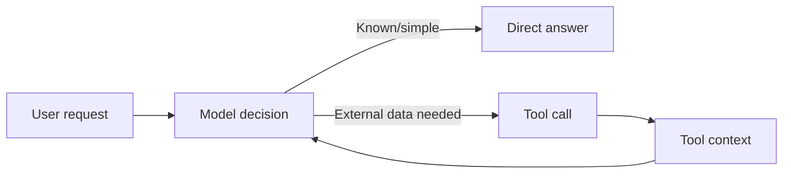
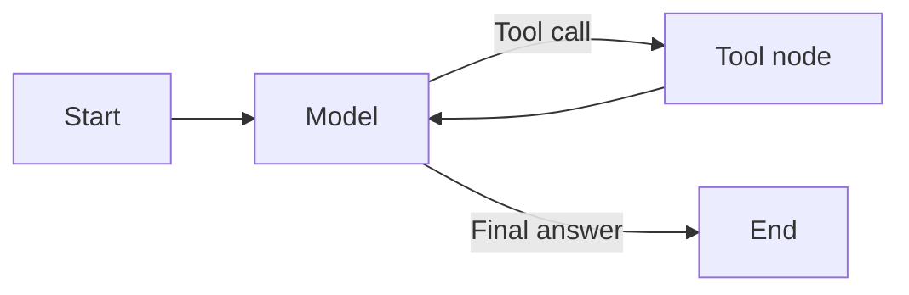
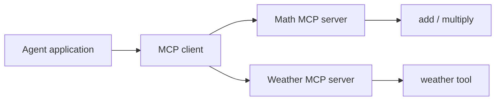
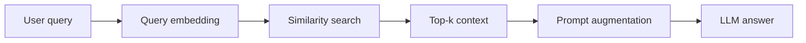
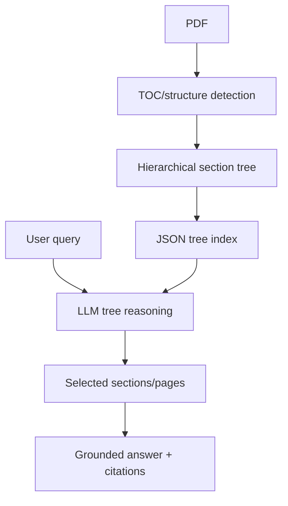
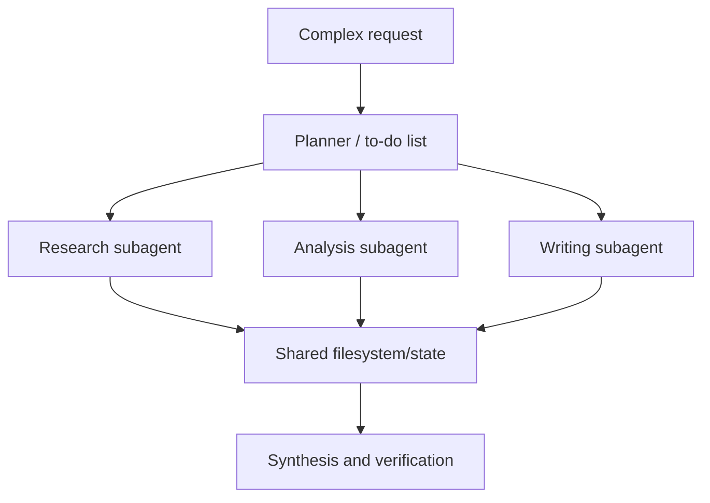
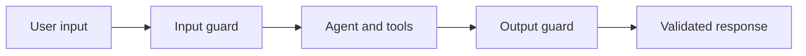
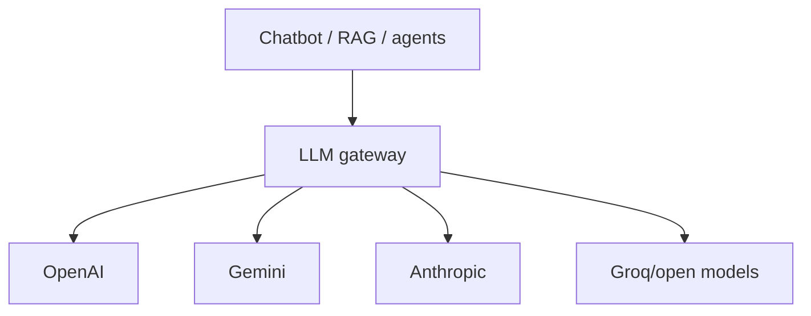
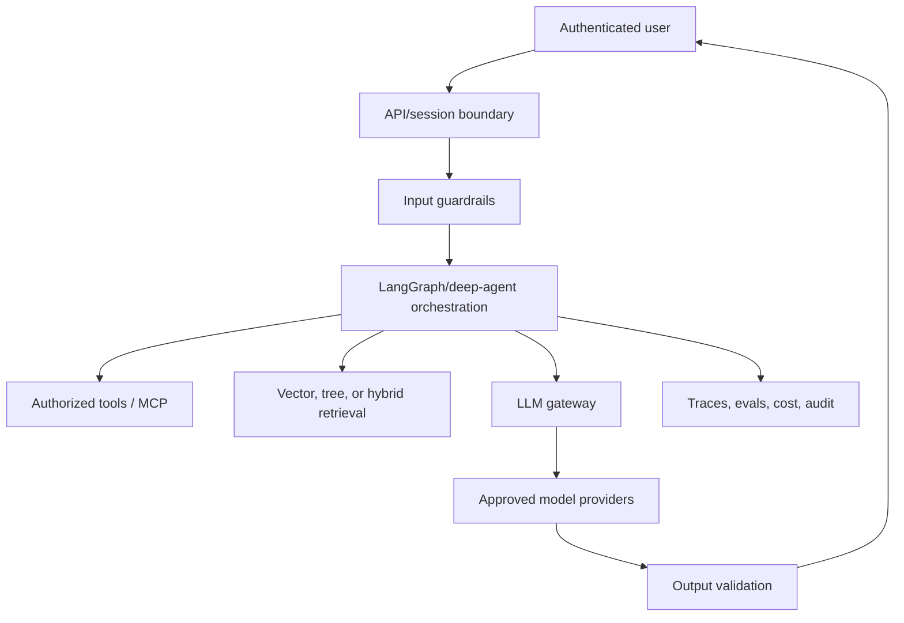

# Modern Generative AI and Agentic AI: Complete Study Notes

## Lecture Scope

This document reconstructs a stitched, approximately **10.5-hour technical lecture** covering the recent LangChain/LangGraph agent stack and the larger ecosystem around production generative AI. The lecture progresses through:

1. LangChain v1 setup and model integration;
2. basic agents and tool calling;
3. messages, streaming, batching, and structured outputs;
4. middleware, short-term memory, summarization, and human approval;
5. LangGraph state, nodes, edges, reducers, ReAct loops, memory, and streaming;
6. Model Context Protocol (MCP) servers and clients;
7. traditional vector-based RAG;
8. vectorless/tree-based RAG with PageIndex;
9. deep agents and research-agent architecture;
10. deterministic, model-based, and layered guardrails;
11. chatbot and RAG evaluation with LangSmith and LLM-as-a-judge;
12. LLM gateways with LiteLLM, routing, fallback, caching, cost tracking, and security callbacks.

The transcript is a compilation of several recorded modules. Repeated setup instructions and promotional interludes have been consolidated, while the complete technical progression has been retained.

### Caption normalization

| Captioned phrase | Correct technical term |
|---|---|
| Lang chain / Langin | **LangChain** |
| Langraph | **LangGraph** |
| Lang / Langmith | **LangSmith** |
| Grock | **Groq** |
| Germany / Geminy | **Gemini** |
| Pydentic / Pyntic | **Pydantic** |
| Type deck / Type dick | **TypedDict** |
| Tably / Tabli | **Tavily** |
| Files vector store | **FAISS vector store** |
| H stdio / HTDIO | **stdio** |
| Streamable HTD | **Streamable HTTP** |
| Light LLM | **LiteLLM** |
| Radius / Reddish | **Redis** |
| RAG doctor relevance | **RAG document/retrieval relevance** |

> **Framework-version note:** the lecture demonstrates APIs described as LangChain v1 and reports particular package/model versions available to the instructor. Exact versions and model names are time-sensitive. Preserve the concepts, but pin and verify versions before running the examples.

---

# 1. Course Setup and Reproducible Python Environments

## 1.1 Why use an isolated environment?

A virtual environment isolates dependencies for one project from the global Python installation and from other projects. This prevents incompatible versions of LangChain, LangGraph, Pydantic, provider SDKs, and notebook packages from contaminating one another.

The lecture uses **uv**, a Rust-based Python project and package manager, for initialization, environment creation, dependency resolution, and installation.

## 1.2 Project initialization

```bash
# Initialize metadata such as pyproject.toml and .python-version
uv init

# Create the virtual environment
uv venv

# Windows Command Prompt
.venv\Scripts\activate

# Linux/macOS
source .venv/bin/activate
```

The generated project commonly contains:

```text
project/
├── .gitignore
├── .python-version
├── main.py
├── pyproject.toml
└── README.md
```

The transcript's demonstrations selected Python `3.13.x`. In professional work, “latest” is not automatically “best”: select a Python version supported by all critical dependencies and record it explicitly.

## 1.3 Dependency management

A representative dependency list from the combined modules includes:

```text
langchain
langchain-community
langchain-openai
langchain-google-genai
langchain-groq
langgraph
langsmith
python-dotenv
ipykernel
sentence-transformers
faiss-cpu
pypdf
pymupdf
fastmcp
mcp
langchain-mcp-adapters
tavily-python
litellm
```

Install a requirements file or individual package:

```bash
uv add -r requirements.txt
uv add ipykernel
```

`uv add` updates project dependency metadata and lock information. A lock file should be committed so another environment resolves the same versions.

## 1.4 Environment variables and API keys

The demonstrations use keys for OpenAI, Gemini, Groq, Tavily, LangSmith, PageIndex, and other providers.

```dotenv
OPENAI_API_KEY=...
GOOGLE_API_KEY=...
GROQ_API_KEY=...
TAVILY_API_KEY=...
LANGSMITH_API_KEY=...
PAGEINDEX_API_KEY=...
```

```python
import os
from dotenv import load_dotenv

load_dotenv()
openai_key = os.getenv("OPENAI_API_KEY")
```

Never commit `.env`, print secret values, paste real keys into notebooks, or rely on deleting a displayed key later. Production deployments should use a managed secret store and least-privilege credentials.

## Key Takeaways

- Use one isolated, reproducible environment per project.
- `uv init`, `uv venv`, and `uv add` cover the demonstrated project lifecycle.
- Pin versions instead of assuming the latest Python/framework release is compatible.
- Store secrets outside code and never expose them in notebooks, logs, or recordings.

---

# 2. LangChain v1 Foundations

## 2.1 From a plain LLM to an agent

A plain generative application maps an input prompt to output:

$$
y = f_{\theta}(x)
$$

where $f_{\theta}$ is a pretrained language model. It is limited by its training cutoff, context window, and lack of direct access to external systems.

> An **AI agent** is an LLM-centered program that can decide whether to answer directly or invoke one or more tools, observe their results, and continue until it can produce a final response.

For a request such as “What is today's AI news?”, the model cannot safely infer live facts from weights. A search tool must provide current context.



## 2.2 Creating a basic agent

The updated high-level interface is `create_agent`:

```python
from langchain.agents import create_agent

def get_weather(city: str) -> str:
    """Get the current weather for a city."""
    # Demonstration stub; a real implementation calls an authorized API.
    return f"The weather in {city} is sunny."

agent = create_agent(
    model="openai:gpt-example",
    tools=[get_weather],
    system_prompt="You are a helpful assistant.",
)

result = agent.invoke({
    "messages": [
        {"role": "user", "content": "What is the weather in New York?"}
    ]
})

print(result["messages"][-1].content)
```

The function docstring and parameter annotations become part of the tool schema. They help the model determine when the tool is applicable and which arguments it needs.

The returned message history typically contains:

1. the human message;
2. an AI message with a tool-call request;
3. a tool message containing the tool result;
4. a final AI message.

## 2.3 Model integration

### Provider-neutral initialization

```python
from langchain.chat_models import init_chat_model

openai_model = init_chat_model("openai:gpt-example")
gemini_model = init_chat_model("google_genai:gemini-example")
groq_model = init_chat_model("groq:llama-example")
```

### Provider-specific classes

```python
from langchain_openai import ChatOpenAI
from langchain_groq import ChatGroq

model = ChatOpenAI(model="gpt-example", temperature=0)
response = model.invoke("Explain agents in two sentences.")
print(response.content)
```

The provider-neutral initializer reduces import changes; provider-specific classes may expose additional settings. Model identifiers used in the lecture were examples and must be replaced by currently available account-supported models.

## 2.4 Message types

LangChain represents conversations using typed messages:

- **SystemMessage** — internal behavioral instruction;
- **HumanMessage** — user input;
- **AIMessage** — model output or tool-call request;
- **ToolMessage** — result of executing a tool call.

```python
from langchain_core.messages import SystemMessage, HumanMessage

messages = [
    SystemMessage(content="You are a concise technical tutor."),
    HumanMessage(content="What is an embedding?"),
]

answer = model.invoke(messages)
```

Messages are more expressive than a raw string because they preserve role, tool-call metadata, identifiers, token metadata, and other execution information.

## 2.5 Tool binding and manual tool execution

At a lower level, a model can be bound to tools:

```python
from langchain_core.tools import tool

@tool
def multiply(a: int, b: int) -> int:
    """Multiply two integers."""
    return a * b

model_with_tools = model.bind_tools([multiply])
ai_message = model_with_tools.invoke("What is 5 multiplied by 8?")

for call in ai_message.tool_calls:
    if call["name"] == "multiply":
        tool_result = multiply.invoke(call)
```

`bind_tools` lets the model propose calls; application code or a graph still executes those calls. A high-level agent automates the loop.

## 2.6 Batching and streaming

### Batch execution

Batching submits several independent prompts through one interface:

```python
responses = model.batch([
    "Define machine learning.",
    "Define deep learning.",
    "Compare both in one sentence.",
])
```

It improves throughput but does not necessarily reduce total provider token charges.

### Streaming

`stream()` returns an iterator of partial response chunks:

```python
for chunk in model.stream("Explain transformers step by step."):
    print(chunk.content, end="", flush=True)
```

> **Streaming** returns output progressively instead of waiting for the full generation, improving perceived latency and enabling responsive user interfaces.

Time to first token and total completion latency are distinct:

$$
T_{\text{total}} = T_{\text{queue}} + T_{\text{prefill}} + T_{\text{decode}}
$$

Streaming mainly exposes output during $T_{\text{decode}}$; it does not eliminate computation.

## 2.7 Structured output

Free-form text is difficult to consume reliably in downstream software. Structured output constrains the response to a schema.

### Pydantic model

```python
from pydantic import BaseModel, Field

class Movie(BaseModel):
    title: str = Field(description="Movie title")
    year: int = Field(description="Release year")
    director: str
    rating: float

structured_model = model.with_structured_output(Movie)
movie = structured_model.invoke("Provide details about Inception.")
```

Pydantic performs runtime validation and parsing. An incompatible field can raise a validation error rather than silently entering the application.

To retain both raw and parsed outputs:

```python
structured_model = model.with_structured_output(Movie, include_raw=True)
result = structured_model.invoke("Provide details about Inception.")
# result may contain raw, parsed, and parsing_error fields.
```

### Nested schema

```python
class Actor(BaseModel):
    name: str
    role: str

class MovieDetails(BaseModel):
    title: str
    year: int
    cast: list[Actor]
    genres: list[str]
    budget_million_usd: float | None = None
```

### `TypedDict`

```python
from typing_extensions import TypedDict, Annotated

class MovieDict(TypedDict):
    title: Annotated[str, "Movie title"]
    year: Annotated[int, "Release year"]
    director: str
    rating: float
```

`TypedDict` is a static typing aid and behaves as a normal dictionary at runtime. It does not provide Pydantic-style validation by itself.

### Dataclass

```python
from dataclasses import dataclass

@dataclass
class ContactInfo:
    name: str
    email: str
    phone: str
```

A schema can also be attached directly to an agent:

```python
extractor = create_agent(
    model="openai:gpt-example",
    tools=[],
    response_format=ContactInfo,
)
```

Use Pydantic when runtime validation and rich field constraints matter; use `TypedDict` for lightweight dictionary-shaped typing; use dataclasses for simple Python data containers.

## Key Takeaways

- An agent combines model judgment with executable tools and an observation loop.
- Tool descriptions and schemas strongly influence tool selection and arguments.
- Messages preserve roles and tool metadata that plain strings cannot.
- Streaming improves responsiveness; batching improves throughput.
- Structured output makes LLM results safer for software, but schema validation does not prove factual correctness.

---

# 3. LangChain Middleware, Summarization, and Human Approval

## 3.1 Middleware concept

> **Agent middleware** inserts reusable logic at defined execution hooks around the agent, model, or tool calls.

The lecture compares middleware to airport checkpoints: security, immigration, and boarding each perform a separate check before the passenger reaches the final destination.

Middleware can support:

- logging, analytics, and debugging;
- prompt transformation;
- tool filtering or selection;
- output formatting;
- retries, fallback, and early termination;
- model/tool call limits;
- PII detection and guardrails;
- conversation summarization;
- human approval.

Conceptual hooks include:

```text
before_agent → before_model → around_model/tool → after_model → after_agent
```

Multiple middleware objects may be stacked in order.

## 3.2 Summarization middleware

Long chat history consumes the model context window. Summarization middleware compresses older messages while preserving a recent tail.

```python
from langchain.agents import create_agent
from langchain.agents.middleware import SummarizationMiddleware
from langgraph.checkpoint.memory import InMemorySaver

agent = create_agent(
    model="openai:gpt-example",
    tools=[],
    checkpointer=InMemorySaver(),
    middleware=[
        SummarizationMiddleware(
            model="openai:small-summary-model",
            trigger={"messages": 10},
            keep={"messages": 4},
        )
    ],
)
```

The lecture demonstrates three trigger styles:

1. **message-count trigger** — summarize when history reaches a configured number of messages;
2. **token-count trigger** — summarize when estimated tokens exceed a threshold;
3. **context-fraction trigger** — summarize when history consumes a configured fraction of the model context window.

For a context capacity $C$ and fraction $\alpha$, trigger near:

$$
T_{\text{trigger}} = \alpha C
$$

The demonstration approximates one token as roughly four characters for display purposes. That heuristic is not an exact tokenizer and should not drive production limits; use the model's tokenizer or provider token count.

Every invocation uses a thread ID so the checkpointer can associate the correct conversation:

```python
config = {"configurable": {"thread_id": "user-session-1"}}
agent.invoke({"messages": [{"role": "user", "content": "Hello"}]}, config)
```

Summarization is lossy. Preserve exact facts, commitments, identifiers, and tool results separately when they must not be compressed away.

## 3.3 Human-in-the-loop middleware

> **Human in the loop (HITL)** pauses an agent before a sensitive action and requires a human to approve, reject, or edit the proposed tool call.

Appropriate use cases include:

- sending email externally;
- buying securities or transferring money;
- deleting production data;
- changing permissions;
- compliance workflows;
- any irreversible or high-impact action.

```python
from langchain.agents.middleware import HumanInTheLoopMiddleware
from langgraph.checkpoint.memory import InMemorySaver

agent = create_agent(
    model="openai:gpt-example",
    tools=[read_email, send_email],
    checkpointer=InMemorySaver(),
    middleware=[
        HumanInTheLoopMiddleware(
            interrupt_on={
                "read_email": False,
                "send_email": {
                    "allowed_decisions": ["approve", "edit", "reject"]
                },
            }
        )
    ],
)
```

The agent returns an interrupt before `send_email` executes. Resume with a LangGraph `Command` and the same thread configuration:

```python
from langgraph.types import Command

approved = agent.invoke(
    Command(resume={"decisions": [{"type": "approve"}]}),
    config,
)
```

An edit supplies corrected tool name/arguments; rejection records a reason and avoids executing the tool.

The checkpointer is essential: execution must resume from the paused state for the same session, not restart or approve another user's action.

## Key Takeaways

- Middleware provides reusable control points without rewriting the core agent loop.
- Summarization manages context growth but can lose details.
- Trigger summarization by messages, tokens, or context fraction.
- HITL is required for high-impact actions and supports approve/edit/reject decisions.
- Approval must be authenticated, session-bound, auditable, and checked again immediately before execution.

---

# 4. LangGraph: Stateful Agent Workflows

## 4.1 Graph API concepts

LangGraph models an application as a stateful directed graph. Its three foundational concepts are:

> A **node** is an executable function or operation.

> An **edge** defines where execution flows next.

> **State** is shared structured data that nodes read and update during one graph execution.

The lecture's explanatory workflow transforms a YouTube video into a blog:


State might include `url`, `transcript`, `title`, and `content`, allowing later nodes to reuse earlier outputs.

State is not identical to persistent long-term memory. It is the working data of a graph run; a checkpointer can persist snapshots across turns.

## 4.2 State schema and reducers

For a chatbot, messages should be appended rather than overwritten. LangGraph uses a reducer:

```python
from typing import Annotated
from typing_extensions import TypedDict
from langgraph.graph.message import add_messages

class State(TypedDict):
    messages: Annotated[list, add_messages]
```

If node updates are $u_1,u_2,\ldots$, a reducer $R$ combines them with the current state:

$$
s_{t+1} = R(s_t,u_t)
$$

For `add_messages`, $R$ appends/merges messages with ID-aware semantics rather than replacing the whole list.

## 4.3 Basic chatbot graph

```python
from langgraph.graph import StateGraph, START, END

def chatbot(state: State):
    return {"messages": [model.invoke(state["messages"])]}

builder = StateGraph(State)
builder.add_node("chatbot", chatbot)
builder.add_edge(START, "chatbot")
builder.add_edge("chatbot", END)
graph = builder.compile()

result = graph.invoke({
    "messages": [{"role": "user", "content": "Explain LangGraph."}]
})
```

The node name identifies the graph vertex; the function is its implementation.

## 4.4 Tool nodes and conditional edges

LangGraph provides `ToolNode` to execute selected tools and `tools_condition` to inspect the latest AI message:

```python
from langgraph.prebuilt import ToolNode, tools_condition

tools = [web_search, multiply]
model_with_tools = model.bind_tools(tools)

def tool_calling_llm(state: State):
    return {"messages": [model_with_tools.invoke(state["messages"])]}

builder = StateGraph(State)
builder.add_node("assistant", tool_calling_llm)
builder.add_node("tools", ToolNode(tools))
builder.add_edge(START, "assistant")
builder.add_conditional_edges("assistant", tools_condition)
builder.add_edge("tools", END)
```

`tools_condition` routes to the tool node when the latest AI message contains a tool call; otherwise it routes to `END`.

## 4.5 ReAct loop

The one-pass graph above fails for a compound request such as:

```text
Give me today's AI news, then multiply 5 by 10.
```

It may execute the first tool and stop before completing the second task. The correction is to connect the tool node back to the model:

```python
builder.add_edge("tools", "assistant")
```



> **ReAct** interleaves reasoning/decision, action, and observation. The model selects an action, observes the result, and decides whether another action is needed.

The lecture describes the cycle as:

1. **reason** about the request/current observations;
2. **act** by selecting a tool and arguments;
3. **observe** the tool result;
4. repeat until a final answer is possible.

Bound the loop with model/tool call limits, timeouts, and a maximum step count.

## 4.6 Checkpointed short-term memory

Without checkpointing, separate invocations do not remember previous turns. `MemorySaver`/`InMemorySaver` stores graph checkpoints keyed by `thread_id`:

```python
from langgraph.checkpoint.memory import MemorySaver

memory = MemorySaver()
graph = builder.compile(checkpointer=memory)
config = {"configurable": {"thread_id": "thread-1"}}

graph.invoke({"messages": [{"role": "user", "content": "My name is Aakash."}]}, config)
graph.invoke({"messages": [{"role": "user", "content": "What is my name?"}]}, config)
```

The in-memory implementation is a local demonstration and is lost on restart. Multi-instance production requires durable shared checkpoint storage and authenticated thread ownership.

## 4.7 Graph streaming modes

### `stream_mode="updates"`

Emits only the delta produced by the node that just completed.

```python
for chunk in graph.stream(inputs, config, stream_mode="updates"):
    print(chunk)
```

### `stream_mode="values"`

Emits the entire current state after each update, including previously accumulated messages.

```python
for state_snapshot in graph.stream(inputs, config, stream_mode="values"):
    print(state_snapshot["messages"])
```

### Asynchronous events

`astream()` is the asynchronous state stream; `astream_events()` exposes detailed lifecycle events useful for telemetry and debugging.

Use `updates` for compact UI progress and `values` when consumers need complete state snapshots.

## 4.8 Human interruption inside a graph

A custom human-assistance tool can pause execution:

```python
from langchain_core.tools import tool
from langgraph.types import interrupt, Command

@tool
def human_assistance(query: str) -> str:
    """Request expert assistance from a human."""
    response = interrupt({"query": query})
    return response["data"]

# Later, using the same config/thread:
graph.stream(Command(resume={"data": "Approved expert guidance"}), config)
```

An interrupt serializes the current graph position. Resume continues from that checkpoint.

## Key Takeaways

- LangGraph makes state, nodes, edges, and branching explicit.
- Reducers define how concurrent or sequential updates combine with state.
- A ReAct graph loops tool observations back to the model until it emits a final answer.
- Checkpointers add cross-turn continuity but local memory is not production persistence.
- `updates`, `values`, and event streams serve different UI and debugging needs.

---

# 5. Model Context Protocol (MCP)

## 5.1 Architecture

> **MCP** is a protocol through which an AI host/client discovers and calls externally provided tools, resources, and prompts using standardized messages and transports.

The lecture distinguishes:

- **host application** — the chatbot/agent application;
- **MCP client** — maintains a connection to one or more servers;
- **MCP server** — exposes tools, resources, or prompts.



The LLM sees tool schemas discovered through the client and selects a tool based on the user request.

## 5.2 FastMCP server over stdio

```python
from mcp.server.fastmcp import FastMCP

mcp = FastMCP("math")

@mcp.tool()
def add(a: int, b: int) -> int:
    """Add two integers."""
    return a + b

@mcp.tool()
def multiply(a: int, b: int) -> int:
    """Multiply two integers."""
    return a * b

if __name__ == "__main__":
    mcp.run(transport="stdio")
```

**stdio transport** launches the server as a local child process and exchanges protocol messages through standard input/output. It is convenient for local desktop/CLI integrations. Application logs must not corrupt the protocol stream; diagnostics generally belong on stderr.

## 5.3 Streamable HTTP server

```python
from mcp.server.fastmcp import FastMCP

mcp = FastMCP("weather")

@mcp.tool()
def get_weather(location: str) -> str:
    """Get weather for a location."""
    return f"Demonstration weather for {location}"

if __name__ == "__main__":
    mcp.run(transport="streamable-http")
```

**Streamable HTTP** exposes a network service, demonstrated locally on a URL ending in `/mcp`. Unlike stdio, it can be independently hosted and accessed across process or machine boundaries. Production use needs TLS, authentication, authorization, request limits, network policy, and observability; these were not implemented in the lecture.

## 5.4 Multi-server client

```python
import asyncio
from langchain_mcp_adapters.client import MultiServerMCPClient
from langgraph.prebuilt import create_react_agent

async def main():
    client = MultiServerMCPClient({
        "math": {
            "command": "python",
            "args": ["/absolute/path/math_server.py"],
            "transport": "stdio",
        },
        "weather": {
            "url": "http://localhost:8000/mcp",
            "transport": "streamable_http",
        },
    })

    tools = await client.get_tools()
    agent = create_react_agent(model, tools)

    math_result = await agent.ainvoke({
        "messages": [{"role": "user", "content": "What is (3 + 5) * 12?"}]
    })
    weather_result = await agent.ainvoke({
        "messages": [{"role": "user", "content": "What is the weather in California?"}]
    })

asyncio.run(main())
```

The client configuration must match each server's transport. For stdio, the executable and absolute script path matter. For HTTP, the server must already be running and reachable.

## Key Takeaways

- MCP separates an AI host/client from independently developed tool servers.
- stdio is well suited to local child processes; Streamable HTTP supports network services.
- Tool schemas and docstrings enable the model to choose between discovered capabilities.
- MCP standardizes communication, but does not automatically provide authentication or safe authorization.
- Treat remote MCP servers as untrusted integrations and constrain permissions and outputs.

---

# 6. Traditional Vector-Based RAG

## 6.1 Definition and motivation

> **Retrieval-Augmented Generation (RAG)** retrieves relevant information from an external knowledge base and supplies it to an LLM before generation, extending the model to private, domain-specific, or recently updated information without retraining its weights.

Two limitations motivate RAG:

1. **knowledge cutoff and hallucination** — a model may not know recent events and may produce unsupported details;
2. **private organizational knowledge** — HR policies, financial policies, manuals, and internal documents are absent from public pretraining.

Fine-tuning can adapt behavior or knowledge but is expensive, data-intensive, and inconvenient for frequently changing documents. RAG leaves model weights unchanged and refreshes the knowledge index instead.

## 6.2 Two pipelines

### Offline ingestion


### Online retrieval and generation



RAG expands as:

- **Retrieval** — find relevant external evidence;
- **Augmentation** — combine evidence, user question, and instructions;
- **Generation** — ask the LLM to synthesize an answer.

## 6.3 LangChain `Document`

> A **Document** contains `page_content` plus `metadata` describing the source.

```python
from langchain_core.documents import Document

doc = Document(
    page_content="The actual text used for retrieval.",
    metadata={
        "source": "manual.pdf",
        "page": 7,
        "author": "Engineering",
        "created_at": "2026-01-24",
    },
)
```

Metadata enables source citations, filters, tenant/ACL enforcement, page references, updates, and deletion. It should travel with every derived chunk.

## 6.4 Loaders

The lecture demonstrates or mentions:

- `TextLoader` for text files;
- `DirectoryLoader` for a directory/glob;
- `PyPDFLoader` and PyMuPDF tooling for PDFs;
- CSV, web, HTML, Excel, database, and other format-specific loaders.

```python
from langchain_community.document_loaders import TextLoader, PyPDFLoader

text_docs = TextLoader("python_intro.txt", encoding="utf-8").load()
pdf_docs = PyPDFLoader("attention.pdf").load()
```

The loader normalizes source data into `Document` objects. Extraction quality is foundational: malformed text, lost tables, wrong reading order, and missing metadata propagate through the entire RAG pipeline.

## 6.5 Chunking

Documents are divided because embedding models and LLMs have finite input windows, and focused chunks improve retrieval granularity.

```python
from langchain_text_splitters import RecursiveCharacterTextSplitter

splitter = RecursiveCharacterTextSplitter(
    chunk_size=1000,
    chunk_overlap=200,
    separators=["\n\n", "\n", ". ", " ", ""],
)
chunks = splitter.split_documents(pdf_docs)
```

If the character length is $L$, nominal chunk size $c$, and overlap $o<c$, an approximate chunk count is:

$$
N \approx 1 + \left\lceil \frac{\max(0,L-c)}{c-o} \right\rceil
$$

Overlap preserves boundary context but increases storage and duplicate retrieval. Chunking should respect headings, tables, code, and semantic sections when possible.

## 6.6 Embeddings and similarity

An embedding model maps text to a vector:

$$
f: \mathcal{X} \rightarrow \mathbb{R}^{d}
$$

The modular example uses a SentenceTransformer such as `all-MiniLM-L6-v2`:

```python
from sentence_transformers import SentenceTransformer

embedder = SentenceTransformer("sentence-transformers/all-MiniLM-L6-v2")
vectors = embedder.encode(
    [chunk.page_content for chunk in chunks],
    show_progress_bar=True,
)
```

Cosine similarity is:

$$
\operatorname{cos}(\mathbf{q},\mathbf{x}) =
\frac{\mathbf{q}^{\top}\mathbf{x}}
{\|\mathbf{q}\|_2\|\mathbf{x}\|_2}
$$

For normalized vectors, maximizing cosine similarity is equivalent to minimizing squared Euclidean distance:

$$
\|\mathbf{q}-\mathbf{x}\|_2^2 = 2-2\mathbf{q}^{\top}\mathbf{x}
$$

Document and query vectors must use the same embedding model/version and compatible preprocessing.

## 6.7 Vector stores

The lecture uses in-memory stores for small demonstrations, mentions Typesense, and implements a local persistent **FAISS** index with separate metadata serialization.

Conceptual FAISS class responsibilities:

```python
class FaissVectorStore:
    def build_from_documents(self, documents): ...
    def add_embeddings(self, embeddings, metadata): ...
    def save(self): ...
    def load(self): ...
    def search(self, query_vector, top_k=3): ...
```

The index is written to `faiss.index`; document/chunk metadata is serialized separately. Never load an untrusted pickle file because pickle can execute code.

The query path is:

```python
query_vector = embedder.encode([query]).astype("float32")
distances, indices = index.search(query_vector, k=3)
retrieved = [metadata[i] for i in indices[0]]
```

## 6.8 Simple and enhanced generation

### Simple RAG

```python
def rag_simple(query, retriever, llm, top_k=3):
    docs = retriever.retrieve(query, top_k=top_k)
    if not docs:
        return "No relevant context found."

    context = "\n\n".join(doc.page_content for doc in docs)
    prompt = f"""
    Use only the following context to answer concisely.

    Context:
    {context}

    Question: {query}
    """
    return llm.invoke(prompt).content
```

### Enhanced RAG response

The enhanced demonstration returns:

- answer;
- sources and page numbers;
- similarity score;
- confidence aggregate;
- optional full context;
- a short preview of each retrieved chunk.

```python
return {
    "answer": answer,
    "sources": sources,
    "confidence": confidence,
    "context": context if return_context else None,
}
```

Similarity is not calibrated probability. Calling an average vector score “confidence” can mislead; name it `retrieval_score` unless calibrated against labeled data.

The lecture further sketches streaming, citations, history, and summarization as extensions.

## 6.9 Modular architecture

```text
rag_project/
├── app.py
├── data/
├── vector_store/
│   ├── faiss.index
│   └── metadata.json
└── src/
    ├── __init__.py
    ├── data_loader.py
    ├── embedding.py
    ├── vector_store.py
    └── search.py
```

The sequence is:

1. `load_all_documents(data_dir)`;
2. `EmbeddingPipeline.chunk_documents(docs)`;
3. `EmbeddingPipeline.embed_chunks(chunks)`;
4. `FaissVectorStore.build_from_documents(...)` and save;
5. load the index for later processes;
6. `RAGSearch.search_and_summarize(query)`.

Production ingestion should add deterministic IDs, checksums, versioning, ACL metadata, retries, queues, deletion/update workflows, and embedding-version tracking.

## Key Takeaways

- RAG injects external knowledge at inference time without modifying model weights.
- Parsing and metadata quality determine downstream retrieval quality.
- Chunk size and overlap trade context preservation against noise, duplication, and cost.
- Query and documents must share the same embedding space.
- A professional response should return citations and scores, but vector similarity is not factual confidence.

---

# 7. Vectorless RAG and PageIndex

## 7.1 Core idea

> **Vectorless RAG**, as presented in the lecture, replaces embedding similarity search with an LLM-generated hierarchical document index and LLM-guided tree navigation.

Instead of chunking every document by token/character size and storing vectors, the system builds a hierarchy corresponding to document sections.



Each node can contain:

- node ID;
- title/heading;
- start and end page;
- parent/child relationships;
- an LLM-generated section summary.

## 7.2 Documents with and without a table of contents

### With TOC

1. detect and parse the table of contents;
2. map headings and subsections to page ranges;
3. extract each logical section;
4. summarize it;
5. assemble the parent/child tree.

### Without TOC

1. inspect pages for heading patterns and layout signals;
2. ask an LLM to infer headings and section structure;
3. split by semantic/logical section boundaries rather than a fixed token count;
4. summarize each section;
5. assemble the inferred tree.

The central claim is that a section remains coherent instead of being arbitrarily cut across chunks.

## 7.3 Retrieval loop

```pseudocode
input: query q, JSON tree T

read root and relevant node summaries
reason about the most promising branch
select candidate node IDs
load full content of selected sections

if evidence is insufficient:
    traverse another branch or refine selection
else:
    generate answer with section/page citations
```

The navigation path is more interpretable than a cosine score: the system can report which headings and pages it traversed.

The JSON index can be stored in a file, object store such as S3, or a JSON/document database such as MongoDB. Storage is still required; “vectorless” means no vector index, not no index or persistence.

## 7.4 PageIndex workflow

The demonstration uses PageIndex clients approximately as follows:

```python
from pageindex import PageIndexClient
from openai import OpenAI

page_client = PageIndexClient(api_key=os.getenv("PAGEINDEX_API_KEY"))
llm_client = OpenAI(api_key=os.getenv("OPENAI_API_KEY"))

# Conceptual operations; exact SDK calls depend on version:
document_id = page_client.upload("long_report.pdf")
tree = page_client.build_index(document_id)
selected_sections = page_client.search(document_id, query)
```

The practical example uploads a long structured PDF, creates a tree, prints node/page structure, and asks document questions. The transcript also notes that PageIndex may have hosted-service limits despite an available public repository.

## 7.5 Traditional versus vectorless RAG

| Dimension | Traditional vector RAG | Vectorless/tree RAG |
|---|---|---|
| Index | Dense/sparse vectors | Hierarchical JSON tree |
| Retrieval | Similarity/keyword search | LLM-guided navigation |
| Best scale | Very large heterogeneous corpora | Tens to thousands of long structured documents |
| Query latency | Usually low | Often higher due to multiple LLM calls |
| Query cost | Embedding + search + generation | Tree reasoning calls + generation |
| Cross-section reasoning | Weak without extra retrieval logic | Stronger design goal |
| Explainability | Retrieved chunks and scores | Navigation path, sections, pages |
| Model migration | Often requires re-embedding | May require re-summarizing/re-indexing |
| Ecosystem maturity | Mature | Emerging |
| Best use cases | FAQs, tickets, mixed knowledge bases, fact lookup | Contracts, annual reports, textbooks, regulatory filings |

### Traditional RAG strengths

- scales to millions of documents;
- cheap, fast nearest-neighbor retrieval;
- mature databases and operational tooling;
- domain agnostic;
- effective for short factoid questions.

### Traditional RAG weaknesses

- arbitrary chunk boundaries can split evidence;
- vector similarity is not the same as relevance;
- cross-section comparison may require many chunks;
- a cosine score alone does not explain why a passage matters;
- embedding-model changes require re-embedding.

### Vectorless strengths

- preserves logical sections;
- supports document navigation similar to a human using a TOC;
- can compare and synthesize across sections;
- returns an interpretable section/page path;
- removes the embedding/index pipeline.

### Vectorless weaknesses

- several LLM calls may increase latency and cost;
- tree construction also requires model work;
- not suitable for internet-scale heterogeneous corpora;
- depends on usable structure or accurate inferred structure;
- tooling is less mature;
- section summaries can omit critical details or hallucinate.

## 7.6 Hybrid systems

The lecture concludes that vector and tree retrieval are complementary rather than absolute competitors. A hybrid system may:

1. use vector search to select likely documents;
2. use tree navigation inside each selected document;
3. retrieve full coherent sections;
4. rerank evidence;
5. generate with citations.

## Key Takeaways

- Vectorless RAG replaces embedding similarity with a hierarchical document index and reasoning-based navigation.
- It is most compelling for long, structured, limited-size document sets.
- Tree navigation offers section/page explainability but costs additional LLM latency.
- Tree summaries are generated artifacts and must be verified against source pages.
- Benchmark vector, tree, and hybrid methods on the actual corpus; do not choose based on novelty.

---

# 8. Deep Agents and Research-Agent Architecture

## 8.1 Shallow agents

The lecture calls a direct model→tool→answer flow a **shallow agent**. Even a ReAct loop can remain shallow when it lacks explicit planning, task decomposition, specialized subagents, durable working files, and long-horizon state management.

Typical limitations:

- no explicit multi-step plan;
- weak decomposition of complex queries;
- limited context retention;
- one monolithic agent owns every task;
- no persistent workspace for large intermediate artifacts.

## 8.2 Four deep-agent components

> A **deep agent** is an agent architecture designed for complex, long-horizon tasks using explicit planning, delegation, detailed instructions, and persistent working context.

The lecture identifies four core components:

1. **Planning tool / to-do list**
   - decomposes the request into trackable subtasks;
   - records pending, active, and completed work;
   - revises the plan when evidence changes.
2. **Subagents**
   - specialize in research, coding, writing, validation, or other roles;
   - isolate context and can work in parallel when dependencies permit.
3. **System prompt**
   - defines role, behavior, safety policy, style, tool constraints, and completion criteria.
4. **Filesystem or persistent workspace**
   - stores large tool results, notes, drafts, and shared artifacts;
   - prevents all intermediate context from remaining in the chat window.



The lecture illustrates this with trip planning and blog research: one subagent searches the web, another reads papers, another drafts, and another checks quality/copyright.

## 8.3 Basic deep-agent implementation

The demonstrated `deepagents` library is built on LangGraph.

```python
from typing import Literal
from tavily import TavilyClient
from deepagents import create_deep_agent
from langchain.chat_models import init_chat_model

tavily = TavilyClient(api_key=os.getenv("TAVILY_API_KEY"))

def web_search(
    query: str,
    max_results: int = 5,
    topic: Literal["general", "news", "finance"] = "general",
    include_raw_content: bool = False,
):
    """Search the live web for research evidence."""
    return tavily.search(
        query=query,
        max_results=max_results,
        topic=topic,
        include_raw_content=include_raw_content,
    )

model = init_chat_model("groq:qwen-example")

research_agent = create_deep_agent(
    model=model,
    tools=[web_search],
    system_prompt="Act as a careful research analyst. Cite your evidence.",
)

result = research_agent.invoke({
    "messages": [{"role": "user", "content": "Research deep agents."}]
})
```

The resulting graph includes middleware/hooks for planning/to-do management, summarization, tools, and filesystem behavior. Large tool outputs can be written as files and referenced rather than injected in full on every turn.

## 8.4 When to use deep agents

Use them when tasks require:

- planning and decomposition;
- multiple specialized roles;
- substantial research context;
- durable artifacts across turns;
- long-running workflows;
- resumability and human intervention.

Do not use a deep agent for trivial lookups or deterministic workflows. It adds latency, cost, failure modes, and debugging complexity.

## 8.5 Production concerns

- Plans are hypotheses, not guarantees; validate them.
- Parallel subagents can duplicate work or contradict one another.
- Shared files require permissions, provenance, and conflict handling.
- A filesystem is not automatically “memory”; it needs indexing and retrieval rules.
- Set budgets for tokens, steps, wall-clock time, tools, and spawned subagents.
- Use sandboxing and least privilege for code or file operations.
- Require citations and a verification phase for research answers.

## Key Takeaways

- Deep agents add explicit planning, subagents, detailed policy, and persistent working context.
- A ReAct loop alone does not provide reliable long-horizon execution.
- To-do middleware tracks task decomposition and progress.
- Filesystems offload large intermediate results but introduce security and consistency requirements.
- Deep agents are appropriate only when task complexity justifies their operational cost.

---

# 9. Guardrails for Agents

## 9.1 Definition and placement

> **Guardrails** are controls around an AI pipeline that validate inputs, restrict actions, and validate or transform outputs according to policy.



Guardrails aim to ensure that an agent:

- processes appropriate input;
- performs only approved actions;
- returns compliant output.

## 9.2 Deterministic versus model-based controls

### Deterministic guardrails

Use explicit keywords, regexes, parsers, schemas, allowlists, or business rules.

```python
BANNED = {"hack", "exploit", "malware", "bomb"}

def deterministic_guardrail(text: str) -> bool:
    tokens = text.lower()
    return any(keyword in tokens for keyword in BANNED)
```

Advantages:

- low latency and no model cost;
- predictable and easy to audit;
- good for exact PII patterns, formats, and permissions.

Limitations:

- misses paraphrases and obfuscation;
- keyword matches can block benign educational questions;
- lacks semantic context.

### Model-based guardrails

```python
def model_guardrail(text: str) -> str:
    prompt = f"Reply only SAFE or UNSAFE for this user input:\n{text}"
    return safety_model.invoke(prompt).content.strip().upper()
```

Advantages:

- understands semantics and paraphrases better;
- supports nuanced policy descriptions.

Limitations:

- adds latency and cost;
- remains probabilistic and attackable;
- can be inconsistent or biased.

Layer deterministic checks with model-based checks instead of treating either as sufficient.

## 9.3 PII middleware

The lecture demonstrates LangChain's PII middleware with strategies:

- `redact` — replace with a marker such as `[REDACTED_EMAIL]`;
- `mask` — hide most characters;
- `hash` — replace with a stable/derived hash;
- `block` — raise an exception.

```python
from langchain.agents.middleware import PIIMiddleware

agent = create_agent(
    model="openai:gpt-example",
    tools=[customer_lookup],
    middleware=[
        PIIMiddleware("email", strategy="redact", apply_to_input=True),
        PIIMiddleware("credit_card", strategy="mask", apply_to_input=True),
        PIIMiddleware(
            "api_key",
            detector=r"[A-Za-z0-9_-]{32,}",
            strategy="block",
            apply_to_input=True,
        ),
    ],
)
```

PII detection can apply to input, output, logs, and tool-call arguments. Hashing is not automatically anonymization: weak or unsalted hashes can be reversible by guessing, and stable hashes remain linkable identifiers.

## 9.4 HITL for sensitive tools

The guardrail module repeats the HITL pattern for `send_email` and `delete_records`, while allowing read-only web search automatically. A checkpointer and thread ID bind the approval to a paused workflow.

Read actions can still leak data, so “read-only” is not universally safe; authorization must follow the actual data and threat model.

## 9.5 Custom before-agent middleware

```python
from langchain.agents.middleware import AgentMiddleware, hook_config
from langgraph.graph import END

class ContentFilterMiddleware(AgentMiddleware):
    def __init__(self, banned_keywords: list[str]):
        super().__init__()
        self.banned = [x.lower() for x in banned_keywords]

    @hook_config(can_jump_to=[END])
    def before_agent(self, state, runtime):
        if not state.get("messages"):
            return None
        content = state["messages"][-1].content.lower()
        if any(word in content for word in self.banned):
            return {
                "messages": [{
                    "role": "assistant",
                    "content": "I cannot process that request.",
                }],
                "jump_to": END,
            }
        return None
```

A before-agent guard can terminate without paying for an LLM call.

## 9.6 After-agent safety middleware

An output guard reviews the final response for unsafe claims, compliance language, leakage, or quality issues. It may redact, replace, or refuse the response before the user sees it.

Appropriate uses include:

- legal/medical/financial disclaimer requirements;
- unsupported claims;
- PII/secret leakage;
- toxicity or self-harm policy;
- format and citation validation.

The lecture proposes using a smaller safety model. However, the underlying action must already have been prevented if harmful: an output guard cannot undo a money transfer or database deletion.

## 9.7 Layered guardrails

A layered order may be:

1. deterministic content filter;
2. PII detection/redaction;
3. prompt-injection/jailbreak classifier;
4. authorization and tool schema validation;
5. HITL for sensitive actions;
6. output safety and factuality checks;
7. audit logging.

## Key Takeaways

- Guardrails operate on input, actions/tools, and output.
- Deterministic rules are fast and auditable; model guards are more semantic but probabilistic.
- PII strategies include redact, mask, hash, and block.
- HITL is an action guard, not merely a prompt filter.
- Guardrails supplement authentication, authorization, sandboxing, and least privilege; they do not replace them.

---

# 10. Chatbot and RAG Evaluation

## 10.1 Why evaluation is necessary

Selecting an LLM based only on cost or anecdotal prompts is unreliable. Evaluation requires a versioned data set, target function, metrics, and comparison across model/prompt/retrieval configurations.

The lecture introduces:

- LLM-as-a-judge;
- gold/reference-answer evaluation;
- functional tests;
- human evaluation and annotation;
- regression testing;
- LangSmith data sets, experiments, traces, latency, and cost.

## 10.2 Evaluation workflow

1. construct representative input/reference examples;
2. upload/version the data set;
3. define the target chatbot or RAG function;
4. define evaluator functions;
5. run an experiment;
6. inspect metrics, examples, latency, cost, and traces;
7. compare another model/prompt/index version;
8. preserve failures as regression cases.

## 10.3 LangSmith data construction

```python
from langsmith import Client

client = Client()
dataset = client.create_dataset(
    dataset_name="chatbot-evaluation-v1",
    description="Ground-truth questions and answers",
)

examples = [
    {
        "inputs": {"question": "What is LangChain?"},
        "outputs": {"answer": "A framework for building LLM applications."},
    },
    {
        "inputs": {"question": "What is LangSmith?"},
        "outputs": {"answer": "A platform for tracing and evaluating AI applications."},
    },
]

client.create_examples(dataset_id=dataset.id, examples=examples)
```

The reference answer is called ground truth in the lecture. In open-ended tasks, one reference may not cover every valid answer; use rubrics, multiple references, or human review.

## 10.4 LLM-as-a-judge

The judge receives some combination of:

- input question $q$;
- generated response $a$;
- reference answer $r$;
- retrieved documents $D$;
- a grading rubric.

It emits a structured score and explanation.

```python
from pydantic import BaseModel

class CorrectnessGrade(BaseModel):
    explanation: str
    correct: bool

grader = ChatOpenAI(
    model="small-grader-model",
    temperature=0,
).with_structured_output(CorrectnessGrade)
```

Structured output makes the evaluator machine-readable but does not make the judge objectively correct.

## 10.5 Chatbot correctness evaluator

```python
def correctness(inputs: dict, outputs: dict, reference_outputs: dict) -> bool:
    question = inputs["question"]
    answer = outputs["answer"]
    reference = reference_outputs["answer"]

    grade = grader.invoke(f"""
    Grade factual correctness only.
    Question: {question}
    Reference answer: {reference}
    Student/model answer: {answer}

    Extra accurate information is acceptable.
    Conflicting or materially wrong information is incorrect.
    """)
    return grade.correct
```

An experiment runs the target on every data point with this evaluator, then reports aggregate success, latency, and token/cost information.

For binary scores $s_i\in\{0,1\}$ over $N$ examples:

$$
\widehat{p}=\frac{1}{N}\sum_{i=1}^{N}s_i
$$

With only three or five examples, $\widehat{p}$ is extremely unstable; professional evaluation requires a larger, representative test set.

## 10.6 RAG evaluation dimensions

The lecture constructs a small RAG bot from web articles using loaders, splitting, embeddings, an in-memory vector store, and an LLM. It then defines four evaluators.

### 1. Correctness

Compare generated answer $a$ to reference $r$ for factual agreement:

$$
C(q,a,r)
$$

Question: “Is the model's answer correct relative to the accepted answer?”

### 2. Answer relevance

Compare question $q$ to answer $a$ without requiring a reference:

$$
R_a(q,a)
$$

Question: “Does the answer directly and concisely address the question?”

An answer can be relevant but wrong.

### 3. Groundedness/faithfulness

Compare answer $a$ to retrieved evidence $D$:

$$
G(a,D)
$$

Question: “Are the answer's factual claims supported by the retrieved documents?”

An answer may match a reference yet contain additional unsupported claims, reducing groundedness.

### 4. Retrieval relevance

Compare question $q$ to retrieved evidence $D$:

$$
R_d(q,D)
$$

Question: “Did retrieval return evidence relevant to the question?”

This separates retrieval failure from generation failure.

| Metric | Compared objects | Diagnoses |
|---|---|---|
| Correctness | answer ↔ reference | factual answer quality |
| Answer relevance | answer ↔ question | focus/responsiveness |
| Groundedness | answer ↔ documents | hallucination/unsupported claims |
| Retrieval relevance | documents ↔ question | retrieval quality |

## 10.7 Running an experiment

```python
def target(inputs: dict) -> dict:
    return rag_bot(inputs["question"])

experiment = client.evaluate(
    target,
    data="rag-evaluation-v1",
    evaluators=[
        correctness,
        answer_relevance,
        groundedness,
        retrieval_relevance,
    ],
    experiment_prefix="rag-model-index-v1",
)
```

The LangSmith view links each input, reference, generated answer, retrieved context, evaluator result, latency, and cost.

## 10.8 Limitations of LLM judges

LLM judges can exhibit:

- position bias;
- verbosity/style bias;
- self-preference for answers from the same model family;
- sensitivity to rubric wording;
- non-determinism;
- failure to verify specialized facts;
- prompt injection from the answer/context being graded.

Mitigate through:

1. strict structured rubrics;
2. temperature near zero;
3. blinded/shuffled comparisons;
4. deterministic metrics where possible;
5. human calibration samples;
6. multiple judges or majority voting for high-stakes cases;
7. agreement and error analysis, not only averages;
8. treating evaluation documents and responses as untrusted data.

## 10.9 Statistical reporting

For a numeric score $x_i$:

$$
\bar{x}=\frac{1}{N}\sum_{i=1}^{N}x_i,
\qquad
s=\sqrt{\frac{1}{N-1}\sum_{i=1}^{N}(x_i-\bar{x})^2}
$$

Report distribution, confidence intervals, failure categories, and slice results—not only one mean. Important slices include domain, language, query length, retrieval difficulty, safety category, and tool type.

## Key Takeaways

- Evaluation begins with representative, versioned input/reference data.
- Correctness, relevance, groundedness, and retrieval relevance diagnose different RAG components.
- LLM-as-a-judge is scalable but must be calibrated against humans and deterministic checks.
- Tiny demonstration data sets cannot justify model-selection claims.
- Store failures as regression tests and compare model, prompt, chunking, and index versions under the same data set.

---

# 11. LLM Gateways with LiteLLM

## 11.1 Gateway definition

> An **LLM gateway** is a control layer between applications and model providers that exposes a unified API while centralizing routing, fallback, load balancing, caching, rate limits, logging, cost controls, and policy enforcement.

Without a gateway, each application integrates separately with OpenAI, Gemini, Anthropic, Groq, or another provider. A provider outage or quota exhaustion can take the application down.



## 11.2 Core capabilities

1. **Unified API** — one request format across providers.
2. **Fallback** — retry an approved alternative when the primary fails.
3. **Task-aware routing** — send coding, summarization, or reasoning tasks to different models.
4. **Load balancing** — distribute traffic across deployments or keys.
5. **Caching** — reuse matching responses.
6. **Observability** — log prompt metadata, response status, tokens, latency, and cost.
7. **Guardrails** — inspect or redact input/output.
8. **Evaluation hooks** — attach quality assessment.
9. **Budgets/rate limits** — control cost and provider quotas.

## 11.3 Unified LiteLLM completion

```python
from litellm import completion

response = completion(
    model="openai/gpt-example",
    messages=[{"role": "user", "content": "Explain RAG in one sentence."}],
)

response2 = completion(
    model="groq/llama-example",
    messages=[{"role": "user", "content": "Explain RAG in one sentence."}],
)
```

Only the provider-qualified model name changes; the function contract remains consistent.

## 11.4 Fallback

```python
def call_with_fallbacks(messages, models):
    errors = []
    for model_name in models:
        try:
            return completion(model=model_name, messages=messages)
        except Exception as exc:
            errors.append((model_name, str(exc)))
    raise RuntimeError(f"All models failed: {errors}")
```

The lecture intentionally uses an invalid primary model so execution falls back to a real secondary model.

Fallback should trigger only for retryable failures. A safety refusal, invalid request, or authentication failure should not automatically be sent to another provider to bypass policy.

## 11.5 Caching

The local demonstration enables an in-memory cache, asks an identical question twice, and observes a much faster second response.

An exact cache key should include at least:

$$
K = H(\text{model},\text{messages},\text{temperature},\text{tools},
\text{prompt version},\text{tenant},\text{policy version})
$$

If knowledge or permissions change, cached answers must be invalidated. Local in-memory caching disappears on restart and is not shared among replicas; Redis or another managed store is typical for distributed systems.

The transcript's claim of “zero cost” for a cache hit applies only to the avoided provider call; cache storage, gateway compute, and network operation still have cost.

## 11.6 Router and load-balancing strategies

```python
from litellm import Router

model_list = [
    {
        "model_name": "fast-cheap",
        "litellm_params": {"model": "groq/llama-example", "api_key": "..."},
    },
    {
        "model_name": "smart-coding",
        "litellm_params": {"model": "openai/gpt-example", "api_key": "..."},
    },
]

router = Router(model_list=model_list, routing_strategy="simple-shuffle")
response = router.completion(
    model="fast-cheap",
    messages=[{"role": "user", "content": "Summarize this text."}],
)
```

Strategies mentioned include:

- **simple shuffle** — distribute calls among eligible deployments;
- **least busy** — route to the deployment with the lowest current load;
- **latency based** — use recent response-time measurements to select the fastest deployment.

Latency routing can overconcentrate traffic on a temporarily fast provider; production systems also consider error rate, cost, capacity, region, and quality.

## 11.7 Task-aware smart chatbot

The demonstration first classifies each query as one word—`code`, `summary`, or `general`—then maps it to an ordered model chain.

```python
ROUTES = {
    "code": ["openai/coding-model", "openai/small-model", "groq/llama-model"],
    "summary": ["openai/small-model", "groq/llama-model"],
    "general": ["groq/llama-model", "openai/small-model"],
}

def smart_chat(query: str):
    task = classify_task(query)
    models = ROUTES.get(task, ROUTES["general"])
    started = time.perf_counter()
    result = call_with_fallbacks(
        [{"role": "user", "content": query}],
        models,
    )
    latency = time.perf_counter() - started
    return {"task": task, "latency": latency, "result": result}
```

Classification itself is a model call in the example and adds latency/cost. Use deterministic routing when possible, cache classifications, or choose a lightweight classifier.

## 11.8 LangChain integration

```python
from langchain_litellm import ChatLiteLLM
from langchain_core.prompts import ChatPromptTemplate
from langchain_core.output_parsers import StrOutputParser

llm = ChatLiteLLM(model="groq/llama-example", temperature=0)
prompt = ChatPromptTemplate.from_messages([
    ("system", "You are a concise AI engineer."),
    ("user", "{question}"),
])

chain = prompt | llm | StrOutputParser()
```

LangChain runnables can attach fallbacks:

```python
robust_llm = primary.with_fallbacks([fallback_one, fallback_two])
```

## 11.9 Gateway callbacks for PII

The lecture creates regex patterns for email, phone, PAN, Aadhaar, credit cards, and IP addresses, redacts matches, and attaches the function to a pre-call callback.

```python
PII_PATTERNS = {
    "email": r"\b[A-Za-z0-9._%+-]+@[A-Za-z0-9.-]+\.[A-Za-z]{2,}\b",
    "phone": r"\b(?:\+91[- ]?)?[6-9]\d{9}\b",
    "pan": r"\b[A-Z]{5}\d{4}[A-Z]\b",
    "aadhaar": r"\b\d{4}[ -]?\d{4}[ -]?\d{4}\b",
}

def redact_pii(text: str) -> str:
    for label, pattern in PII_PATTERNS.items():
        text = re.sub(pattern, f"[{label.upper()}_REDACTED]", text)
    return text
```

Input callbacks must inspect every message, tool argument, attachment, and nested field—not only the final string.

## 11.10 Prompt-injection blocking

The demonstration matches phrases such as “ignore previous instructions,” “reveal your system prompt,” or role-play jailbreaks. This is a useful signal but cannot provide complete protection because attackers can paraphrase, encode, translate, or place instructions in retrieved documents.

Stronger defenses include:

- separating data from instructions;
- strict tool schemas and allowlists;
- deterministic authorization;
- output encoding/validation;
- isolating untrusted retrieved content;
- least-privilege credentials;
- adversarial testing and monitoring.

## Key Takeaways

- Gateways decouple applications from provider-specific SDKs and centralize reliability/policy controls.
- Fallback, routing, load balancing, and caching solve different operational problems.
- Cache keys must include model, prompt, parameters, tenant, and policy/knowledge versions.
- A gateway is itself a critical trust and availability dependency.
- Regex and callback guardrails help but cannot replace authorization, sandboxing, and defense in depth.

---

# 12. Integrated Production Architecture

The combined lecture implies the following system architecture:



## 12.1 Required boundaries

- authenticate every user and service;
- authorize every document and tool action independently of the LLM;
- bind thread IDs and approvals to authenticated identities;
- redact secrets before providers and telemetry;
- set timeouts and bounded retries on every external call;
- restrict agent steps, model calls, tool calls, cost, and wall time;
- isolate untrusted MCP servers and retrieved documents;
- version prompts, models, embedding indexes, tree indexes, evaluators, and policies;
- use durable shared state for scaled deployments;
- retain citations and provenance.

## 12.2 Evaluation-driven component selection

Do not choose “best” components in isolation. Evaluate complete variants:

```text
(loader, parser, chunker, embedding, index, retrieval parameters,
reranker/tree navigator, prompt, model, gateway policy)
```

Measure:

- retrieval recall/relevance;
- answer correctness and groundedness;
- routing and tool accuracy;
- safety violations;
- latency percentiles;
- token and infrastructure cost;
- cache hit rate;
- failure recovery;
- user/human-review acceptance.

## 12.3 Important corrections to prototype assumptions

1. **In-memory state is not durable production memory.**
2. **Vector similarity is not calibrated confidence.**
3. **An LLM judge is not ground truth.**
4. **Prompt filters are not authorization.**
5. **A filesystem is not automatically a memory system.**
6. **Vectorless RAG still requires an index and model-generated summaries.**
7. **A gateway cannot guarantee uptime if it is a single point of failure.**
8. **Provider fallback can change quality, safety, latency, context capacity, and data residency.**
9. **Model and framework names in a recording are time-sensitive.**
10. **A live demonstration is not a benchmark.**

## Key Takeaways

- The lecture's modules fit together as layers of one production AI platform.
- Security and authorization must be deterministic at system boundaries.
- Every routing, retrieval, model, guardrail, and memory choice must be evaluated end to end.
- Production engineering requires durable state, observability, budgets, provenance, and failure recovery beyond notebook demonstrations.

---

# 13. Final Revision Sheet

## Core definitions

- **Agent:** model-centered program that can select tools, observe results, and continue toward an answer.
- **ReAct:** iterative reason/act/observe tool-use pattern.
- **Middleware:** reusable hook logic around agent, model, or tool execution.
- **State:** structured working data shared by LangGraph nodes.
- **Reducer:** function defining how state updates are combined.
- **Checkpointer:** storage of graph snapshots keyed by thread/session.
- **MCP:** standard protocol for discovering and invoking external tools/resources/prompts.
- **RAG:** retrieval of external evidence followed by evidence-conditioned generation.
- **Embedding:** semantic numerical representation of text.
- **Vectorless RAG:** hierarchical document indexing plus LLM-guided navigation instead of vector similarity.
- **Deep agent:** long-horizon architecture with planning, subagents, persistent workspace, and detailed policy.
- **Guardrail:** input/action/output control enforcing explicit policy.
- **LLM-as-a-judge:** a model used to grade another system under a rubric.
- **LLM gateway:** provider control plane for unified access, routing, reliability, caching, costs, and policies.

## LangGraph patterns

```text
Basic chatbot:
START → model → END

One-pass tools:
START → model ─┬─ no call → END
               └─ tool call → tools → END

ReAct agent:
START → model ─┬─ final → END
               └─ tool call → tools → model → ...
```

## RAG patterns

```text
Traditional:
documents → parse → chunks → embeddings → vector index
query → embedding → top-k → prompt → answer

Vectorless:
document → sections → summaries → JSON tree
query → tree reasoning → section pages → answer

Hybrid:
query → vector document selection → tree navigation
→ coherent evidence → reranking/verification → answer
```

## Four RAG evaluator questions

1. **Correctness:** Is the answer correct compared with a reference?
2. **Answer relevance:** Does the answer address the question?
3. **Groundedness:** Is the answer supported by retrieved evidence?
4. **Retrieval relevance:** Is the retrieved evidence relevant to the question?

## Production invariants

1. Never let an LLM make the final authorization decision.
2. Use the same compatible embedding space for documents and queries.
3. Bind sessions and approvals to authenticated identities.
4. Treat tools, MCP servers, retrieved documents, and model output as untrusted.
5. Apply bounded retries, timeouts, budgets, and circuit breakers.
6. Version data sets and run regression evaluation for every material change.
7. Redact sensitive content before providers and logs.
8. Return citations and provenance rather than unsupported confidence language.
9. Use durable shared state before horizontal scaling.
10. Benchmark architecture choices on the target data and workload.

